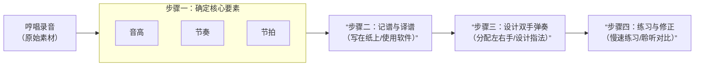

## Z025/12/01（一）

将哼唱的调子转化为可弹奏的琴谱是一个结合了**音乐感知、乐理知识和实践技巧**的过程。这对于钢琴初学者可能有一定挑战，但通过系统的方法完全可以实现。

整个过程可以概括为以下核心步骤：

下面，我们来详细分解每一个步骤的操作方法：

### **步骤一：确定核心音乐要素（最关键的一步）**

你需要像侦探一样，从你的哼唱中分析出三大要素。

1.  **确定音高（旋律线）**
    *   **使用工具辅助**：这是最有效的方法。在手机上下载一个 **「调音器」或「钢琴键盘」App**。哼唱时，App会实时显示你哼唱的音高对应的音符（如 C, D, E 等）。
    *   **跟唱对比**：在钢琴或键盘上，一个键一个键地尝试，找到与你哼唱最匹配的那个音。从简单的短句开始。

2.  **确定节奏（音的长短）**
    *   用手均匀地打拍子，速度就是你感觉最自然的那种。
    *   分析每个音持续了多久：是短促的（像八分音符 ▏）？中等的（像四分音符 ▍）？还是悠长的（像二分音符 ▎）？
    *   记录下哪里有空拍（休止符 𝄽）。

3.  **确定节拍（强弱规律）**
    *   感受你哼唱中的“强弱循环”。最常见的节拍是：
        *   **4/4拍**（强-弱-次强-弱）：感觉像在数“1-2-3-4, 1-2-3-4”。
        *   **3/4拍**（强-弱-弱）：感觉像华尔兹，“蹦-嚓-嚓”。

### **步骤二：记谱与译谱**

1.  **写在纸上**
    *   在五线谱本上，根据你确定的节拍（如4/4拍）画好谱号和小节线。
    *   将分析出的音符和节奏画在五线谱上。如果不懂五线谱，可以先在纸上用简谱（数字谱，如 1 2 3）和横线表示节奏。

2.  **使用软件辅助（强烈推荐）**
    *   **音频转谱软件**：如 **AnthemScore、MuseScore、ScoreCloud** 等。它们能分析音频文件，自动生成大致的乐谱，你可以在上面进行修改和编辑。
    *   **手机App**：如 **「完美钢琴」的录音记谱功能**，或 **「Notation Pad」** 等，可以直接在屏幕上记谱。

### **步骤三：设计双手弹奏**

这是从旋律到演奏的关键。

1.  **右手**：通常负责弹奏你哼唱的 **主旋律**。
2.  **左手**：负责弹奏 **伴奏**，为旋律提供和声与节奏支撑。常见的左手伴奏型有：
    *   **分解和弦**：将和弦音一个个弹出来，如 C 和弦弹成 **1-3-5-3**（do-mi-sol-mi）。
    *   **柱式和弦**：同时按下和弦的所有音，作为节奏点。
    *   **根音与和弦**：先弹一个低音根音，再弹和弦。

**和声（和弦）如何配？**
这是难点，但也有规律：
*   旋律的第一个和最后一个音，通常是主和弦（C大调就是C和弦）。
*   旋律中的长音、重音，往往就是当前和弦内的音。
*   从 **C, F, G (G7)** 这三个最基础的和弦开始尝试搭配，在钢琴上试听，选择听起来最和谐、最符合情绪的。

### **步骤四：练习与修正**

1.  **分手练习**：先单独练熟右手旋律，再单独练熟左手伴奏。
2.  **慢速合手**：以极慢的速度尝试双手配合，确保节奏点对齐，不要急于求成。
3.  **录音对比**：弹奏你的谱子并录音，与你原始的哼唱对比，感觉哪里不对就回到步骤一进行微调。
4.  **完善细节**：加入力度变化（强弱）、踏板等，让演奏更生动。

### **给初学者的捷径建议**

如果以上步骤看起来过于复杂，你可以采用这个“快速启动方案”：

1.  **哼唱并录制**：用手机清晰录下你的旋律。
2.  **寻求外部帮助**：
    *   将录音发给 **懂音乐的朋友** 或 **线上音乐社区**（如贴吧、知乎相关板块），请他们帮忙听记。
    *   在电商平台或家教平台寻找 **“音乐记谱”服务**，支付少量费用请专业人士为你完成。
3.  **学习基础**：同时，开始学习基础的 **钢琴入门教程** 和 **乐理知识**（如音符、节奏、简单和弦）。随着你自身能力的提升，你将能越来越独立地完成这个过程。

**核心工具推荐**：
*   **记谱软件**：MuseScore（免费、强大）
*   **手机App**：Tuner Lite（调音器）、完美钢琴
*   **学习平台**：Simply Piano、Yousician等互动式App，可以寓教于乐地学习弹奏基础。

这个过程需要耐心和反复实践。从一小段简单的旋律开始，成功一次后，你会获得巨大的成就感，并逐渐掌握这项创造性的技能。
