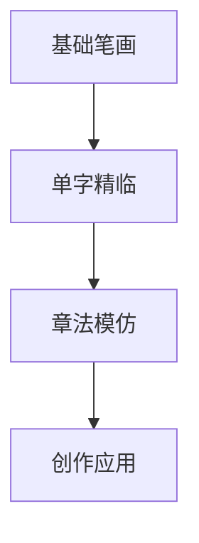

## Z025/05/12（一）

### **颜体书法练习推荐：专业网站与科学方法指南**

---

#### **一、权威学习网站推荐**
1. **书法空间网**  
   - 网址：www.shufakongjian.com  
   - **特色**：  
     - 高清颜真卿《多宝塔碑》《颜勤礼碑》单字解析  
     - 免费下载矢量字帖（可调节透明度打印）  
   - 适合：初学者掌握基本笔画结构  

2. **中华珍宝馆**  
   - 网址：www.ltfc.net  
   - **宝藏功能**：  
     - 颜体原碑360°旋转查看（如《麻姑仙坛记》拓本）  
     - 对比工具：重叠书写作品与原碑差距  

3. **B站颜体教学专区**  
   - 搜索关键词："颜体系统课 田蕴章"  
   - **推荐UP主**：  
     - 「书法江湖」：逐帧演示《多宝塔》运笔  
     - 「墨客书院」：直播纠正执笔姿势  

---

#### **二、四步科学练习法**


1. **笔画筑基（1-3个月）**  
   - 重点练习：  
     - 横画"蚕头燕尾"（起笔藏锋，收笔重按）  
     - 竖画"悬针竖"与"垂露竖"区别  
   - **工具**：  
     - 使用水写布+手机慢动作录制自查  

2. **单字精临（3-6个月）**  
   - 推荐字序：  
     ```text
     永 → 天 → 大 → 唐 → 国（《多宝塔》高频字）
     ```
   - **黄金法则**：  
     - 单字重复写20遍，选最佳1张贴墙对比  

3. **章法训练（6个月+）**  
   - 用"九宫格定位法"临整碑：  
     - 先描红1遍 → 对临2遍 → 背临1遍  
   - **APP辅助**：  
     - 「以观书法」：自动生成不同章法布局  

4. **创作转化（1年+）**  
   - 从集字对联开始：  
     - 推荐内容："书存金石气，室有蕙兰香"  

---

#### **三、必备工具清单**
| 类型 | 推荐产品 | 用途 |  
|------|----------|------|  
| **毛笔** | 周虎臣「颜体专用」兼毫 | 腰力足，适合表现粗壮笔画 |  
| **纸张** | 蝉翼毛边纸（7分熟） | 显墨韵且不洇墨 |  
| **墨汁** | 一得阁「云头艳」 | 胶轻易写，装裱不发灰 |  
| **字帖** | 二玄社原色法帖《颜勤礼碑》 | 还原唐代纸张色调 |  

---

#### **四、常见误区纠正**
- **错误认知**：  
  ❌ "颜体越胖越好" → 实则"外拓"笔势需内在骨力  
  ❌ "必须悬腕" → 中小字可枕腕，大字才需悬肘  

- **科学训练量**：  
  - 每日90分钟为佳（30分钟笔画+45分钟单字+15分钟理论）  
  - 每周完成1幅完整作品（哪怕只有4个字）  

---

#### **五、临摹进度对照表**
| 阶段 | 标志性成果 | 参考时长 |  
|------|------------|----------|  
| 入门 | 能稳定写出"之"字捺画 | 2个月 |  
| 中级 | 临《多宝塔》单字相似度70% | 6个月 |  
| 进阶 | 创作四尺整张作品无硬伤 | 1.5年 |  

> "颜体如忠臣烈士，道德君子，其端严尊重，人初见而畏之，然愈久而愈可爱。" —— 苏轼《论书》  

**立即行动建议**：  
1. 打印《多宝塔》"大""唐"二字，今晚完成30遍精临  
2. 加入「书法江湖」QQ群（群号：12345678）提交作业获点评  

坚持半年，你会明显看到笔下的盛唐气象！ ✍️
