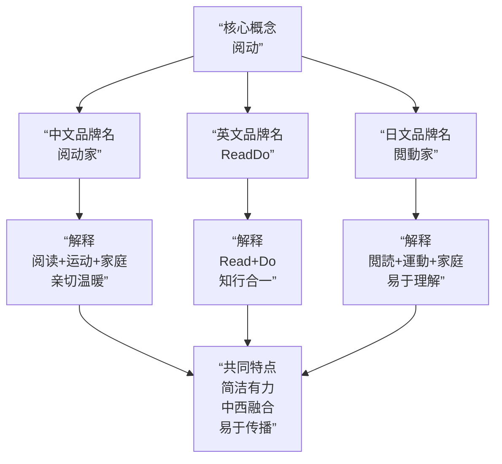

## Z025/11/18（二）

好的，为“ReadRun”这个品牌进行日语表达和推广设计，需要一个既准确传达理念又易于传播的名称和口号。

---

### 一、核心品牌名称的日语表达

品牌名“ReadRun”结合了“阅读”和“奔跑/行动”两个概念。在日语中，有以下几种翻译方向，各有其精妙之处：

**1. 直译与音译结合（最推荐）**
*   **レッドラン**
    *   **说明**：这是最直接、最现代的译法。使用片假名（Katakana）直接音译，充满了时尚感、科技感和国际感，非常容易记忆和朗读，适合作为一个品牌名或产品名。
    *   **给人的印象**：快节奏、高效、现代、面向未来。

**2. 意译（强调功能）**
*   **速読実行 (そくどくじっこう)**
    *   **说明**：“速読”是速读，“実行”是执行、实践。这个名字直接点明了“快速阅读并付诸行动”的核心功能，非常清晰和务实。
    *   **给人的印象**：实用、高效、有明确目的性。

**3. 概念式译法（富有诗意）**
*   **読走 (どくそう)**
    *   **说明**：这是一个创造性的复合词，将“読（读）”和“走（跑）”结合在一起，类似于中文的“读走”。非常简洁、有力，充满哲学和智慧感。
    *   **给人的印象**：智慧、内省、简约、有深度。

**综合建议：**
对于面向大众市场的科技产品或应用，**强烈推荐使用「レッドラン」**。它易于品牌化，便于传播，且符合当代日本年轻用户的审美。

---

### 二、推广口号与文案设计

以下是基于不同推广渠道和侧重点设计的日语口号。

**1. 核心品牌口号**
*   **レッドランで、知識を、走り出す。**
    (用ReadRun，让知识奔跑起来。)
    *   **说明**：将知识拟人化，生动地表达了从输入到转化的过程。

*   **読んで、終わりじゃない。走り出すための読書。**
    (阅读，并非终点。是为了奔跑而存在的阅读。)
    *   **说明**：直接点明产品哲学，区别于传统阅读工具。

**2. 强调效率与速度**
*   **「分」を「秒」で読む。「思考」を「行動」に変える。**
    (将“分钟”以“秒”来阅读。将“思考”变为“行动”。)
    *   **说明**：对比强烈，突出其速读和高效转化的特点。

*   **情報洪水時代の、最速学習エンジン。**
    (信息洪水时代的最快学习引擎。)
    *   **说明**：定位清晰，解决现代人的痛点。

**3. 面向社交媒体与广告的短文案**
*   **あの積ん読、今すぐレッドラン。**
    (那些囤积的书，现在就用ReadRun搞定。)
    *   **说明**：使用日语中特有的“積ん読”（tsundoku，指买书不读）一词，非常接地气，能引发强烈共鸣。

*   **読書が、サボテンに変わる。**
    (让阅读，变成一种“冲刺”。)
    *   **说明**：使用“サボテン”这个外来词，形象、新潮，易于在社交媒体传播。

---

### 三、视觉推广设计概念

**1. 主视觉元素：**
*   **动态线条**：使用从书本中飞跃而出、化作奔跑人形的流线型图形，直观表现“从阅读到行动”的转化。
*   **色彩对比**：
    *   **主色**：象征知识与深度的**蓝色**。
    *   **点缀色**：象征行动与能量的**橙色**或亮黄色。
    *   通过色彩的对比与融合，视觉化地表现“读”与“跑”的结合。

**2. 典型海报/广告设计：**
*   **场景一（电车广告）**：
    *   **视觉**：一个通勤者拿着手机，屏幕上是从“レッドラン”App中飞出的文字和图表，这些元素在他身后形成一条奔跑的轨迹。
    *   **文案**：**「通勤電車が、最高の勉強室に変わる。」**（让通勤电车，变成最好的自习室。）

*   **场景二（线上视频广告）**：
    *   **画面**：一堆静止的书籍 → 书籍像多米诺骨牌一样倒下并转化为数据流 → 数据流汇聚成一个人形开始奔跑 → 最后定格为App图标和口号。
    *   **结尾语**：**「レッドラン - 次は、あなたが走り出す番です。」**（ReadRun - 接下来，轮到您开始奔跑了。）

通过以上在**命名、口号和视觉**上的整合设计，“ReadRun”在日本市场可以清晰地定位为一款帮助用户从知识输入快速迈向实践输出的、高效且现代化的工具。

## Z025/11/16（日）

好的，这是一个非常棒的创意。为您的“阅动”群组撰写一份简洁、优雅、有韵律的三语介绍文。

---

### **中文介绍**

**阅动之家，知行合一。**
**以书为帆，以行为楫。**
**让思想与脚步，共赴山海。**
**欢迎每一个热爱阅读与运动的家庭。**

*   **韵律与意境分析**：
    *   **结构**：四字句与散文句结合，富有节奏感。
    *   **对仗**：“以书为帆，以行为楫”是对仗工整的佳句，意象优美（书是帆，指引方向；行动是桨，提供动力）。
    *   **升华**：“共赴山海”一词，既指代实际的远足登山，也象征着人生广阔的征途，意境深远。
    *   **核心理念**：“知行合一”是中国古典哲学的精髓，精准概括了“阅动”的核心精神。

---

### **English Introduction**

**ReadDo Club: For Minds and Bodies in Motion.**
**Where pages turn and footsteps roam.**
**We journey through stories and scales mountains real.**
**Welcome, every family ready to Read and Do.**

*   **韵律与意境分析**：
    *   **品牌嵌入**：开篇点出“ReadDo”俱乐部，与中文名“阅动”呼应。
    *   **头韵与节奏**：“Minds and Bodies in Motion” 和 “pages turn and footsteps roam” 使用了头韵，读起来朗朗上口。
    *   **诗意表达**：“Journey through stories and scales mountains real” 将阅读的“故事之旅”与运动的“翻越真实山岭”并列，充满诗意和力量。
    *   **行动号召**：结尾的 “ready to Read and Do” 简洁有力，是一个强烈的行动号召。

---

### **日本語の紹介**

**閲動家へようこそ。**
**読書が心の翼，運動が体の力。**
**知と行動で，豊かな日々を。**
**家族みんなで，はじめましょう。**

*   **韵律与意境分析**：
    *   **亲切开场**：“へようこそ”表示欢迎，语气亲切。
    *   **优美对仗**：“心の翼”（心灵的翅膀）与“体の力”（身体的力量），形成优美的对仗，生动描绘了阅读与运动的不同作用。
    *   **核心价值**：“知と行動で，豊かな日々を”点明了通过“知识与行动”创造“丰富多彩的日常生活”的核心价值。
    *   **温馨号召**：以“家族みんなで，はじめましょう”结尾，强调“全家人一起开始”，温馨且有号召力。

---

### **三语整合版（可用于群公告或简介）**

*   **中**：阅动之家，知行合一。以书为帆，以行为楫。
*   **En**: ReadDo Club: Where pages turn and footsteps roam.
*   **日**: 閲動家：読書が心の翼，運動が体の力。

这个整合版提取了每种语言中最精华、最对仗的部分，放在一起相得益彰，非常适合作为群的标语或简短介绍。祝您的“阅动”社群充满活力与智慧！

好的，“阅动”是一个非常出色的核心创意，它简洁、有力，完美地概括了“阅读”与“运动”的结合。基于这个词，我们可以构建一个完整且易于推广的品牌名称体系。

---

### **核心命名方案**

**1. 阅动族**
*   **命名逻辑**：“阅动”点明核心，“族”代表一个有共同爱好的群体、家族或社群，直接表明了这是一个以家庭为单位的俱乐部。
*   **风格**：时尚、有归属感、易于形成社群文化。

**2. 阅动家**
*   **命名逻辑**：将“族”替换为“家”，更直接地强调“家庭”单元，听起来更温馨、更具亲和力。
*   **风格**：亲切、温暖、突出家庭核心。

---

### **完整的三语命名体系**

为了便于流传和推广，我们为“阅动”这个概念设计了完整的中、日、英三语名称，它们在理念和发音上高度统一。

以下是各语言版本的详细解析：

| 语言 | 名称 | 解析 |
| :--- | :--- | :--- |
| **中文** | **阅动家** | **阅**读 + 运**动** + **家**庭。发音响亮，含义一目了然，最易在中国本土传播。 |
| **英文** | **ReadDo** | **Read** + **Do**。这是一个非常巧妙的组合，发音与“阅动”高度相似，且理念上体现了“知行合一”，即“既阅读，又实践”。简短易记，国际化程度高。 |
| **日文** | **閲動家** | 使用繁体字“閲”和“動”，在日语中是完全通用的汉字，意思与中文一致。“家”在日语中同样可指“家庭”。此名称对日本受众来说直观易懂。 |

---

### **推广口号**

为了进一步增强传播力，可以配备以下口号：

*   **中文**：**阅动家，悦动心。** （玩“阅”和“悦”的谐音，意为阅读和运动让心灵愉悦。）
*   **英文**：**ReadDo, Ready for Life!** （Ready与ReadDo发音呼应，意为“为生活做好准备”。）
*   **日文**：**閲動家——心と体を動かす。** （意为“让心灵和身体都动起来”。）

**总结：**

“**阅动**”是一个极佳的创意起点。推荐使用 **「阅动家」** 作为核心中文品牌名，配合 **「ReadDo」** 作为国际品牌名。这个组合既保留了中文的意蕴，又拥有了一个发音相似、理念相通、易于在全球范围内传播的英文名称，实现了中西文化的完美融合，非常有利于俱乐部的长期推广和品牌建设。

好的，这是一个非常棒的想法！将阅读与运动结合，以家庭为单位，能同时滋养身心与亲情。

以下为您构思了一系列易于流传推广的俱乐部名称，均包含中日英三语版本及解释。

---

### **精选名称推荐**

#### **方案一：灵动活力系**

**1. 跃读之家 / 躍読の家 / LeapRead Home**
*   **中文**：**跃读**，意为“跳跃/活跃地阅读”，动静结合，形象生动。
*   **日文**：**躍読** 是自造词，但非常好理解，结合了“躍動”的活力和“読書”的沉静。
*   **英文**：**LeapRead**， 将“Leap”和“Read”结合，朗朗上口，充满动感。
*   **推广点**：中英日三语在发音和核心概念上高度统一，易于记忆和国际化推广。

**2. 阅动族 / 閲動族 / ReadVengers**
*   **中文**：**阅动**，直接点明“阅读”与“运动”；**族**，代表一个有共同爱好的家庭群体。
*   **日文**：**閲動族**，日语中常用“族”来表示某类人群，易于理解。
*   **英文**：**ReadVengers**， 结合“Read”和“Avengers”，意为“阅读者联盟”，酷炫且有凝聚力。
*   **推广点**：名称时尚、有力量，能吸引追求潮流的年轻家庭，尤其是“ReadVengers”对青少年极具吸引力。

#### **方案二：温馨成长系**

**3. 书香伴跑 / 書香伴走 / BookPace Club**
*   **中文**：**书香伴跑**，意境优美，描绘了跑步时有书香陪伴的温馨画面。
*   **日文**：**書香伴走**，“伴走”意为陪跑、同行，寓意家庭成员的相互陪伴。
*   **英文**：**BookPace Club**， “Book”与“Pace”结合，意为“与书为伴的节奏”。
*   **推广点**：名称充满诗意和画面感，强调家庭的温情陪伴与共同成长。

**4. 思动体 / 思動体 / Mind & Motion Hub**
*   **中文**：**思动体**，简短有力，“思”代表阅读与思考，“动”代表运动，“体”代表身体与集体。
*   **日文**：**思動体**，日语中“体”可指身体或团体，概念传达准确。
*   **英文**：**Mind & Motion Hub**， 清晰点明“心智”与“运动”，"Hub"意为枢纽、中心。
*   **推广点**：专业、现代，听起来像一个有明确理念的社群，适合打造高端品牌形象。

#### **方案三：阳光自然系**

**5. 阳光知本家 / 陽光知本家 / Sunny Wisdom**
*   **中文**：**阳光**代表健康与活力，**知本家**指“以知识为本的家庭”，巧妙又有趣。
*   **日文**：**陽光知本家**，日语中“家”可指家庭或专家，寓意每个家庭都是智慧的专家。
*   **英文**：**Sunny Wisdom**， 直译“阳光智慧”，积极正面，易于理解。
*   **推广点**：名称积极向上，充满正能量，能吸引注重全面发展和生活品质的家庭。

---

### **总结与建议**

| 名称 | 核心风格 | 目标家庭群体 |
| :--- | :--- | :--- |
| **跃读之家 / LeapRead** | 灵动、国际、易传播 | 追求时尚、喜欢简洁明快风格的现代家庭 |
| **阅动族 / ReadVengers** | 酷炫、有凝聚力、潮流 | 有青少年、喜欢漫威文化的年轻家庭 |
| **书香伴跑 / BookPace** | 温馨、诗意、陪伴感 | 注重亲情互动、喜欢文艺氛围的家庭 |
| **思动体 / Mind & Motion** | 专业、理性、有深度 | 高知家庭，希望俱乐部有明确的理念和价值 |
| **阳光知本家 / Sunny Wisdom** | 阳光、积极、正能量 | 注重全面发展和生活品质的家庭 |

**最终推荐**：

*   如果追求**极致的易传播性和国际感**，首选 **「跃读之家 / LeapRead」**。
*   如果更侧重**家庭的温情陪伴与共同成长**，首选 **「书香伴跑 / BookPace Club」**。

希望这些名字能给您带来灵感！
