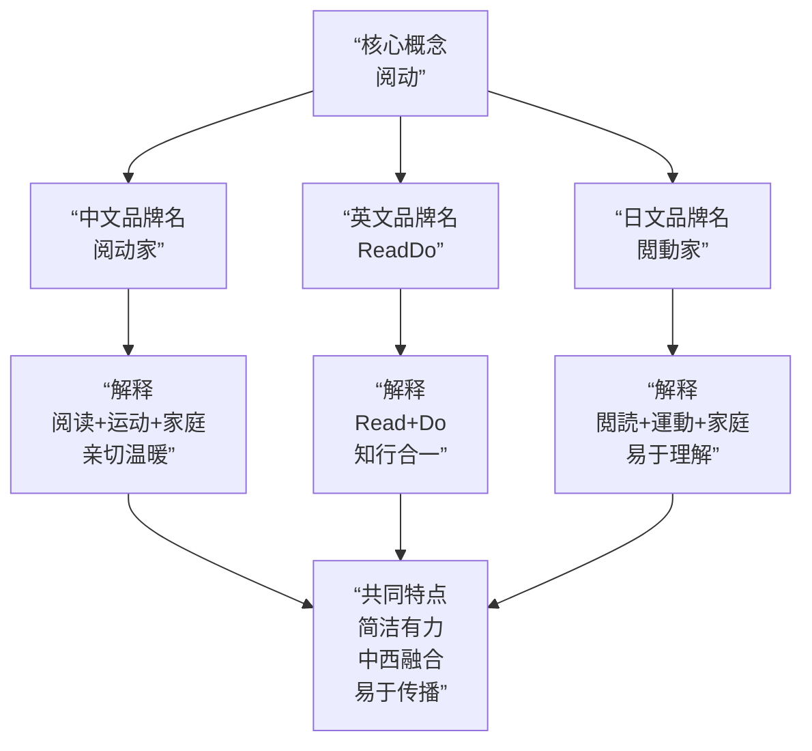

## Z025/11/16（日）

好的，这是一个非常棒的创意。为您的“阅动”群组撰写一份简洁、优雅、有韵律的三语介绍文。

---

### **中文介绍**

**阅动之家，知行合一。**
**以书为帆，以行为楫。**
**让思想与脚步，共赴山海。**
**欢迎每一个热爱阅读与运动的家庭。**

*   **韵律与意境分析**：
    *   **结构**：四字句与散文句结合，富有节奏感。
    *   **对仗**：“以书为帆，以行为楫”是对仗工整的佳句，意象优美（书是帆，指引方向；行动是桨，提供动力）。
    *   **升华**：“共赴山海”一词，既指代实际的远足登山，也象征着人生广阔的征途，意境深远。
    *   **核心理念**：“知行合一”是中国古典哲学的精髓，精准概括了“阅动”的核心精神。

---

### **English Introduction**

**ReadDo Club: For Minds and Bodies in Motion.**
**Where pages turn and footsteps roam.**
**We journey through stories and scales mountains real.**
**Welcome, every family ready to Read and Do.**

*   **韵律与意境分析**：
    *   **品牌嵌入**：开篇点出“ReadDo”俱乐部，与中文名“阅动”呼应。
    *   **头韵与节奏**：“Minds and Bodies in Motion” 和 “pages turn and footsteps roam” 使用了头韵，读起来朗朗上口。
    *   **诗意表达**：“Journey through stories and scales mountains real” 将阅读的“故事之旅”与运动的“翻越真实山岭”并列，充满诗意和力量。
    *   **行动号召**：结尾的 “ready to Read and Do” 简洁有力，是一个强烈的行动号召。

---

### **日本語の紹介**

**閲動家へようこそ。**
**読書が心の翼，運動が体の力。**
**知と行動で，豊かな日々を。**
**家族みんなで，はじめましょう。**

*   **韵律与意境分析**：
    *   **亲切开场**：“へようこそ”表示欢迎，语气亲切。
    *   **优美对仗**：“心の翼”（心灵的翅膀）与“体の力”（身体的力量），形成优美的对仗，生动描绘了阅读与运动的不同作用。
    *   **核心价值**：“知と行動で，豊かな日々を”点明了通过“知识与行动”创造“丰富多彩的日常生活”的核心价值。
    *   **温馨号召**：以“家族みんなで，はじめましょう”结尾，强调“全家人一起开始”，温馨且有号召力。

---

### **三语整合版（可用于群公告或简介）**

*   **中**：阅动之家，知行合一。以书为帆，以行为楫。
*   **En**: ReadDo Club: Where pages turn and footsteps roam.
*   **日**: 閲動家：読書が心の翼，運動が体の力。

这个整合版提取了每种语言中最精华、最对仗的部分，放在一起相得益彰，非常适合作为群的标语或简短介绍。祝您的“阅动”社群充满活力与智慧！

好的，“阅动”是一个非常出色的核心创意，它简洁、有力，完美地概括了“阅读”与“运动”的结合。基于这个词，我们可以构建一个完整且易于推广的品牌名称体系。

---

### **核心命名方案**

**1. 阅动族**
*   **命名逻辑**：“阅动”点明核心，“族”代表一个有共同爱好的群体、家族或社群，直接表明了这是一个以家庭为单位的俱乐部。
*   **风格**：时尚、有归属感、易于形成社群文化。

**2. 阅动家**
*   **命名逻辑**：将“族”替换为“家”，更直接地强调“家庭”单元，听起来更温馨、更具亲和力。
*   **风格**：亲切、温暖、突出家庭核心。

---

### **完整的三语命名体系**

为了便于流传和推广，我们为“阅动”这个概念设计了完整的中、日、英三语名称，它们在理念和发音上高度统一。

以下是各语言版本的详细解析：

| 语言 | 名称 | 解析 |
| :--- | :--- | :--- |
| **中文** | **阅动家** | **阅**读 + 运**动** + **家**庭。发音响亮，含义一目了然，最易在中国本土传播。 |
| **英文** | **ReadDo** | **Read** + **Do**。这是一个非常巧妙的组合，发音与“阅动”高度相似，且理念上体现了“知行合一”，即“既阅读，又实践”。简短易记，国际化程度高。 |
| **日文** | **閲動家** | 使用繁体字“閲”和“動”，在日语中是完全通用的汉字，意思与中文一致。“家”在日语中同样可指“家庭”。此名称对日本受众来说直观易懂。 |

---

### **推广口号**

为了进一步增强传播力，可以配备以下口号：

*   **中文**：**阅动家，悦动心。** （玩“阅”和“悦”的谐音，意为阅读和运动让心灵愉悦。）
*   **英文**：**ReadDo, Ready for Life!** （Ready与ReadDo发音呼应，意为“为生活做好准备”。）
*   **日文**：**閲動家——心と体を動かす。** （意为“让心灵和身体都动起来”。）

**总结：**

“**阅动**”是一个极佳的创意起点。推荐使用 **「阅动家」** 作为核心中文品牌名，配合 **「ReadDo」** 作为国际品牌名。这个组合既保留了中文的意蕴，又拥有了一个发音相似、理念相通、易于在全球范围内传播的英文名称，实现了中西文化的完美融合，非常有利于俱乐部的长期推广和品牌建设。

