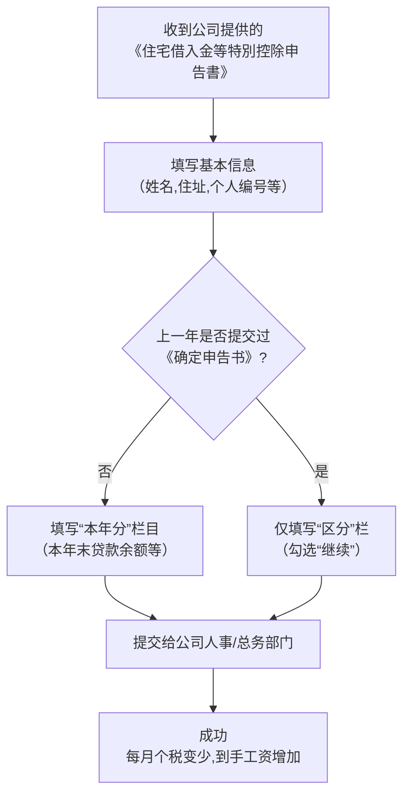

Z025/11/20（四）

好的，为您详细说明如何填写第二年的「住宅借入金等特別控除申告書」（以下简称《申告书》）。

对于公司职员（給与所得者）来说，**第二年及以后的手续比第一年简单得多，不再需要自己去税务署进行“确定申告”**，而是通过公司办理。这意味着您每月预扣的所得税会直接减少，到手的工资会增加，无需等待次年退税。

整个流程的核心是正确填写公司发给您的《申告书》。下图清晰地展示了从收到表格到提交的完整流程和关键点：

下面，我们对照流程图，对每个环节进行详细说明：

### **一、 填写内容详解（对照图表中的决策点）**

您拿到的《申告书》可能因公司格式略有不同，但核心栏目基本一致。

**首先，填写基本信息：**
*   **氏名**：您的姓名
*   **住所**：您的住址
*   **個人番号（マイナンバー）**：您的个人编号
*   **勤務先**：公司名称

**然后，来到关键部分——“区分”栏：**

*   **情况一：如果您上一年是正常通过公司提交的（最常见）**
    *   您只需要在「**継続**」（继续）这一栏打勾（✔）即可。
    *   这告诉税务局：“我的情况与上一年相比没有变化，请继续为我办理抵扣。”

*   **情况二：如果您上一年是自己去税务署提交了“确定申告”**
    *   您需要在「**確定申告書を提出した**」（已提交确定申告书）这一栏打勾（✔）。
    *   这意味着您今年想切换回通过公司办理每月抵扣的模式。

**最后，填写“本年分”的贷款信息（对应流程图中的“填写本年分栏目”步骤）：**

这部分信息来源于您的贷款银行。通常，银行会在每年年底或次年年初主动将 **「年末残高証明書」** 邮寄给您。

*   **1. 貸付金等の債権者（銀行名）**：贷款银行的名字（如：○○銀行）。
*   **2. 貸付金等の種類**：贷款类型，一般是「住宅ローン」。
*   **3. 本年分の貸付金等の元金の年末残高**：**这是最重要的数字！** 填写「年末残高証明書」上标明的本年12月31日的贷款余额。
*   **4. 控除額の計算**：通常，这一栏您**不需要自己计算**，留空即可。公司或税务部门会代为计算。

---

### **二、 重要注意事项**

1.  **及时提交**：公司通常会在**每年1月**发放这张表格，并要求在1月底或2月初交回。请务必在此期限内提交，否则当年将无法享受每月抵扣，只能等到次年自行去税务署申告。
2.  **信息准确性**：确保填写的贷款余额与银行证明文件上的数字完全一致。
3.  **情况变更**：如果发生**出售房产、还清贷款、搬家（不再是主要住所）** 等情况，您需要立即通知公司，并停止申请抵扣。
4.  **找不到年末残高証明書**：如果没收到银行寄来的证明，请**主动联系您的贷款银行**，他们可以补发或告知您如何在线查询和下载。
5.  **住民税**：您提交的这份《申告书》信息，公司也会同步给地方政府，用于减免您下一年度的住民税。您通常无需额外操作。

### **总结**

第二年的手续非常简单：
**收到银行「年末残高証明書」 → 填写公司发的「住宅借入金等特別控除申告書」（主要在「継続」栏打勾并填写年末余额）→ 在规定期限内交回公司。**

完成以上步骤后，从接下来的那个月开始，您就会发现工资单上的所得税预扣额减少了，到手的现金增加了。这就是住宅贷款抵扣在顺利运行的标志。

## Z025/11/19（三）

### 15：xx Q：住宅借入金控除，如何规定，该如何申请

住宅借入金控除（住宅贷款税收抵扣）是日本一项非常重要的购房税收优惠政策。下面为您详细解释其规定和申请方法。

### **一、 制度概要（是什么？）**

简单来说，这是一个为了减轻购房者房贷负担的税收制度。在满足一定条件的情况下，您每年缴纳的**个人所得税**和**住民税**的一部分，可以根据您年末的房贷余额，在10年或13年内获得退还（抵扣）。

**核心机制**：
*   **个人所得税**：每年年末房贷余额的0.7%，直接从您的应缴个人所得税中扣除。如果抵扣额大于您的个税，多余部分将退还给您。
*   **住民税**：除了个税抵扣外，您还可以在住民税上获得减免（计算公式复杂一些，但也是实质性的减免）。

---

### **二、 适用条件（您需要满足什么？）**

条件比较严格，主要针对新房或符合条件的中古住宅（二手房），以下是核心条件：

1.  **房屋属性**：
    *   必须是您的**主要住所**（不能是投资房或第二套房）。
    *   建筑面积在50平方米以上，并且您拥有的土地面积在500平方米以下。
    *   如果是中古住宅，其建筑年限（从新筑之日到贷款合约日）需在20年（耐火建筑为25年）以内。**（2024年现行制度，请注意未来可能变化）**

2.  **贷款目的**：
    *   贷款必须是用于**购买或建造自住住宅**。
    *   贷款来自正规金融机构（银行、信用金库、劳动金库等）。

3.  **收入要求**：
    *   申请年的合計所得金額在**2000万日元以下**。

4.  **居住时间要求**：
    *   必须在**购房后6个月内**入住该住宅。
    *   在申请抵扣的整个纳税年度内，您都必须居住在该住宅中。

5.  **贷款偿还期间**：
    *   贷款偿还期间必须在**10年以上**。

6.  **适用期限（非常重要！）**：
    *   **2029年12月31日之前**签约的贷款适用此制度。税率和抵扣年限根据购房时间有所不同：
        *   **2019年10月1日 ~ 2021年12月31日** 购房：抵扣率为**0.7%**，抵扣年限为**10年**。
        *   **2022年1月1日 ~ 2029年12月31日** 购房：抵扣率为**0.7%**，抵扣年限为**13年**。

---

### **三、 申请方法（如何操作？）**

申请分为两个阶段：**初次申请**和**后续每年的确认**。

#### **阶段一：初次申请（确定控除期间）**

这是最关键的一步，在您购房后的**第二年进行**。

1.  **何时申请**：
    *   在您开始偿还贷款后的**第一个年份**，在进行该年度的**确定申告**时一同申请。
    *   例如：您在2023年1月购房并开始还贷，那么您需要在**2024年2月16日~3月15日**期间，进行2023年度的确定申告，并提交住宅借入金控除的初次申请。

2.  **所需材料**：
    *   **确定申告书**：在税务局官网下载或去税务局领取。
    *   **住宅借入金等特別控除額の計算明細書**：这是核心的申请表格，需要您和贷款银行共同填写。
    *   **源泉徵收票**：您公司提供的年度收入证明。
    *   **住民票**：证明您已入住该地址。
    *   **登記事項証明書（登记簿藤本）**：证明房屋的所有权。
    *   **买卖契约书或请负契约书的复印件**。
    *   **贷款契约书的复印件**以及**年末残高证明书**（由贷款银行提供，通常会主动寄给您）。

3.  **如何提交**：
    *   将以上所有材料带到您居住地所属的**税务署**，在确定申告期间一并提交。

#### **阶段二：第二年及以后的申请（确认继续适用）**

从初次申请后的第二年开始，手续会变得非常简单。

*   **如果您是公司职员（工薪族）**：
    *   您通常不需要每年都去做确定申告。
    *   在您完成初次申请后，税务署会将信息共享给地方政府。
    *   您只需要在每年年初，公司给您发《給与所得者の(住宅借入金等)特別控除申告書》时，确认信息并提交给公司即可。公司会在计算您的每月工资所得税时，直接应用这项抵扣。
    *   同时，您的地方政府也会自动为您减免住民税。

*   **如果您是个体经营者或需要做确定申告的人**：
    *   您需要在每年的确定申告时，继续填写《住宅借入金等特別控除額の計算明細書》（通常银行会每年寄送年末残高证明给您），并附上必要的证明文件，与确定申告书一同提交。

---

### **总结与重要提示**

1.  **不要错过初次申请**：第一年的申请必须在购房后的**第一个确定申告期间**完成，否则将失去整个期间的优惠。
2.  **妥善保管所有文件**：从购房合同、贷款合同到每年的年末残高证明，所有文件都应妥善保管至少10-13年。
3.  **咨询专业人士**：如果您对流程不熟悉，或者情况比较复杂（例如有副业收入、中途出售房产等），强烈建议咨询**税务会计师**或向**当地税务署的咨询窗口**求助。
4.  **确认银行合作**：确保您的贷款银行了解此制度并能及时为您提供《年末残高证明书》。

这项政策能为购房者节省可观的税金，请务必仔细核对条件并按时申请。
---
### Q：举例说明抵扣和退还的税款

好的，我们通过一个具体的例子来详细说明住宅借入金控除（住宅贷款税收抵扣）是如何实现“抵扣”和“退还”的。

这个例子的核心是：**抵扣额 > 您本应缴纳的个税 = 获得退税**。

---

### **举例说明**

**人物背景：**
*   **山田先生**，公司职员。
*   年收入 **500万日元**。
*   于 **2023年1月** 购买自住房并申请了住宅贷款。
*   **2023年12月31日** 的房贷余额为 **3000万日元**。

**税收抵扣计算：**

1.  **计算可抵扣额度**
    *   抵扣额度 = 年末房贷余额 × 0.7%
    *   山田先生的抵扣额度 = 30,000,000日元 × 0.7% = **210,000日元**

2.  **计算本应缴纳的个税（抵扣前）**
    *   我们先粗略计算一下山田先生年收入500万日元时，需要缴纳的个税（所得税）大约是多少。
    *   扣除基础免税额、社会保险料等之后，他的**应纳税所得额**大约在 500万 - (约200万) = **300万日元** 左右。
    *   根据日本的累进税率计算，这300万日元应纳税所得额的个税大约是：
        *   ~195万日元部分：5% → 约97,500日元
        *   195万~300万日元部分：10% → (300-195)万 × 10% = 105,000日元
        *   **个税总额（估算）≈ 97,500 + 105,000 = 202,500日元**

3.  **进行税收抵扣/退还**
    *   现在，我们将抵扣额度应用于他本应缴纳的个税。
    *   **可抵扣额度：210,000日元**
    *   **抵扣前个税：202,500日元**

    *   **抵扣过程**：
        *   由于可抵扣额度（21万日元）大于他本应缴纳的个税（20.25万日元），他的个税将被全部抵免。
        *   **最终应缴纳的个税 = 0日元**。

    *   **退税过程**：
        *   山田先生作为公司职员，每个月公司已经通过“源泉徴収”从他的工资里预扣了个人所得税。我们假设公司全年为他预扣的个税总额正好是 **202,500日元**。
        *   在第二年（2024年）进行确定申告并申请住宅贷款抵扣后，税务署的计算结果是：他最终应缴个税为0日元。
        *   这意味着，他已经预缴的 **202,500日元** 将全部退还给他。

---

### **两种情况的总结**

| 情况 | 计算公式 | 结果 |
| :--- | :--- | :--- |
| **情况A：抵扣额 ≤ 应缴个税**   （例如：抵扣额10万，个税20万） | 最终个税 = 应缴个税 - 抵扣额 20万 - 10万 = **10万** | 您需要缴纳的个税**减少**。如果公司已预扣20万，您将获得**10万日元的退税**。 |
| **情况B：抵扣额 > 应缴个税**   （如山田先生的例子） | 最终个税 = 0 多余部分 = 抵扣额 - 应缴个税 （此部分仅限个税抵扣，不现金退还） | 您已预缴的个税将**全额退还**。您实际到手现金 = 已预缴的全部个税。 |

**关于住民税：**

以上只计算了个人所得税（国税）。实际上，住宅借入金控除对**住民税（地方税）** 也有大幅减免。住民税的计算方式不同，但原理相似：它会根据一个复杂的公式（通常是（年末房贷余额 × 0.5% - 所得税抵扣额）/ 3，但有上限）来减少您下一年度的住民税。

在山田先生的例子里，他除了获得20.25万日元的个人所得税退税外，他第二年的住民税也会比正常情况下低数万至十万日元不等。

### **核心要点回顾**

*   **退税的钱从哪里来？** 是退还您**已经被公司预扣**的个人所得税。
*   **能退多少？** 最多能退回到您**本年度预扣的个税总额**。抵扣额度中超出您个税总额的部分，不会以现金形式退还，但会通过减免住民税的方式继续惠及您。
*   **如何拿到退税？** 必须通过**确定申告**（或通过公司提交《給与所得者の住宅借入金等特別控除申告書》）来主动申请。

希望这个具体的例子能帮助您清晰地理解这个制度的运作方式！

---

当然可以！**第二年自己去税务署进行确定申告，正是申请住宅借入金控除（住宅贷款税收抵扣）并获得退税的标准且推荐的流程。**

特别是对于**公司职员**，在购房后的第一年，这几乎是必经之路。

下面为您详细说明具体情况和操作步骤：

### **谁需要自己去税务署申告？**

1.  **公司职员（給与所得者）**：在您**购入住宅并开始还贷的第一年**，必须自己去税务署进行“确定申告”，才能申请到住宅借入金控除。从第二年开始，手续会简化（通常通过公司办理）。
2.  **个人事业主、自由职业者**：您本身每年就需要进行确定申告，只需将住宅借入金控除的申请材料一并提交即可。

### **为什么公司职员第一年必须自己去？**

因为公司在您购房的当年（例如2023年），并不知道您发生了符合抵扣条件的住房贷款，所以他们会按照常规税率为您预扣个人所得税。到了第二年（2024年）初，您需要通过“确定申告”来告诉税务局：“我去年符合这项优惠政策，请重新计算我应缴的税款，并把多扣的部分退给我。”

### **自己去税务署申告的详细步骤**

**步骤一：准备材料（至关重要）**

请务必带齐以下文件：

1.  **身份证明**：个人番号卡（My Number Card）或驾照等。
2.  **源泉徵收票**：您公司会在年底或次年1月发给您，这是您收入和已缴税款的证明。
3.  **住宅借入金等特別控除額の計算明細書**：
    *   这是核心申请表格。您可以从国税厅官网下载并填写第一部分。
    *   **第二部分必须由您的贷款银行填写并盖章**。通常，银行会在年底主动寄送《年末残高证明书》和这份已填写好的表格给您。如果没收到，请主动联系银行索取。
4.  **证明购房和居住的材料**：
    *   **登记事项证明书（登记簿藤本）**：证明您是房主。
    *   **买卖契约书或请负契约书的复印件**。
    *   **住民票**：证明您已入住该地址（需要显示迁入日期）。
5.  **贷款契约书的复印件**。
6.  **印章**：认印即可。
7.  **本人的银行账户信息**：存折或银行卡，用于接收退税款项。

**步骤二：填写确定申告书**

*   您可以去税务署窗口索取空白申告书，并在工作人员的指导下填写。
*   更推荐的方式是：在国税厅官网使用“确定申告书等作成コーナー”在线填写，然后打印出生成的PDF文件。
*   在申告书中，找到“住宅借入金等特別控除”栏目，根据《計算明細書》上的数字填写即可。

**步骤三：前往税务署提交**

*   在**每年2月16日至3月15日**的确定申告期间，携带所有材料前往您居住地所管辖的税务署。
*   提交材料后，工作人员会进行审核。如果一切无误，您就完成了申告。

**步骤四：等待退税**

*   退税款项通常会在申告截止日（3月15日）之后的**1至3个月内**，直接汇入您提供的银行账户。

---

### **一个重要的例外：从第二年开始**

完成初次申告后，从**第二年开始**，您通常**不需要**再去税务署了。

*   您公司会给您一张《給与所得者の(住宅借入金等)特別控除申告書》，您填写后交回给公司。
*   公司会从您当年的每月工资中，**直接少扣个人所得税**，这样您每个月到手的工资会变多，无需等待次年退税。
*   同时，您下一年度的住民税也会自动获得减免。

### **总结与建议**

| | **购房后第一年** | **购房后第二年及以后** |
| :--- | :--- | :--- |
| **主要方式** | **自己去税务署进行确定申告** | **通过公司办理（提交《申告書》给公司）** |
| **目的** | 申请抵扣，**退还**上一年被多扣的税款。 | **从源头少扣税**，每月到手工资增加。 |

**结论：**
**完全可以，而且对于公司职员来说，在买房后的第一年，自己去税务署申告是唯一能获得退税的途径。** 请务必准备好上述材料，在规定的申告期内前往办理。如果觉得流程复杂，也可以咨询税务署的免费咨询窗口，他们会提供详细的指导。

---

17：4x 提交

好的，这句话需要根据您与对方的熟悉程度以及沟通方式（如电话、邮件、即时通讯软件）来决定具体的表达。以下是几种不同场景下的日语表达：

**1. 标准礼貌版**
这个版本清晰、礼貌，通过「~てもよろしいでしょうか」委婉地询问对方是否方便，适合与关系普通的同事或上级沟通。
> **田中さん、これから年末残高証明書をお持ちしますが、今、そちらに伺ってもよろしいでしょうか？**
> （田中先生，我现在把年末余额证明书给您送过去，现在方便过去您那边吗？）

**2. 简洁口语版**
这个版本更直接、口语化，使用了「~いい？」这种轻松的询问方式，适合与关系密切、熟悉的同事沟通。
> **田中さん、今から年末残高証明書を届けに行くけど、今、いい？**
> （田中先生，我现在过去送年末余额证明书，现在方便吗？）

**3. 非常正式/书面版**
这个版本使用了「~参ります」「~お時間よろしいでしょうか」等非常郑重的自谦语和尊敬语，适合在邮件中或对尊长、重要客户使用。
> **田中様**
> **いつもお世話になっております。**
> **只今、年末残高証明書をお持ちして参りたいと存じますが、ご都合のよろしいお時間を頂けますでしょうか？**
> （田中先生：一直承蒙关照。我正准备现在将年末余额证明书为您送去，不知能否告知您方便的时间？）

您可以根据您与田中先生的关系以及具体的沟通场景，选择最合适的表达。如果需要调整为其他形式，请随时告诉我。
