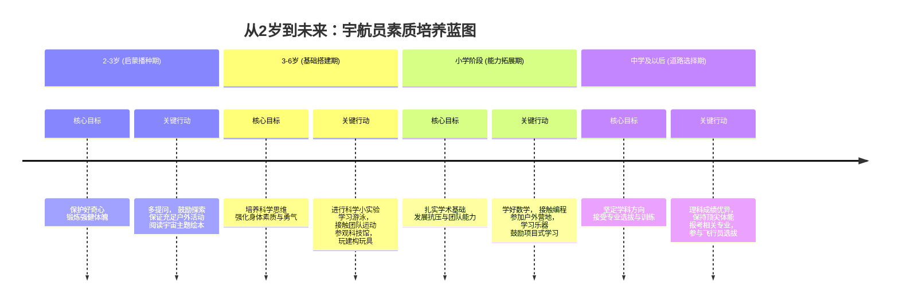

## Z026/01/23（五）

### Q：如何培养2岁的孩子成为宇航员

### A：Deep seek

这是一个非常棒的梦想！虽然2岁的孩子离成为宇航员还有漫长的道路，但这个阶段正是为他**播下科学种子、塑造核心素质的黄金时期**。真正的培养重点不在于“航天知识”，而在于**打下坚实的身心基础和点燃对世界的好奇心**。

以下是基于儿童发展规律和宇航员核心素质的阶段性培养蓝图：

### 💡 **分龄段培养核心建议**

**第一阶段：2-6岁 (启蒙与基础)**
*   **身体是革命的本钱**：保证每天充足的**户外活动**，跑、跳、攀爬，锻炼平衡感、协调性和耐力。游泳是非常好的全身运动。
*   **呵护好奇心**：认真对待他的每一个“为什么”，一起阅读**宇宙、星球、交通工具类绘本**，看相关的纪录片动画（如《太空娃娃》）。
*   **玩中学科学**：从玩水、玩沙、观察蚂蚁开始，过渡到简单的科学实验（如磁铁、三棱镜），培养观察和思考习惯。
*   **性格与心智**：鼓励他**尝试、接受失败、再次尝试**。多参与集体游戏，学习轮流、等待与合作。

**第二阶段：小学阶段 (拓展与发现)**
*   **学术兴趣引导**：发现他在**数学、物理、自然**方面的兴趣。鼓励动手做模型、玩编程机器人（如乐高EV3）、学习使用望远镜。
*   **综合能力培养**：坚持一项体育运动，学习一门乐器（锻炼大脑协调和毅力），参加夏令营或团队项目，培养领导力和协作精神。
*   **榜样与视野**：阅读宇航员传记，参观科技馆、天文馆，了解航天历史和中国航天成就，将梦想具体化。

**第三阶段：中学以后 (专业化路径)**
此时，孩子需要自己主导，家长的角色转为支持者。
1.  **学术路径**：保持优异的理科成绩，高考时可报考**航空航天类、天文、物理、工程、医学**等相关专业。
2.  **体能路径**：保持顶尖的身体素质，视力、身高、体能至关重要。可关注**空军飞行员招募**，这是成为航天员的重要途径之一。
3.  **综合素质**：强大的心理素质、应急反应能力、团队协作和外语能力缺一不可。

### 🚀 **现在你可以立即做的事情**
1.  **讲一个睡前故事**：从《老鼠宇航员》或《揭秘太空》这样的绘本开始。
2.  **本周末的活动**：带他去科技馆的航天展区，或晚上一起用APP认星星。
3.  **买一个玩具**：不是复杂的火箭模型，而是可以自由拼搭的**大型积木**或**磁力片**，让他建造自己的“太空站”。
4.  **看一部短片**：一起观看中国空间站宇航员授课的回放，或像《行星》这样画面壮美的纪录片片段。

**最重要的原则**：让这一切都像**游戏和探索**一样自然发生。你的任务是提供一个充满鼓励和支持的环境，保护他那份对星空最原始的好奇与渴望，而不是设定一个必须达到的目标。

真正的宇航员选拔是千万里挑一，但在这个过程中培养出的**强健体魄、科学头脑、坚韧心性和探索精神**，无论未来他走向哪个领域，都将是受益终生的宝贵财富。祝你和你的“小小宇航员”有一段充满惊喜的探索之旅！
