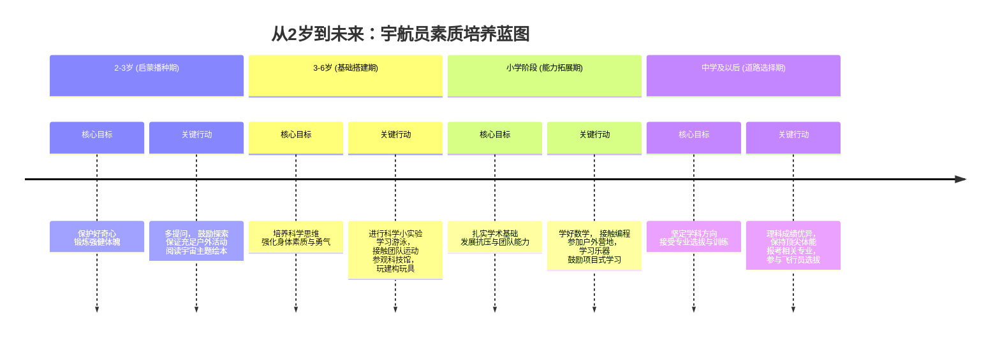

## Z026/01/31（五）

### Q：

### deep seek
好的，这是一个关于**猎户座**的浪漫与现实交织的介绍，以及从地球“到达”那里的科学畅想。

---

### **一、猎户座简介：夜空的王者**

**猎户座** 是夜空中最著名、最容易辨认的星座之一，横跨天球赤道，在全球大部分地区都能看到。它不是一个“地点”，而是一个从地球视角看到的**恒星投影图案**。

1.  **外形**：
    *   最显著的特征是**三颗排成一线的亮星**，即**猎户的腰带**。
    *   腰带上下方各有两颗极亮的星：左上为红星**参宿四**，右下为蓝白星**参宿七**。这四颗星构成了一个巨大的长方形。
    *   下方悬挂着著名的**猎户座大星云**，是恒星诞生的摇篮。

2.  **科学真相**：
    *   **不是物理实体**：星座中的恒星彼此之间**没有物理关联**，只是从地球看去刚好在同一个方向。
    *   **距离遥远且各异**：星座中的每颗星离地球的距离都**完全不同**。例如：
        *   参宿四：约**550光年**
        *   参宿七：约**860光年**
        *   猎户座大星云：约**1,344光年**
    *   **一个视角**：想象你站在一片广阔的森林里，看到远处不同远近的树木，恰巧排列成了一个“人”的形状。猎户座就是宇宙尺度上的这个“人形图案”。

---

### **二、如何“到达”猎户座？——科学与幻想之旅**

既然猎户座是一个二维图案，我们无法“到达”一个图案。但我们可以飞向其中最著名的天体，比如**猎户座大星云**。以下是基于当前和未来可能技术的设想：

#### **阶段一：逃离地球 & 太阳系（现有技术）**
*   **工具**：巨型火箭（如SpaceX星舰）。
*   **时间**：以每小时约4万公里的速度，**飞出太阳系**就需要约1万年。这仅仅是开始。

#### **阶段二：星际旅程（未来科技设想）**
旅程目标：猎户座大星云（约1,344光年）。1光年 ≈ 9.46万亿公里。

| 推进方式 | 理论速度 | 所需时间 | 可行性/挑战 |
| :--- | :--- | :--- | :--- |
| **化学火箭** | 约4万公里/小时 | **约1800万年** | 完全不可行。人类文明史仅几千年。 |
| **核聚变推进** | 可能达到10%光速 | **约1万3千年** | 理论可行，但可控核聚变技术尚未突破。 |
| **曲速引擎/时空扭曲** | 超光速（理论上） | **数年或更短** | 纯理论，需要“负能量”等未知物质。目前属于科幻范畴。 |
| **世代飞船/生命冷冻** | 亚光速（如1%-10%光速） | **数万至十数万年** | 社会学挑战巨大。飞船需自成一个小生态，承载多代人在飞船上生老病死。 |

**一个直观的比喻**：
如果**把地球到太阳的距离（1.5亿公里）缩小到1米**，那么：
*   太阳系边缘（奥尔特云）大约在**100公里**外。
*   猎户座大星云则在...**超过8万公里**外（相当于绕地球赤道两圈多的距离）。

#### **阶段三：抵达与探索**
如果真能抵达猎户座大星云，你将看到的不是从地球看到的那一小团光斑，而是一个**横跨数十光年的、璀璨无比的恒星育婴室**。
*   气体和尘埃云在引力下塌缩，形成新的恒星。
*   强烈的紫外线从年轻恒星中射出，照亮周围的气体，形成绚丽的色彩。
*   可能存在拥有行星系统的年轻恒星。

---

### **三、结论：我们如何“到达”？**

1.  **用眼睛和望远镜到达（现在就能实现）**：
    *   在冬季夜空中找到它，用天文望远镜观察其中的星云，这是最直接、最现实的“到达”。

2.  **用无线电波和探测器“到达”**：
    *   我们已向宇宙发送了包含信息的无线电波和探测器（如旅行者号的金唱片）。但它们速度太慢，到达猎户座区域需要数十万年。

3.  **用想象力到达（最浪漫的方式）**：
    *   就像你把家想象成太阳系，把保育园想象成猎户座一样。人类通过神话、科学和艺术，早已在心中无数次抵达这片璀璨的星空。它是我们宇宙探索梦想的象征。

**最终答案**：以人类目前的物理躯体和技术，**几乎不可能**在有生之年抵达猎户座。但它作为一个指引和梦想，持续驱动着我们发展更快的推进技术、更深入的天文观测，以及最重要的——**永不满足的探索之心**。

你搭建的“宇宙基地”，正是这种探索精神最美好的起点。

## Z026/01/23（五）

### Q：如何培养2岁的孩子成为宇航员

### A：Deep seek

这是一个非常棒的梦想！虽然2岁的孩子离成为宇航员还有漫长的道路，但这个阶段正是为他**播下科学种子、塑造核心素质的黄金时期**。真正的培养重点不在于“航天知识”，而在于**打下坚实的身心基础和点燃对世界的好奇心**。

以下是基于儿童发展规律和宇航员核心素质的阶段性培养蓝图：

### 💡 **分龄段培养核心建议**

**第一阶段：2-6岁 (启蒙与基础)**
*   **身体是革命的本钱**：保证每天充足的**户外活动**，跑、跳、攀爬，锻炼平衡感、协调性和耐力。游泳是非常好的全身运动。
*   **呵护好奇心**：认真对待他的每一个“为什么”，一起阅读**宇宙、星球、交通工具类绘本**，看相关的纪录片动画（如《太空娃娃》）。
*   **玩中学科学**：从玩水、玩沙、观察蚂蚁开始，过渡到简单的科学实验（如磁铁、三棱镜），培养观察和思考习惯。
*   **性格与心智**：鼓励他**尝试、接受失败、再次尝试**。多参与集体游戏，学习轮流、等待与合作。

**第二阶段：小学阶段 (拓展与发现)**
*   **学术兴趣引导**：发现他在**数学、物理、自然**方面的兴趣。鼓励动手做模型、玩编程机器人（如乐高EV3）、学习使用望远镜。
*   **综合能力培养**：坚持一项体育运动，学习一门乐器（锻炼大脑协调和毅力），参加夏令营或团队项目，培养领导力和协作精神。
*   **榜样与视野**：阅读宇航员传记，参观科技馆、天文馆，了解航天历史和中国航天成就，将梦想具体化。

**第三阶段：中学以后 (专业化路径)**
此时，孩子需要自己主导，家长的角色转为支持者。
1.  **学术路径**：保持优异的理科成绩，高考时可报考**航空航天类、天文、物理、工程、医学**等相关专业。
2.  **体能路径**：保持顶尖的身体素质，视力、身高、体能至关重要。可关注**空军飞行员招募**，这是成为航天员的重要途径之一。
3.  **综合素质**：强大的心理素质、应急反应能力、团队协作和外语能力缺一不可。

### 🚀 **现在你可以立即做的事情**
1.  **讲一个睡前故事**：从《老鼠宇航员》或《揭秘太空》这样的绘本开始。
2.  **本周末的活动**：带他去科技馆的航天展区，或晚上一起用APP认星星。
3.  **买一个玩具**：不是复杂的火箭模型，而是可以自由拼搭的**大型积木**或**磁力片**，让他建造自己的“太空站”。
4.  **看一部短片**：一起观看中国空间站宇航员授课的回放，或像《行星》这样画面壮美的纪录片片段。

**最重要的原则**：让这一切都像**游戏和探索**一样自然发生。你的任务是提供一个充满鼓励和支持的环境，保护他那份对星空最原始的好奇与渴望，而不是设定一个必须达到的目标。

真正的宇航员选拔是千万里挑一，但在这个过程中培养出的**强健体魄、科学头脑、坚韧心性和探索精神**，无论未来他走向哪个领域，都将是受益终生的宝贵财富。祝你和你的“小小宇航员”有一段充满惊喜的探索之旅！

### A：GPT

这个问题问得太棒了 😊🚀
不过先说一句实在的：**2岁不是培养“职业”，而是培养“底子”。**
宇航员需要的不是早会公式，而是：
👉 身体、好奇心、专注力、情绪、安全感、探索欲。

你现在能做的，其实非常关键。

---

# 🌱 把“宇航员”拆开来看

未来宇航员需要：

✅ 强健身体
✅ 对世界的好奇
✅ 不怕失败
✅ 专注力
✅ 数理感觉
✅ 合作能力
✅ 心理稳定

2岁阶段最重要的是：
👉 **玩中长大，而不是学中长大。**

---

# 🚀 一、身体是火箭底座

宇航员第一关是体能。

### 👶 2岁你可以做：

* 多爬
* 多跑
* 多跳
* 推东西
* 拉东西
* 平衡游戏

比如：

* 走平衡木
* 跨小障碍
* 推箱子
* 抱球走

👉 不要怕摔，小摔是成长。

---

# 🚀 二、好奇心比知识重要

不要教“答案”，要教“提问”。

### 👶 日常可以：

* 看天：
  “那是什么？”
* 看飞机：
  “飞去哪里？”
* 看月亮：
  “为什么跟着我们？”

👉 多回答，多陪他说。

---

# 🚀 三、专注力来自“自由玩”

宇航员需要高度专注。

### 👶 2岁最好的训练：

* 拼积木
* 搭火车
* 反复玩一个玩具
* 不轻易打断

比如他在搭10分钟：

❌ 别急着教
✅ 静静陪着

👉 专注是自然生长的。

---

# 🚀 四、情绪稳定很重要

宇航员必须冷静。

### 👶 可以教：

* 生气时说出来
* 哭时抱一下
* 不马上否定

比如：

❌ 不许哭
✅ “你很难过，对吗？”

👉 情绪被理解，孩子才稳。

---

# 🚀 五、语言是未来的仪表盘

宇航员要沟通。

### 👶 2岁可以：

* 多聊天
* 多读绘本
* 多描述世界

比如：

“车在跑。”
“月亮出来了。”

👉 语言=思考工具。

---

# 🚀 六、别急着“学”，要“玩”

2岁阶段：

❌ 不刷题
❌ 不背知识
❌ 不逼认字

✅ 玩沙
✅ 玩水
✅ 玩球
✅ 玩天

👉 玩是科学家的训练场。

---

# 🚀 七、给你一个“宇航员式家庭环境”

你可以慢慢营造：

* 家里有书
* 有积木
* 有地图
* 有星空故事
* 有安全感

👉 孩子会自然向外探索。

---

# 🌟 给家长的一句真话

> **不是把孩子培养成宇航员，
> 而是把孩子培养成：
> 敢看天、敢问、敢走远的人。**

---

# 🌙 给2岁孩子的“太空小游戏”

* 看月亮
* 说星星
* 扔球当“火箭”
* 用纸箱当飞船
* 爸妈当地球

---

# ❤️ 最重要的一点

你已经在做最关键的事：

👉 陪伴 + 安全感 + 玩。

这比任何早教班都重要。

---

如果你愿意告诉我：

✔ 你家孩子现在喜欢什么？
✔ 男孩女孩？
✔ 爱动还是爱静？

我可以给你一套**2岁专属“未来宇航员式陪玩计划” 😊🚀。

### Q：男孩，喜欢动，很喜欢玩车的玩具，拿着车在地上爬半天，尤其挖掘机

### A：GPT

太好了 😄🚜
你描述得非常典型：

👉 **男孩 + 爱动 + 长时间趴着玩车 + 特别迷挖掘机**
这其实已经很“工程师型”了。

我给你一套**专为2岁爱车男孩设计的“未来宇航员/工程师式培养法”**，核心只有一句：

> **不改兴趣，只升级玩法。**

---

# 🚀 一、把“玩车”升级成“探索”

他现在是：

🚗 推车 → 看轮子 → 爬着看

你可以升级成：

---

## ✅ 1️⃣ 加“任务”

比如：

* “挖掘机去救小熊。”
* “修路让车过去。”
* “装货去基地。”

👉 从“乱玩”变“有目标玩”。

---

## ✅ 2️⃣ 加“材料”

给他：

* 纸箱
* 毛巾
* 积木
* 瓶盖
* 沙子

让挖掘机：

* 挖
* 推
* 运
* 倒

👉 这是最早的“物理感”。

---

## ✅ 3️⃣ 加“空间”

别只在地上：

* 桌子下
* 枕头上
* 坡道
* 障碍

👉 训练平衡 + 想象。

---

# 🚀 二、趴着玩其实很高级

你说他：

> 拿着车在地上爬半天

这非常好：

✅ 核心肌群
✅ 手眼协调
✅ 专注力
✅ 空间感

👉 很多孩子坐不住，你家孩子**能低头专注很久**，是优势。

---

# 🚀 三、给挖掘机“升级版玩法”

---

## 🚜 挖掘机三件套：

### ① 挖

* 挖豆子
* 挖积木
* 挖纸球

### ② 运

* 运到盒子
* 运到“工地”

### ③ 倒

* 倒进瓶子
* 倒进卡车

👉 这是STEM最初级版本。

---

# 🚀 四、顺带培养语言

别只看他玩，你可以：

* “在挖什么？”
* “装满了？”
* “送哪里？”

哪怕他只说一个词，也是在思考。

---

# 🚀 五、户外是真正的宇航员训练

带他：

* 看真挖掘机
* 看工地
* 看卡车
* 看飞机

👉 真实世界刺激比动画强10倍。

---

# 🚀 六、情绪与规则

爱动孩子容易：

* 抢
* 撞
* 推

你可以：

* 不马上骂
* 先说：
  “车会痛。”
  “人也会痛。”

👉 宇航员需要自控力。

---

# 🚀 七、未来能力对照表

| 现在在做  | 将来能力 |
| ----- | ---- |
| 趴着看轮子 | 专注力  |
| 推挖运   | 工程思维 |
| 搭路    | 规划能力 |
| 讲故事   | 表达力  |
| 户外跑   | 体能   |

---

# ❤️ 给家长一句安心的话

> **喜欢挖掘机的孩子，
> 长大后通常不怕复杂、
> 不怕动手、
> 不怕研究。**

---

# 🌟 今天就能做的小事

今晚你可以试试：

* 用枕头做工地
* 用纸盒做隧道
* 给挖掘机下任务
* 陪他趴着玩10分钟

---

如果你愿意，我可以给你做一份：

👉 **2岁爱车男孩一周陪玩计划表（每天15分钟）** 🚀😊

### Q：一周陪玩计划表，再按月，按年龄段，大概24年的规划

太棒了 😊🚜
你家宝宝现在是：**2岁男孩 + 爱动 + 爱车 + 挖掘机迷 + 能长时间趴着专注玩**。
这正是做**“工程型 + 探索型”培养**的黄金起点。

我给你一套**完整体系**：

✅ 一周陪玩计划表
✅ 按月升级
✅ 按年龄段
✅ 覆盖未来约24个月（2～4岁）

核心原则一句话：

> **不逼学、不打断、不换兴趣，只“升级玩法”。**

---

# 🗓 一、每周陪玩计划（每天15～30分钟）

> 时间不在多，在“连续 + 有互动”。

---

## ✅ 周一｜挖掘机工程日

* 挖豆子 / 积木 / 纸球
* 运到盒子
* 倒进“仓库”

👨‍👩‍👦 说话引导：

* “装满了吗？”
* “送哪里？”

能力：
👉 手眼协调 + 专注力

---

## ✅ 周二｜修路搭桥日

* 用枕头、书、纸盒搭路
* 车走坡道
* 过隧道

引导：

* “高一点？”
* “稳不稳？”

能力：
👉 空间感 + 平衡感

---

## ✅ 周三｜故事工地日

* 给挖掘机设任务
* “救小熊”
* “修机场”

引导：

* “下一步呢？”

能力：
👉 想象力 + 表达

---

## ✅ 周四｜户外观察日

* 看真实车
* 看工地
* 看飞机

引导：

* “大不大？”
* “响不响？”

能力：
👉 现实认知 + 兴奋调节

---

## ✅ 周五｜精细动作日

* 拼积木
* 插孔
* 倒水

引导：

* “慢慢来。”

能力：
👉 手指控制 + 耐心

---

## ✅ 周六｜运动探险日

* 爬
* 跑
* 跨
* 推

能力：
👉 核心肌群 + 自信

---

## ✅ 周日｜自由整合日

* 他选玩什么
* 爸妈跟着玩

能力：
👉 自主性 + 安全感

---

---

# 📅 二、按月升级逻辑（示例12个月）

---

## ✅ 第1–3个月

重点：

* 不教规则
* 不求成果
* 拉长专注时间

目标：

👉 能连续玩15–25分钟

---

## ✅ 第4–6个月

加入：

* 分类
* 顺序
* 简单任务

目标：

👉 会“先做A再做B”

---

## ✅ 第7–9个月

加入：

* 简单数数
* 比大小
* 比远近

目标：

👉 开始理解关系

---

## ✅ 第10–12个月

加入：

* 合作
* 轮流
* 简单规则

目标：

👉 有社会意识

---

---

# 👶 三、按年龄段规划（2～4岁）

---

## 🧸 2～2.5岁

重点：

✅ 动作
✅ 语言
✅ 专注

不做：

❌ 写字
❌ 背书

---

## 🚗 2.5～3岁

加入：

✅ 数量
✅ 对比
✅ 角色扮演

---

## 🏗 3～3.5岁

加入：

✅ 简单逻辑
✅ 问“为什么”
✅ 合作任务

---

## 🚀 3.5～4岁

加入：

✅ 规划
✅ 表达
✅ 情绪控制

---

---

# 🗺 四、24个月总体路线图

| 阶段   | 核心能力     |
| ---- | -------- |
| 2岁   | 安全感 + 动作 |
| 2.5岁 | 专注 + 表达  |
| 3岁   | 逻辑 + 数量  |
| 3.5岁 | 合作 + 思考  |
| 4岁   | 规划 + 情绪  |

---

---

# ❤️ 五、家长最重要的3件事

1️⃣ 不打断
2️⃣ 不比较
3️⃣ 不急教

---

---

# 🌟 给你一句长期有效的话

> **今天玩挖掘机，
> 明天玩世界，
> 后天才能飞上天。**

---

---

# 🧩 六、如果你愿意，我可以继续升级

我还能给你做：

👉 雨天室内版
👉 户外专用版
👉 绘本+车结合版
👉 太空主题升级版

---

如果你告诉我：

✔ 平时在家多还是外出多？
✔ 一天陪玩多久？
✔ 是否上保育园？

我可以再给你**更贴合你家节奏的24个月定制版** 😊🚀。

明白啦 👍
不是**24个月**，而是**未来24年长期培养规划**，目标是：
👉 结合你家**2岁、爱动、爱车、爱挖掘机**的特点，逐步培养成具备**工程思维＋体能＋探索精神＋学习能力**，将来具备走向**宇航员/工程科学路线**的可能性。

我给你分三层：
1️⃣ 现在的**一周陪玩表**
2️⃣ **0–6岁基础阶段**
3️⃣ **7–25岁＝24年成长路线图**

---

# ✅ 一、现在2岁的【一周陪玩计划】

围绕：**动手＋运动＋语言＋探索**

| 时间 | 内容        |
| -- | --------- |
| 周一 | 挖掘机玩具＋搭积木 |
| 周二 | 推车比赛＋户外跑跳 |
| 周三 | 画车、贴贴纸    |
| 周四 | 讲交通工具故事   |
| 周五 | 拆装玩具＋分类   |
| 周六 | 公园攀爬＋滑梯   |
| 周日 | 亲子阅读＋音乐律动 |

👉 每天30–60分钟即可。
👉 核心：**玩中学，不逼学。**

---

# ✅ 二、0–6岁【基础能力期】

目标：
✔ 爱运动
✔ 爱提问
✔ 手眼协调
✔ 语言表达

重点：

* 2–3岁：

  * 多跑、多爬、多推车
  * 玩工程车、积木、轨道

* 4–5岁：

  * 乐高
  * 简单科学玩具
  * 数量、颜色、形状

* 6岁：

  * 编程启蒙（Scratch Jr）
  * 拼装机器人
  * 科学绘本

👉 这个阶段不谈成绩，只谈：
**兴趣＋身体＋好奇心。**

---

# ✅ 三、未来24年长期路线图（简版）

---

## 🚀 阶段1：7–9岁

目标：兴趣建立

* 编程启蒙
* 数学思维
* 科学实验
* 游泳训练
* LEGO机器人

---

## 🚀 阶段2：10–12岁

目标：工程意识

* Scratch / Python
* 模型飞机
* 天文基础
* 体能训练
* 英语强化

---

## 🚀 阶段3：13–15岁

目标：能力形成

* 编程项目
* 机器人比赛
* 数学竞赛
* 游泳＋跑步
* 科普阅读

---

## 🚀 阶段4：16–18岁

目标：方向确定

* 高级数学
* 物理
* 编程实战
* 模拟科研项目
* 国际交流

---

## 🚀 阶段5：19–22岁

目标：专业能力

* 工程 / 航天 / 信息专业
* 实验室研究
* 英语＋第二外语
* 体能保持

---

## 🚀 阶段6：23–25岁

目标：职业准备

* 项目经验
* 模拟飞行
* 航空工程
* 心理与体能训练

---

## 🚀 核心培养4条主线

🧠 思维
💪 体能
🛠 动手
🌍 语言

---

## ❤️ 给家长最重要的一句话

> **不是培养“宇航员”，
> 而是培养“爱探索、敢尝试、有耐力的人”。**

你家宝宝现在**爱挖掘机、趴地玩车很久**，本身就是：
✔ 专注力
✔ 空间感
✔ 工程兴趣

已经是很好的起点 😊

---

# ✅ 如果你愿意

我可以：

✔ 按**3岁 / 5岁 / 8岁 / 12岁**分别给你**详细陪玩方案**
✔ 或做一个**家庭版长期培养表PDF结构**
✔ 或按**东京生活环境定制活动路线**。

你可以告诉我：
👉 想偏**快乐型**、**学术型**，还是**运动＋工程型**？

太好了 👍
结合你现在**在东京生活**、孩子**2岁、男孩、爱动、爱工程车、尤其挖掘机**的特点，我给你定一套——

👉 **东京版·未来24年探索型成长路线**
核心理念：
**城市资源 + 自然体验 + 工程兴趣 + 国际视野 + 体能基础**

不会鸡娃，而是：
✔ 玩中学
✔ 看世界
✔ 做中懂
✔ 动中强

---

# 🌱 一、现在阶段（2–3岁）东京陪玩路线

目标：
👉 身体 + 专注 + 语言 + 探索

---

## ✅ 每周城市型活动

### 🚂 交通工具沉浸

* **铁道博物馆（大宫）**
* **东京地铁博物馆（葛西）**
* **JR东日本训练展示活动日**

玩法：
👉 看车 → 讲用途 → 模仿开车 → 回家画车

---

### 🚧 工程车实景

* **工地远观散步**
* **港区湾岸开发区**
* **台场建设区域**

玩法：
👉 看挖掘机 → 数轮子 → 模拟施工

---

### 🌳 体能公园

* **葛西临海公园**
* **代代木公园**
* **砧公园**

玩法：
👉 跑、爬、滑、推

---

### 🧱 动手空间

* **Bornelund Playville**
* **室内大型积木场**

玩法：
👉 拼轨道 → 推车 → 合作

---

---

# 🌱 二、3–6岁东京探索升级

目标：
👉 兴趣 + 体能 + 思维

---

## 🚀 必走路线

### 🔭 科学启蒙

* **日本科学未来馆 Miraikan**
* **东京都儿童会馆**

内容：
👉 宇宙 → 机器人 → 地球

---

### ✈️ 航空启蒙

* **羽田机场参观路线**
* **ANA机库见学**

玩法：
👉 看飞机 → 学起降 → 玩模型

---

---

### 🤖 工程启蒙

* LEGO教室
* 编程体验营

---

---

### 🏊 体能

* 幼儿游泳班
* 攀爬馆

---

---

# 🌱 三、7–12岁东京能力培养期

目标：
👉 工程 + 科学 + 国际化

---

## 🚀 重点路线

* **科学未来馆深度体验**
* **JAXA筑波宇宙中心参观**
* **模型火箭体验营**
* **机器人比赛**

---

## 🌍 国际感

* 国际交流营
* 英语STEM课程

---

---

# 🌱 四、13–18岁东京精进期

目标：
👉 技术 + 体能 + 世界观

---

* JAXA夏令营
* 大学实验室体验
* 编程竞赛
* 模拟飞行体验

---

---

# 🌱 五、东京家庭长期培养3个技巧

---

## ✅ 1️⃣ 周末“主题出行法”

比如：
本周主题：🚧 工程车
👉 看工地 → 拍照 → 回家拼 → 讲故事

---

## ✅ 2️⃣ 家庭探索笔记

👉 拍照
👉 画画
👉 贴地图

培养记录感与表达。

---

---

## ✅ 3️⃣ 多语环境

你本身会：
🇨🇳 🇯🇵 🇺🇸 🇰🇷 🇻🇳
这是**东京育儿最大优势之一**。

👉 日常切换语言讲同一物体。

---

---

# ❤️ 给你一个现实提醒

宇航员不是规划出来的，
但**探索型人格可以陪出来**。

你家宝宝现在：
✔ 爱趴地观察
✔ 长时间推车
✔ 喜欢机械

已经非常适合走：
**工程 + 空间 + 运动型发展**路线 😊

---

---

# ✅ 如果你愿意

我可以下一步帮你：

✔ 按**东京区域（比如葛西 / 江户川 / 千叶）**细化周末地图
✔ 做**每月主题活动表**
✔ 或给你一份**0–18岁东京版成长年历表**。

你可以告诉我：
👉 你们主要活动区域在东京哪一带？

太好了 👍
结合你们**住在千叶松户（松戸市）**、孩子**2岁、男孩、爱动、爱工程车**的特点，我给你一套**实用型长期成长方案**：

✅ 松户周末活动地图
✅ 每月主题陪玩表
✅ 0–18岁东京圈成长年历

目标不是鸡娃，而是：
**爱动 → 会想 → 敢试 → 能做 → 看世界** 🚀

---

# 🗺 一、千叶松户｜周末亲子细化地图

都选**交通方便 + 幼儿友好 + 能跑能看**的地方。

---

## 🌳 1️⃣ 松户本地必去

### ✅ 21世纪之森与广场

* 大草坪
* 小山坡
* 长距离散步道

玩法：
👉 推工程车
👉 爬坡
👉 观察树叶、昆虫

---

### ✅ 松户中央公园

* 滑梯
* 沙坑
* 平衡木

玩法：
👉 挖沙 = 挖掘机
👉 推车比赛

---

### ✅ 矢切渡口（やぎりの渡し）

* 看江户川
* 看船

玩法：
👉 讲“运输”
👉 认识水上工程

---

---

## 🚂 2️⃣ 交通&机械系

### ✅ 东京地铁博物馆（葛西）

最近＋最适合2岁
👉 真驾驶台
👉 大模型

---

### ✅ 铁道博物馆（大宫）

稍远但必去
👉 新干线
👉 模拟驾驶

---

### ✅ 羽田机场观察区

👉 看飞机起降
👉 玩运输主题

---

---

## 🚧 3️⃣ 工程车沉浸

### ✅ 湾岸建设区（台场一带）

👉 挖掘机
👉 吊车

### ✅ 松户周边河道整备工程

👉 看河堤施工
👉 讲防灾

---

---

## 🧱 4️⃣ 室内活动（雨天）

### ✅ Bornelund 室内乐园

👉 巨型积木
👉 轨道

### ✅ 松户市儿童馆

👉 手工
👉 拼装

---

---

# 📅 二、每月主题陪玩表（2–6岁通用）

每月一个“探索主题”。

---

| 月份  | 主题    | 周末玩法        |
| --- | ----- | ----------- |
| 1月  | 🚂 交通 | 地铁博物馆 + 玩轨道 |
| 2月  | 🚧 工程 | 看工地 + 拼挖掘机  |
| 3月  | 🌸 自然 | 公园 + 观察花    |
| 4月  | ✈ 飞机  | 羽田 + 模型     |
| 5月  | 🌊 水  | 江户川 + 玩水    |
| 6月  | 🐞 昆虫 | 抓虫 + 画虫     |
| 7月  | 🚀 宇宙 | Miraikan    |
| 8月  | 🏖 海  | 葛西临海公园      |
| 9月  | 🧱 建筑 | 积木城堡        |
| 10月 | 🍁 秋叶 | 拾叶 + 分类     |
| 11月 | 🔥 防灾 | 防灾馆         |
| 12月 | 🎄 创造 | 手工 + 拼装     |

玩法公式：
**看 → 说 → 玩 → 画 → 讲**

---

---

# 🧭 三、0–18岁东京圈成长年历

---

## 🌱 0–3岁

目标：身体 + 兴趣
👉 公园
👉 推车
👉 看世界

---

## 🌿 4–6岁

目标：探索 + 表达
👉 Miraikan
👉 LEGO
👉 游泳

---

## 🌳 7–9岁

目标：动手 + 思考
👉 机器人教室
👉 JAXA参观
👉 模型火箭

---

## 🌲 10–12岁

目标：工程 + 国际
👉 编程
👉 英语STEM
👉 科学比赛

---

## 🌴 13–15岁

目标：方向 + 深度
👉 实验室体验
👉 模拟飞行
👉 项目制作

---

## 🌲 16–18岁

目标：专业 + 世界观
👉 JAXA研修
👉 国际营
👉 大学合作项目

---

---

# ❤️ 松户家庭特别优势

你现在：
✔ 在日本
✔ 多语言环境
✔ 有工程敏感度
✔ 孩子天生爱机械

这是**东京圈非常难得的组合**。

你现在做的不是培养宇航员，
而是在培养一个：

> 🚀 **爱观察、会动手、敢探索的孩子。**

---

---

# ✅ 下一步我可以再帮你升级：

✔ 做一份**松户-葛西-台场周末线路图**
✔ 设计**一周陪玩时间表（平日+周末）**
✔ 或按**现在2岁 → 5岁 → 8岁**做更细化版本。

---

👉 你们现在主要活动是：
**松户站周边？新松户？常盘平？矢切？**
告诉我区域，我可以再精确到“步行+电车级路线”。

太好了 😊
结合你们**住在千叶松户**、孩子**2岁+爱工程车+能爬能跑**，我给你做一份**超实用亲子周末线路图**：

👉 松户 → 葛西 → 台场
👉 适合半天 / 一天
👉 推车友好
👉 有“车・船・飞机・工程”元素

目标一句话：
**少折腾、多看、多跑、多玩。**

---

# 🗺 松户－葛西－台场｜亲子周末线路图

---

# 🚂 A线｜松户 → 葛西（交通+海+水族）

## ✅ 路线

松户
↓ JR常磐线
西日暮里
↓ 东京Metro东西线
葛西

🕒 约45～50分钟

---

## ✅ 站点1：东京地下铁博物馆（必去⭐）

📍 葛西站步行1分钟

孩子最爱：

* 真驾驶台
* 按按钮
* 大型模型

玩法：
👉 指着说：出发！停车！
👉 比较地铁 vs 新干线

🕒 建议停留：1.5小时

---

## ✅ 站点2：葛西临海公园

📍 葛西 → JR到葛西临海公园

玩法：

* 看海
* 推工程车
* 放电跑

如果天气好：
👉 草地野餐
👉 看船

🕒 1～2小时

---

## ✅ 站点3：葛西临海水族馆

孩子重点：

* 金枪鱼大水槽
* 企鹅
* 海底隧道

玩法：
👉 找最大的鱼
👉 模仿游泳

🕒 1.5小时

---

## 🍱 吃饭建议

* 公园内餐厅
* 或自带便当

---

---

# 🌊 B线｜葛西 → 台场（工程+未来+海）

---

## ✅ 路线

葛西
↓ 东西线
门前仲町
↓ 都营大江户线
汐留
↓ 百合海鸥线
台场海滨公园

🕒 约45分钟

---

## ✅ 站点1：台场海滨公园

玩法：

* 看彩虹大桥
* 看大船
* 推车跑

主题：
👉 运输
👉 港口工程

🕒 1小时

---

## ✅ 站点2：日本科学未来馆（Miraikan）

孩子能玩：

* 太空
* 地球
* 机器人

玩法：
👉 指星星
👉 看火箭

🕒 1.5小时

---

## ✅ 站点3：DECKS + 工程区

* 积木
* 小汽车
* 看吊车

玩法：
👉 找挖掘机
👉 数吊臂

🕒 1小时

---

---

# ✈ C线｜松户 → 台场直达简化线（半天版）

松户
↓ 常磐线
新桥
↓ 百合海鸥线
台场

适合：
👉 下午出发
👉 不折腾

---

---

# ⏰ 推荐时间表（2岁友好）

| 时间    | 内容   |
| ----- | ---- |
| 09:30 | 松户出发 |
| 10:30 | 博物馆  |
| 12:00 | 午餐   |
| 13:00 | 公园   |
| 14:30 | 水族馆  |
| 16:30 | 回程   |

---

---

# 🎒 出行小技巧

✔ 推车
✔ 零食
✔ 水
✔ 替换衣服
✔ 工程车小玩具

---

---

# ❤️ 给你的小建议

你家孩子现在：
👉 能趴着推车半天
👉 专注力好
👉 空间感强

这些路线不是“看景”，而是：
**让他把现实世界当成巨型玩具。**

---

---

# ✅ 如果你愿意，我可以再做：

✔ **雨天备用版**
✔ **只坐一次车的懒人线**
✔ **松户步行圈精细地图**
✔ **按季节：春夏秋冬线路**

---

👉 告诉我：
你们一般**几点出门？带推车吗？偏半天还是一天？**
我可以再帮你“压缩到最顺”。
