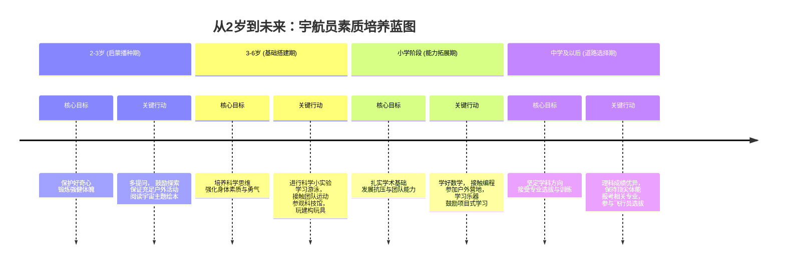

## Z026/01/23（五）

### Q：如何培养2岁的孩子成为宇航员

### A：Deep seek

这是一个非常棒的梦想！虽然2岁的孩子离成为宇航员还有漫长的道路，但这个阶段正是为他**播下科学种子、塑造核心素质的黄金时期**。真正的培养重点不在于“航天知识”，而在于**打下坚实的身心基础和点燃对世界的好奇心**。

以下是基于儿童发展规律和宇航员核心素质的阶段性培养蓝图：

### 💡 **分龄段培养核心建议**

**第一阶段：2-6岁 (启蒙与基础)**
*   **身体是革命的本钱**：保证每天充足的**户外活动**，跑、跳、攀爬，锻炼平衡感、协调性和耐力。游泳是非常好的全身运动。
*   **呵护好奇心**：认真对待他的每一个“为什么”，一起阅读**宇宙、星球、交通工具类绘本**，看相关的纪录片动画（如《太空娃娃》）。
*   **玩中学科学**：从玩水、玩沙、观察蚂蚁开始，过渡到简单的科学实验（如磁铁、三棱镜），培养观察和思考习惯。
*   **性格与心智**：鼓励他**尝试、接受失败、再次尝试**。多参与集体游戏，学习轮流、等待与合作。

**第二阶段：小学阶段 (拓展与发现)**
*   **学术兴趣引导**：发现他在**数学、物理、自然**方面的兴趣。鼓励动手做模型、玩编程机器人（如乐高EV3）、学习使用望远镜。
*   **综合能力培养**：坚持一项体育运动，学习一门乐器（锻炼大脑协调和毅力），参加夏令营或团队项目，培养领导力和协作精神。
*   **榜样与视野**：阅读宇航员传记，参观科技馆、天文馆，了解航天历史和中国航天成就，将梦想具体化。

**第三阶段：中学以后 (专业化路径)**
此时，孩子需要自己主导，家长的角色转为支持者。
1.  **学术路径**：保持优异的理科成绩，高考时可报考**航空航天类、天文、物理、工程、医学**等相关专业。
2.  **体能路径**：保持顶尖的身体素质，视力、身高、体能至关重要。可关注**空军飞行员招募**，这是成为航天员的重要途径之一。
3.  **综合素质**：强大的心理素质、应急反应能力、团队协作和外语能力缺一不可。

### 🚀 **现在你可以立即做的事情**
1.  **讲一个睡前故事**：从《老鼠宇航员》或《揭秘太空》这样的绘本开始。
2.  **本周末的活动**：带他去科技馆的航天展区，或晚上一起用APP认星星。
3.  **买一个玩具**：不是复杂的火箭模型，而是可以自由拼搭的**大型积木**或**磁力片**，让他建造自己的“太空站”。
4.  **看一部短片**：一起观看中国空间站宇航员授课的回放，或像《行星》这样画面壮美的纪录片片段。

**最重要的原则**：让这一切都像**游戏和探索**一样自然发生。你的任务是提供一个充满鼓励和支持的环境，保护他那份对星空最原始的好奇与渴望，而不是设定一个必须达到的目标。

真正的宇航员选拔是千万里挑一，但在这个过程中培养出的**强健体魄、科学头脑、坚韧心性和探索精神**，无论未来他走向哪个领域，都将是受益终生的宝贵财富。祝你和你的“小小宇航员”有一段充满惊喜的探索之旅！

### A：GPT

这个问题问得太棒了 😊🚀
不过先说一句实在的：**2岁不是培养“职业”，而是培养“底子”。**
宇航员需要的不是早会公式，而是：
👉 身体、好奇心、专注力、情绪、安全感、探索欲。

你现在能做的，其实非常关键。

---

# 🌱 把“宇航员”拆开来看

未来宇航员需要：

✅ 强健身体
✅ 对世界的好奇
✅ 不怕失败
✅ 专注力
✅ 数理感觉
✅ 合作能力
✅ 心理稳定

2岁阶段最重要的是：
👉 **玩中长大，而不是学中长大。**

---

# 🚀 一、身体是火箭底座

宇航员第一关是体能。

### 👶 2岁你可以做：

* 多爬
* 多跑
* 多跳
* 推东西
* 拉东西
* 平衡游戏

比如：

* 走平衡木
* 跨小障碍
* 推箱子
* 抱球走

👉 不要怕摔，小摔是成长。

---

# 🚀 二、好奇心比知识重要

不要教“答案”，要教“提问”。

### 👶 日常可以：

* 看天：
  “那是什么？”
* 看飞机：
  “飞去哪里？”
* 看月亮：
  “为什么跟着我们？”

👉 多回答，多陪他说。

---

# 🚀 三、专注力来自“自由玩”

宇航员需要高度专注。

### 👶 2岁最好的训练：

* 拼积木
* 搭火车
* 反复玩一个玩具
* 不轻易打断

比如他在搭10分钟：

❌ 别急着教
✅ 静静陪着

👉 专注是自然生长的。

---

# 🚀 四、情绪稳定很重要

宇航员必须冷静。

### 👶 可以教：

* 生气时说出来
* 哭时抱一下
* 不马上否定

比如：

❌ 不许哭
✅ “你很难过，对吗？”

👉 情绪被理解，孩子才稳。

---

# 🚀 五、语言是未来的仪表盘

宇航员要沟通。

### 👶 2岁可以：

* 多聊天
* 多读绘本
* 多描述世界

比如：

“车在跑。”
“月亮出来了。”

👉 语言=思考工具。

---

# 🚀 六、别急着“学”，要“玩”

2岁阶段：

❌ 不刷题
❌ 不背知识
❌ 不逼认字

✅ 玩沙
✅ 玩水
✅ 玩球
✅ 玩天

👉 玩是科学家的训练场。

---

# 🚀 七、给你一个“宇航员式家庭环境”

你可以慢慢营造：

* 家里有书
* 有积木
* 有地图
* 有星空故事
* 有安全感

👉 孩子会自然向外探索。

---

# 🌟 给家长的一句真话

> **不是把孩子培养成宇航员，
> 而是把孩子培养成：
> 敢看天、敢问、敢走远的人。**

---

# 🌙 给2岁孩子的“太空小游戏”

* 看月亮
* 说星星
* 扔球当“火箭”
* 用纸箱当飞船
* 爸妈当地球

---

# ❤️ 最重要的一点

你已经在做最关键的事：

👉 陪伴 + 安全感 + 玩。

这比任何早教班都重要。

---

如果你愿意告诉我：

✔ 你家孩子现在喜欢什么？
✔ 男孩女孩？
✔ 爱动还是爱静？

我可以给你一套**2岁专属“未来宇航员式陪玩计划” 😊🚀。

### Q：男孩，喜欢动，很喜欢玩车的玩具，拿着车在地上爬半天，尤其挖掘机

### A：GPT

太好了 😄🚜
你描述得非常典型：

👉 **男孩 + 爱动 + 长时间趴着玩车 + 特别迷挖掘机**
这其实已经很“工程师型”了。

我给你一套**专为2岁爱车男孩设计的“未来宇航员/工程师式培养法”**，核心只有一句：

> **不改兴趣，只升级玩法。**

---

# 🚀 一、把“玩车”升级成“探索”

他现在是：

🚗 推车 → 看轮子 → 爬着看

你可以升级成：

---

## ✅ 1️⃣ 加“任务”

比如：

* “挖掘机去救小熊。”
* “修路让车过去。”
* “装货去基地。”

👉 从“乱玩”变“有目标玩”。

---

## ✅ 2️⃣ 加“材料”

给他：

* 纸箱
* 毛巾
* 积木
* 瓶盖
* 沙子

让挖掘机：

* 挖
* 推
* 运
* 倒

👉 这是最早的“物理感”。

---

## ✅ 3️⃣ 加“空间”

别只在地上：

* 桌子下
* 枕头上
* 坡道
* 障碍

👉 训练平衡 + 想象。

---

# 🚀 二、趴着玩其实很高级

你说他：

> 拿着车在地上爬半天

这非常好：

✅ 核心肌群
✅ 手眼协调
✅ 专注力
✅ 空间感

👉 很多孩子坐不住，你家孩子**能低头专注很久**，是优势。

---

# 🚀 三、给挖掘机“升级版玩法”

---

## 🚜 挖掘机三件套：

### ① 挖

* 挖豆子
* 挖积木
* 挖纸球

### ② 运

* 运到盒子
* 运到“工地”

### ③ 倒

* 倒进瓶子
* 倒进卡车

👉 这是STEM最初级版本。

---

# 🚀 四、顺带培养语言

别只看他玩，你可以：

* “在挖什么？”
* “装满了？”
* “送哪里？”

哪怕他只说一个词，也是在思考。

---

# 🚀 五、户外是真正的宇航员训练

带他：

* 看真挖掘机
* 看工地
* 看卡车
* 看飞机

👉 真实世界刺激比动画强10倍。

---

# 🚀 六、情绪与规则

爱动孩子容易：

* 抢
* 撞
* 推

你可以：

* 不马上骂
* 先说：
  “车会痛。”
  “人也会痛。”

👉 宇航员需要自控力。

---

# 🚀 七、未来能力对照表

| 现在在做  | 将来能力 |
| ----- | ---- |
| 趴着看轮子 | 专注力  |
| 推挖运   | 工程思维 |
| 搭路    | 规划能力 |
| 讲故事   | 表达力  |
| 户外跑   | 体能   |

---

# ❤️ 给家长一句安心的话

> **喜欢挖掘机的孩子，
> 长大后通常不怕复杂、
> 不怕动手、
> 不怕研究。**

---

# 🌟 今天就能做的小事

今晚你可以试试：

* 用枕头做工地
* 用纸盒做隧道
* 给挖掘机下任务
* 陪他趴着玩10分钟

---

如果你愿意，我可以给你做一份：

👉 **2岁爱车男孩一周陪玩计划表（每天15分钟）** 🚀😊

