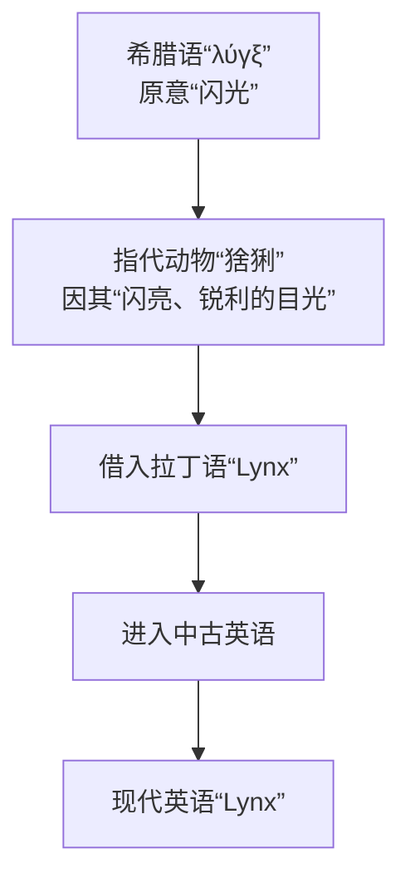

## Z026

很好的一句主题句 👍
**「默默无声，专等候神」**出自《圣经·诗篇》62篇，是非常适合和孩子、也适合大人一起体会的“生命态度”型表达。下面我按你一贯喜欢的**语源＋语义＋多语对照＋文学影视引用＋记忆法**方式系统整理。

---

# ✅ 原文出处

📖 **诗篇 62:1**

**中文（和合本）**

> 我的心默默无声，专等候神；我的救恩是从他而来。

---

## ✨ 一、希伯来语（原文）

**原文：**

> אַךְ אֶל־אֱלֹהִים דּוּמִיָּה נַפְשִׁי מִמֶּנּוּ יְשׁוּעָתִי

**转写：**

> Akh el-Elohim dumiyyāh nafshi, mimennu yeshu‘āti.

---

### 🔎 关键词解析

### ① דּוּמִיָּה (dumiyyāh)

**语源：**
来自动词 **דמם (damam)**
意思：

* 静止
* 沉默
* 安息
* 不再躁动

👉 不是“没声音”，而是**情绪与意志的安静**。

✔ 含义层次：

> 不抱怨、不挣扎、不恐慌，而是把心放下。

---

### ② נַפְשִׁי (nafshi)

来自 **נֶפֶשׁ (nefesh)**
意思不是单纯“灵魂”，而是：

* 心
* 生命
* 情感中心

👉 表示**整个内在的人**在等候。

---

### ③ יְשׁוּעָתִי (yeshu‘ati)

来自 **יָשַׁע (yasha')**
意思：

* 拯救
* 解脱
* 安全

👉 和“耶稣 Yeshua”同源。

---

✅ **希伯来语整体含义：**

> 我的内心完全安静下来，只面向神，我的安全与出路只从他而来。

---

---

## ✨ 二、希腊语（七十士译本 LXX）

**原文：**

> οὐχὶ τῷ θεῷ ὑποταγήσεται ἡ ψυχή μου· παρ’ αὐτοῦ γὰρ τὸ σωτήριόν μου.

---

### 🔎 核心词

### ① ὑποτάσσω (hypotassō)

意思：

* 排列在下面
* 顺服
* 安放自己

👉 不是被迫，而是**主动放下控制权**。

---

### ② σωτήριον (sōtērion)

来自 **σῴζω (sōzō)**
意思：

* 拯救
* 医治
* 保全

👉 不只是“得救”，也包含**心灵稳定与恢复**。

---

✅ 希腊思想侧重：

> 心不是乱跑，而是主动归位。

---

---

## ✨ 三、英语

📖 **NIV**

> Truly my soul finds rest in God; my salvation comes from him.

---

### 🔎 关键词

### ① rest

语源：拉丁 **restare**
意思：

* 停止对抗
* 不再消耗

👉 是**停止内耗的安息**。

---

### ② soul

来自希腊 **psyche**
表示：

* 情绪
* 意志
* 思考中心

---

✅ 英语表达重点：

> 心不再自己救自己，而是停下来。

---

---

## ✨ 四、日语

📖 新共同译

> 私の魂はただ神にのみ沈黙し、救いは神から来る。

---

### 🔎 关键词

### ① 沈黙（ちんもく）

不是“闭嘴”，而是：

* 不争辩
* 不慌乱
* 不抱怨

👉 日语带有**内心静止感**。

---

### ② 魂（たましい）

日语中比“心”更深，表示：

* 人的根部
* 生命方向

---

✅ 日语重点：

> 心的深层停止躁动。

---

---

## ✨ 五、韩语

📖 개역개정

> 나의 영혼이 잠잠히 하나님만 바라며 나의 구원이 그에게서 나오는도다.

---

### 🔎 关键词

### ① 잠잠히 (jam-jam-hi)

意思：

* 安静
* 稳住
* 不乱动

👉 韩语强调**情绪被安抚**。

---

### ② 바라며

意思：

* 注视
* 期待
* 依靠

---

---

## ✨ 六、越南语

📖

> Linh hồn tôi yên lặng nơi Đức Chúa Trời; sự cứu rỗi tôi đến từ Ngài.

---

### 🔎

### ① yên lặng

= 安静、平稳、不翻腾

### ② cứu rỗi

= 拯救、解放、保护

---

---

# 🎬 七、文学影视中的“等候式沉默”

---

## 📘 1️⃣ 《沉默》（远藤周作）

📍 场景：
神父在痛苦中祷告，却没有立即回应。
正是“dumiyyāh”式沉默——不是没有神，而是**人在学习放下控制**。

---

## 📘 2️⃣ 《老人与海》（海明威）

📍 场景：
老人夜里独坐小船，什么都不说，只和大海共处。

👉 是“rest in God”式内心稳定。

---

## 📘 3️⃣ 《肖申克的救赎》

📍 场景：
安迪被关禁闭时，内心安静地计划未来。

👉 沉默不是放弃，而是储能。

---

---

# 🧠 八、记忆法（适合给孩子讲）

### ✅ 形象法

👉 想象：
一杯水在摇晃时是浑浊的。
放下不动，泥沙自然沉底。

✔ 心也是这样。

---

### ✅ 语言拆解法

**默默无声 = 不吵**
**专等候 = 不跑**
**等候神 = 不慌**

👉 不吵、不跑、不慌。

---

### ✅ 生活化说法

可以对孩子说：

> 有时候不是马上解决问题，
> 而是先让心坐下来。

---

---

# 🌱 九、适合和孩子说的一句话版

**中文：**

> 先让心安静下来，再去想办法。

**日文：**

> まず心を静かにしてから、考えよう。

**English：**

> Calm your heart first, then act.

---

---

如果你愿意 😊
我可以下一步给你做：

✔ 儿童版《生命重要的事》对话稿
✔ 亲子灵修5分钟小册
✔ 中日双语朗读版
✔ 或结合你孩子年龄设计理解版

告诉我孩子大概年龄，我可以再“降阶”优化一次 🌱。

## Z025年

以下是“智慧胜过愚昧，如同光明胜过黑暗”的翻译和相关语源语义分析：

---

### **1. 翻译**
- **希伯来语**:  
  *החכמה עדיפה על הכסילות, כמו שהאור עדיף על החושך.*  
  *(HaChokhmah adifa al haksilut, kemo sheha'or adif al hachoshech.)*

- **希腊语**:  
  *Η σοφία είναι ανώτερη από την ανοησία, όπως το φως είναι ανώτερο από το σκοτάδι.*  
  *(I sofía eínai anóteri apó tin anoisía, ópos to fos eínai anótero apó to skotádi.)*

- **日语**:  
  *知恵は愚かさに勝り、光が闇に勝るようなものだ。*  
  *(Chie wa orokasa ni masari, hikari ga yami ni masaru yōna mono da.)*

- **英语**:  
  *Wisdom is better than folly, as light is better than darkness.*

- **越南语**:  
  *Sự khôn ngoan vượt trội hơn sự ngu ngốc, giống như ánh sáng vượt trội hơn bóng tối.*

---

### **2. 语源语义分析**
#### **希伯来语 (חכמה וחושך)**:
- **חכמה (Chokhmah)**:  
  来源于《圣经》，意指“技能、智慧、洞察力”。它不仅指知识，还包含道德和实践智慧。  
- **כסילות (Kesilut)**:  
  表示“愚昧、无知”，常用于描述缺乏精神启迪的人。  
- **אור וחושך (Or veChoshech)**:  
  “光明”和“黑暗”在《创世记》中常见，象征善恶对比和神圣启示。

#### **希腊语 (Σοφία και Σκοτάδι)**:
- **Σοφία (Sophia)**:  
  古希腊哲学中的核心概念，意味着“智慧、知识”，也是智慧女神雅典娜的象征。  
- **Σκοτάδι (Skotádi)**:  
  表示“黑暗”，源于词根 *skot-*，象征混乱和无知。

#### **日语 (知恵と闇)**:
- **知恵 (Chie)**:  
  日本文化中的“智慧”，与禅宗哲学关联，强调直观和实践的结合。  
- **闇 (Yami)**:  
  表示“黑暗”，在日语文学中象征内心的挣扎或未知领域。

#### **英语 (Wisdom and Darkness)**:
- **Wisdom**:  
  源于古英语 *wīsdōm*，意思是“明智的判断”，与希腊 *Sophia* 同义。  
- **Darkness**:  
  从古英语 *deorc* 演化而来，常用于比喻罪恶、无知或恐惧。

#### **越南语 (Khôn ngoan và Bóng tối)**:
- **Khôn ngoan**:  
  与儒家思想相关，强调智慧和德行的结合。  
- **Bóng tối**:  
  表示“黑暗”，常与压迫和无知联系在一起。

---

### **3. 典型例句**
- 希伯来语:  
  *אדם חכם יודע שהאור ינצח את החושך.*  
  *(Adam chacham yodea sheha'or yenatzeach et hachoshech.)*  
  翻译：智慧的人知道光明终将战胜黑暗。

- 希腊语:  
  *Η σοφία είναι το φως που οδηγεί τον δρόμο.*  
  *(I sofía eínai to fos pou odigeí ton drómo.)*  
  翻译：智慧是引导道路的光明。

- 日语:  
  *知恵の光は、闇を追い払う。*  
  *(Chie no hikari wa, yami o oiharau.)*  
  翻译：智慧之光驱散黑暗。

- 英语:  
  *The light of wisdom drives away the darkness of ignorance.*

- 越南语:  
  *Ánh sáng của sự khôn ngoan xua tan bóng tối của sự ngu dốt.*  
  翻译：智慧的光明驱散了无知的黑暗。

---

### **4. 文学与影视中的用例**
- **《圣经·传道书》（Ecclesiastes 2:13）**:  
  原句：“我看见智慧胜过愚昧，如同光明胜过黑暗。”这是该概念的经典出处，用于强调智慧和愚昧的本质对比。

- **电影《指环王》（The Lord of the Rings）**:  
  甘道夫（Gandalf）的一句话：“All we have to decide is what to do with the time that is given us.”  
  象征智慧引导人们走出黑暗。

- **日语动漫《火影忍者》（Naruto）**:  
  鸣人通过学习和成长克服自己的“内心黑暗”，象征智慧战胜愚昧。

- **越南文学《金云翘传》**:  
  主人公通过智慧摆脱悲剧命运，体现光明战胜黑暗的主题。

这些例子展示了该概念在不同文化中的深远影响和普遍意义。

## Z026/01/25（日）

很好选这个词 👍。
**隔たり（へだたり）** 是 N1 非常核心、而且在文学、评论、教育语境里很常见的词，也正好和你之前学《故乡》里“隔膜”的概念呼应。

下面给你系统整理：

✅ **语源 + 构词分析**
✅ **语义层次**
✅ **例句（标注读音 + 中英）**
✅ **常见搭配**
✅ **记忆法（适合你长期备考 N1）**

---

# 📘 隔たり（へだたり）

---

## 一、语源与构词

### 🔹 动词来源

**隔たる（へだたる） → 隔たり（名词化）**

* 隔（へだ）＝ 分开、阻隔
* たる ＝ 状态动词
* 隔たり＝「被隔开的状态」

本义是：

> ✅ **空间上被隔开**
> ✅ **关系上被隔开**
> ✅ **心理上被隔开**

---

### 🔹 汉字本义

**隔**

* 原义：中间有墙、有屏障
* 引申：阻挡、分离、差距

所以：

> **隔たり = 中间有一道“看不见的墙”。**

---

## 二、语义层次

隔たり不是单纯“距离”，而是：

| 层次 | 含义      |
| -- | ------- |
| 物理 | 空间距离    |
| 社会 | 身份、阶层差距 |
| 心理 | 情感隔阂    |
| 认知 | 想法不同    |

所以在文学中，它常翻译成：

👉 隔阂
👉 距离感
👉 心理壁垒

---

## 三、常见搭配

* 心の隔たり（こころのへだたり）
* 世代の隔たり（せだいのへだたり）
* 貧富の隔たり（ひんぷのへだたり）
* 二人の隔たり
* 距離の隔たり

动词：

* 隔たりがある
* 隔たりが生まれる
* 隔たりを感じる
* 隔たりをなくす

---

## 四、例句（含读音 + 中英）

---

### ① 文学风

二人（ふたり）の間（あいだ）には、目（め）に見（み）えない**隔（へだ）たり**があった。

CN：两人之间有一道看不见的隔阂。
EN：There was an invisible gap between the two.

---

---

### ② 家庭场景

親（おや）と子（こ）の**隔（へだ）たり**が、少（すこ）しずつ縮（ちぢ）まってきた。

CN：父母和孩子的隔阂渐渐缩小。
EN：The gap between parent and child gradually narrowed.

---

---

### ③ 社会评论

都会（とかい）と地方（ちほう）の**隔（へだ）たり**は、今（いま）も大（おお）きい。

CN：城市与地方的差距仍然很大。
EN：The gap between cities and rural areas is still large.

---

---

### ④ 心理描写

彼女（かのじょ）は彼（かれ）との**隔（へだ）たり**を感（かん）じ取（と）っていた。

CN：她感受到了与他之间的隔阂。
EN：She sensed the distance between them.

---

---

### ⑤ 教育语境

世代（せだい）の**隔（へだ）たり**を越（こ）える対話（たいわ）が必要（ひつよう）だ。

CN：需要跨越代际隔阂的对话。
EN：Dialogue that crosses generational gaps is needed.

---

---

## 五、近义比较

| 词   | 差别      |
| --- | ------- |
| 距離  | 偏物理     |
| 差   | 客观差距    |
| 溝   | 情感对立    |
| 隔たり | 有“墙”的感觉 |

👉 **隔たり = 距离 + 心理壁垒**

---

## 六、N1考试点

JLPT 常考：

* 抽象用法
* 和「あいだ」搭配
* 和「生まれる・なくす・感じる」共现

例如：

👉 二人の間に隔たりが生じた。

---

## 七、记忆法（很适合你这种长期积累型）

---

### ✅ 1️⃣ 图像记忆

想象：

👨｜🧱｜👩

中间有一堵墙 = 隔たり。

---

---

### ✅ 2️⃣ 汉字联想

隔 = 有“阝 + 革 + 日”像一堵墙
👉 中间挡住 = 心被挡。

---

---

### ✅ 3️⃣ 句型记忆

直接背：

👉 **〜の間に隔たりがある。**
👉 **隔たりをなくす。**

---

---

### ✅ 4️⃣ 和《故乡》联想

你之前学过：

> 希望水生和宏儿不要再有隔膜。

日语自然对应：

👉 **隔たりができないことを願う。**

把文学和词汇连起来，记忆最牢。

---

---

## 八、进阶用法

* 隔たる（动词）
  距離が隔たる
  心が隔たる

* 隔絶（かくぜつ）更强烈

* 溝（みぞ）更偏对立

---

---

如果你愿意，我可以下一步给你：

📘 **隔たり vs 距離 vs 溝 深度对比**
📗 **N1真题型填空练习**
📙 **《故乡》文学句式日语改写扩展**

---

👉 想继续哪个？

## Z025/11/23（日）

好的，我们来详细了解一下 **Lynx** 这个词。

### **发音**

*   **英式发音**： /lɪŋks/
*   **美式发音**： /lɪŋks/

**中文谐音参考**： “凌克斯”
**要点**： 这个词的发音关键在于 **“yn”** 这个组合，它发 **/ɪŋ/** 的音，类似于中文的“英”或英语单词 “**sɪŋ**k”（下沉）中的 “**ing**”。 结尾的 “x” 发 /ks/ 音。

---

### **介绍**

Lynx 主要有以下两层含义：

**1. 动物：猞猁**
猞猁是一种中型的猫科动物，以其独特的外形而闻名。主要特征包括：
*   **皮毛**： 通常为灰褐色或棕黄色，带有深色斑点。
*   **耳簇毛**： 耳朵尖上有一撮显眼的黑色耸立笔毛，这是它们最标志性的特征，用于增强听力。
*   **短尾**： 尾巴很短，像被切掉了一样。
*   **领毛**： 脸颊下有一圈长长的领毛，如同“络腮胡”。
*   **分布**： 主要分布在北美、欧洲和亚洲的北部森林、灌木丛和岩石山地中。它们是独行、敏捷的捕食者，以小型哺乳动物和鸟类为食。

常见的猞猁种类有：
*   **欧亚猞猁**
*   **加拿大猞猁**
*   **伊比利亚猞猁** 等。

**2. 天文学：天猫座**
在希腊神话中，天猫座是一只目光极其锐利的山猫，后来被宙斯升上天空化为星座。它是一个北天星座，星座内没有特别亮的星，但因其神话背景而闻名。

---

### **词源**

Lynx 这个词的历史源远流长，其演变过程清晰地反映了人们对这种动物最突出特点的认知。

如上图所示，这个词的根源是希腊语的 **“λύγξ”** ，其原意是 **“闪光”**。之所以用“闪光”来命名这种动物，是因为猞猁以其**极其锐利、明亮的目光**而著称。在古希腊和欧洲的民间传说中，猞猁被认为拥有能够**看穿障碍物**的非凡视力。

因此，英语中 **“lynx-eyed”** 这个形容词，就是用来形容一个人 **“目光锐利的、明察秋毫的”**。

这个古老的词根，精准地捕捉并一直传递着猞猁最引人注目的特质。

## Z025上半年 不要激动爱情，等她自发

## Z025二季度 温和的话

## Z025/04月 用口坚固

## Z025/04月三周 帐篷中的亮光

## Z025/04/16（三）弹美琴，浆浆PaddleX，琴，琴的声音

### “琴”是一个文化内涵极丰富的汉字，在不同语言和文化中都有一定的传承与对照。以下是对“琴”的发音、语源语义分析、常用词和多语言对照的整理：

---

## 一、日语发音与词义

### ◆ 发音：
- **音读**：きん（kin）  
- **训读**：こと（koto）

### ◆ 语义：
- 弦楽器（弦乐器）的一种，泛指古琴、箏等。也泛指“乐器”。
- 在日语中“琴（こと）”常作为传统日本弦乐器的代称。

---

## 二、语源与汉字结构分析

### ◆ 汉字结构：
- 部首：王（玉）
- 结构：左右结构，左为“王”（代表玉器、乐器），右为“今”

### ◆ 《说文解字》：
> 琴，五弦之乐也。从玉、今声。

古代“琴”是中国传统七弦乐器之一，传至日本后演化为“箏（こと）”等形式。

---

## 三、常见日语词汇与例句

| 单词           | 读音        | 含义               |
|----------------|-------------|--------------------|
| 琴             | こと         | 古筝、琴等弦乐器     |
| 琴を弾く       | ことをひく   | 弹琴               |
| 琴の音         | ことのね     | 琴声               |
| 琴線に触れる   | きんせんにふれる | 打动心弦，感动人心    |

**例句（日语）：**  
- 彼女は毎晩、美しい琴の音を奏でます。  
  *她每天晚上都会演奏美丽的琴声。*

- その言葉は私の琴線に触れた。  
  *那句话打动了我的心。*

---

## 四、对应语言翻译对照

| 语言     | 翻译       | 发音 / 注释                     |
|----------|------------|--------------------------------|
| 中文     | 琴         | qín，泛指弦乐器，尤指古琴等     |
| 英语     | zither / guqin / string instrument | 依据具体琴种而异，如古琴用“guqin”|
| 韩语     | 거문고 / 금 (금) | 거문고 指古琴，금是汉字音     |
| 越南语   | đàn cầm / đàn tranh | 前者泛指琴，后者指筝         |
| 希伯来语 | נבל (Nevel) / כלי מיתר (kli meitar) | 前者为圣经中琴类，后者是弦乐器通称 |
| 希腊语   | κιθάρα (kithára) / έγχορδο όργανο | 类似琴的弦乐器，如吉他或竖琴等 |

---

## 五、参考补充说明

- 日本的“琴（こと）”演化为和风乐器，如“十三弦箏（じゅうさんげんそう）”。
- 古汉语中，“琴瑟”常并列出现，象征和谐美满。
- 英语世界对“琴”的直接认知较少，常用拼音“guqin”或“zither”指代。

---

如需配合发音音频、琴类历史发展对照图、中日古琴演奏视频链接等，我也可以一并提供。需要继续扩展哪一部分内容吗？

## Z025一季度 温和的话

## Z025/01月 用口坚固

## Z025/01/05周 帐篷中的亮光

## Z025/01/10（五）

以下是“永生的神”翻译为多种语言的结果，并附上语源语义分析、典型例句及在文学影视中的应用：  

---

### **希伯来文 (Hebrew)**  
**翻译**: אלוהים החיים לנצח (Elohim HaChayim LaNetzach)  
- **语源与语义**:  
  - **אלוהים (Elohim)**: “神”，源自《圣经希伯来文》，常指全能的上帝。  
  - **החיים (HaChayim)**: “生命”，源自根词 ח.י.ה (chai)，意为“活着”或“生命”。  
  - **לנצח (LaNetzach)**: “永远”，意为无尽的时间或永恒。  

**典型例句**:  
- אנחנו מאמינים באלוהים החיים לנצח.  
  (Anachnu Ma'aminim Be'Elohim HaChayim LaNetzach.)  
  “我们相信永生的神。”  

**文学影视中的应用**:  
在《旧约圣经》中反复出现，比如《申命记》10:17：“因为耶和华你们的神是万神之神，万主之主，是至大的神。”  

---

### **希腊文 (Greek)**  
**翻译**: Θεός αιώνιος (Theos Aionios)  
- **语源与语义**:  
  - **Θεός (Theos)**: “神”，希腊神话与基督教中的常见词汇。  
  - **αιώνιος (Aionios)**: “永恒的”，来自 αιών (aion)，意为“时代”或“永恒”。  

**典型例句**:  
- Πιστεύουμε στον Θεό τον αιώνιο.  
  (Pistevoume ston Theó ton Aiónio.)  
  “我们相信永恒的神。”  

**文学影视中的应用**:  
常见于《新约圣经》的希腊原文，例如《罗马书》16:26：“按永生之神的命令显明出来。”  

---

### **拉丁文 (Latin)**  
**翻译**: Deus Aeternus  
- **语源与语义**:  
  - **Deus**: “神”，源自拉丁语，广泛用于基督教和罗马宗教。  
  - **Aeternus**: “永恒的”，源自 aetas（时代），表示没有时间限制的存在。  

**典型例句**:  
- Credimus in Deum Aeternum.  
  “我们信仰永恒的神。”  

**文学影视中的应用**:  
出现在《圣经·武加大译本》（Vulgata），如《申命记》33:27：“Deus aeternus est refugium tuum”（“永生的神是你的避难所”）。  

---

### **英文 (English)**  
**翻译**: The Eternal God  
- **语源与语义**:  
  - **Eternal**: 来自拉丁词“aeternus”，通过古法语进入英语，意为“没有开始和结束的”。  
  - **God**: 来源于日耳曼词根 *ghut-*，意为“神圣的存在”。  

**典型例句**:  
- We believe in the Eternal God.  
  “我们相信永恒的神。”  

**文学影视中的应用**:  
出现在《圣经·新国际版》（NIV），如《创世记》21:33：“亚伯拉罕呼求永生神的名。”  

---

### **日语 (Japanese)**  
**翻译**: 永遠の神 (Eien no Kami)  
- **语源与语义**:  
  - **永遠 (Eien)**: “永远”，来自汉字词，意为“无尽的时间”。  
  - **神 (Kami)**: “神”，日语中常指神道或基督教中的神。  

**典型例句**:  
- 私たちは永遠の神を信じています。  
  (Watashitachi wa Eien no Kami o Shinjiteimasu.)  
  “我们相信永恒的神。”  

**文学影视中的应用**:  
常见于基督教相关的日语圣经，如《新共同訳聖書》中《詩篇》90:2：“世々にわたり永遠の神。”  

---

### **越南语 (Vietnamese)**  
**翻译**: Đức Chúa Trời vĩnh cửu  
- **语源与语义**:  
  - **Đức Chúa Trời**: “神”，越南语中的基督教术语，源自汉越词汇。  
  - **Vĩnh cửu**: “永恒”，表示没有时间的限制。  

**典型例句**:  
- Chúng tôi tin vào Đức Chúa Trời vĩnh cửu.  
  “我们相信永恒的神。”  

**文学影视中的应用**:  
《越南圣经》中常见，如《诗篇》90:2：“从亘古到永远，祢是神。”  

---

### 总结  
“永生的神”在各语言中都承载了深厚的文化与宗教背景，其语义大多聚焦于“神性”和“永恒”。在文学和影视中，广泛出现在宗教经典和相关作品中，传递着希望和信仰的力量。

## Z024年

### **“像一棵树”的翻译**  

1. **日文**  
   - 翻译：**一本の木のように**（いっぽんのきのように）  
   - 逐字解释：  
     - 一本：指一棵（计数单位）。  
     - 木（き）：树。  
     - ように：像……一样。  

2. **英文**  
   - 翻译：**Like a tree**  
   - 逐字解释：  
     - Like：像。  
     - A tree：一棵树。  

3. **越南语**  
   - 翻译：**Giống như một cái cây**  
   - 逐字解释：  
     - Giống như：像……一样。  
     - Một：一。  
     - Cái cây：树。  

---

### **语源分析**  

1. **日文**  
   - 木（き）：来自上古日语，最早出现在《万叶集》，指生长的植物，象征生命力和稳固。  
   - ように：来源于中古日语，用于表达比喻。  

2. **英文**  
   - Tree：源自古英语 *trēow*，其词根与坚固、忠诚（true）的含义相关，象征稳定和成长。  
   - Like：源于古英语 *gelīc*，意为“相似的、如同”。  

3. **越南语**  
   - Cây：越南固有词，与周边民族语言中“植物”或“树木”相关，象征自然。  
   - Giống như：直译为“像……一样”，用来引导比喻句。  

---

### **文学与影视作品中的例句**  

1. **日文**  
   - **《人間失格》（太宰治）**：  
     *「人間も木のように、天に向かって伸びるべきものだ。」*  
     （人类也应该像树一样，向着天空生长。）  
     - **分析**：这里“木”象征生命的力量和追求成长的渴望。  

2. **英文**  
   - **《圣经》（Psalm 1:3）**：  
     *"He shall be like a tree planted by the rivers of water, that bringeth forth his fruit in his season."*  
     （他像一棵栽在溪水旁的树，按时候结果子。）  
     - **分析**：树象征祝福、成长与稳固。  

3. **越南语**  
   - **《Dế Mèn Phiêu Lưu Ký》（蟋蟀历险记，Tô Hoài）**：  
     *"Hãy sống mạnh mẽ như cái cây giữa giông bão."*  
     （要像风暴中的树一样强壮地活着。）  
     - **分析**：强调在困难中的坚持与生命力。  

---

### **总结与记忆方法**  
- **核心象征**：树在多种语言和文化中代表生命、坚韧与成长。  
- **记忆技巧**：通过文学和宗教中的比喻句反复联系，牢记“树”作为自然的象征和个人成长的隐喻。  

## Z024下半年

### **“在他经营的事上喜乐”的翻译**  

1. **日文**  
   - 翻译：**彼が行う事に喜びを見いだす**（かれがおこなうことによろこびをみいだす）  
   - 逐字解释：  
     - 彼（かれ）：他。  
     - 行う事（おこなうこと）：经营的事、所做的事。  
     - 喜び（よろこび）：喜乐、喜悦。  
     - 見いだす（みいだす）：找到、发现。  

2. **英文**  
   - 翻译：**Find joy in what he does**  
   - 逐字解释：  
     - Find joy：找到喜乐。  
     - In what he does：在他所做的事情中。  

3. **越南语**  
   - 翻译：**Tìm thấy niềm vui trong những việc anh ấy làm**  
   - 逐字解释：  
     - Tìm thấy：找到。  
     - Niềm vui：喜乐、快乐。  
     - Trong những việc：在事情中。  
     - Anh ấy：他。  
     - Làm：做。  

---

### **语源分析**  

1. **日文**  
   - 喜び（よろこび）：来源于古日语，最早见于平安时代文献，用于表达内心的愉悦、幸福感。  
   - 行う（おこなう）：来源于中古日语，意指执行或处理某事，与“经营”有相似含义。  

2. **英文**  
   - Joy：源于拉丁语 *gaudia*，通过古法语进入英语，意指极大的幸福感和喜悦。  
   - Do：来源于古英语 *dōn*，意指执行或完成任务。  

3. **越南语**  
   - Niềm vui：越南语固有词，“niềm”意为情感、状态，“vui”意为快乐或愉悦。  
   - Tìm thấy：指找到、发现，与生活中寻找意义和满足感相关。  

---

### **文学与影视作品中的例句**  

1. **日文**  
   - **《徒然草》（吉田兼好）**  
     *「人はその行うことに喜びを見いださねばならぬ。」*  
     （人必须在自己的所作所为中找到喜悦。）  
     - **分析**：这里“喜び”与人生的满足感紧密联系，体现内心的平和。  

2. **英文**  
   - **《圣经·传道书》（Ecclesiastes 3:22）**  
     *"So I saw that there is nothing better than for a man to rejoice in his work."*  
     （因此，我看见人能在他所做的事上喜乐，别无更好的事。）  
     - **分析**：强调在日常工作中找到喜悦的重要性，与句子表达相契合。  

3. **越南语**  
   - **《Người Nam Châm》（吸引力法则，Jack Canfield）**  
     *"Bạn cần tìm thấy niềm vui trong những việc bạn làm hàng ngày."*  
     （你需要在每天做的事情中找到快乐。）  
     - **分析**：越南文化中也强调从日常事务中寻找快乐，体现平和与满足感。  

---

### **总结与记忆方法**  
- **核心寓意**：句子强调在生活或工作中找到满足和喜悦。  
- **跨文化共通性**：无论是日语、英语还是越南语，都将“喜乐”视为人生幸福的重要来源。  
- **记忆技巧**：结合经典文学或宗教作品背诵，强化理解“喜乐”在个人成长和生活意义中的重要性。

## Z024 四季度

### **“言语要寡少”的翻译**  

1. **希伯来语**  
   - 翻译：**ריבוי דברים אינו טוב** *(Ribui dvarim eino tov)*  
   - 逐字解释：  
     - ריבוי (Ribui)：繁多。  
     - דברים (Dvarim)：言语、话语。  
     - אינו טוב (Eino tov)：不是好的、不合适的。  
   - 简化：话语多并非好事。  

2. **日文**  
   - 翻译：**言葉は少なくあるべきだ**（ことばはすくなくあるべきだ）  
   - 逐字解释：  
     - 言葉（ことば）：言语。  
     - 少なく（すくなく）：少、寡。  
     - あるべきだ：应该是。  

3. **英文**  
   - 翻译：**Words should be few**  
   - 逐字解释：  
     - Words：言语。  
     - Should be：应该是。  
     - Few：寡少。  

4. **越南语**  
   - 翻译：**Lời nói nên ít thôi**  
   - 逐字解释：  
     - Lời nói：言语、话语。  
     - Nên：应该。  
     - Ít thôi：少一些。  

---

### **语源分析**  

1. **希伯来语**  
   - דברים (*Dvarim*)：来源于圣经希伯来语，最早见于《圣经·传道书》，泛指言语、表达或事物。  
   - ריבוי (*Ribui*)：意为“过多”，强调数量上的多余，与节制观念有关。  

2. **日文**  
   - 言葉（ことば）：起源于古日语“言（こと）”与“端（は）”的结合，意指语言的表达端点。  
   - 少なく（すくなく）：来源于日语古语“少し（すこし）”，表示数量少，常用于美德表达。  

3. **英文**  
   - Words：源于古英语 *word*，与日耳曼语系词根 *wer-（说话）* 相关，指语言的基本单位。  
   - Few：源于古英语 *feawa*，表示少量、节制。  

4. **越南语**  
   - Lời nói：越南固有词，“lời”意为言语或声音，“nói”是动词“说”的名词化。  
   - Ít：固有词，表示少量或有限，与简朴和内敛有关。  

---

### **文学与影视作品中的例句**  

1. **希伯来语**  
   - **《圣经·传道书》（Ecclesiastes 5:2）**  
     *"אל תבהל על פיך, ולבך אל ימהר להוציא דבר לפני האלהים."*  
     （翻译：不要急于开口，在上帝面前少说话。）  
     - **分析**：强调言语的节制与敬畏的态度。  

2. **日文**  
   - **《徒然草》（吉田兼好）**  
     *「多くを語らず、少ない言葉で心を伝える。」*  
     （翻译：不多言，用寡少的语言传达内心。）  
     - **分析**：日式美学中，简约言语体现深思熟虑与内在力量。  

3. **英文**  
   - **《圣经·箴言》（Proverbs 10:19）**  
     *"When words are many, sin is not absent, but he who holds his tongue is wise."*  
     （翻译：话多必失，节制言语是智慧。）  
     - **分析**：节制言语被视为智慧和谨慎的象征。  

4. **越南语**  
   - **《Lão Tử》**（老子）译文  
     *"Biết giữ lời, ít nói mới là đạo lý."*  
     （翻译：懂得守口如瓶，少说才是正道。）  
     - **分析**：在越南文化中，言语节制与儒家和道家思想密切相关。  

---

### **总结与记忆方法**  
- **文化共通性**：在各文化中，寡言少语都被视为美德，与深思熟虑、谦逊相连。  
- **记忆技巧**：通过经典文学和宗教语句反复诵读，感受言语节制的内在力量与价值。

## Z024/12月

### **“早晨要撒你的种”翻译及分析**  

---

#### **1. 希伯来语**  
- **翻译**：בבוקר זרע את זרעך *(Baboker z'ra et zar'acha)*  
- **逐字解释**：  
  - בבוקר (*Baboker*)：早晨。  
  - זרע (*Z'ra*)：播种。  
  - את (*Et*)：宾语标记。  
  - זרעך (*Zar'acha*)：你的种子。  
- **语源**：  
  - זרע (*Zara*)：希伯来语中表示“播种”或“传播”，字根广泛用于圣经中，象征播撒希望、努力或信仰。  
- **典型例句**：  
  - **《圣经·传道书》（Ecclesiastes 11:6）**  
    *"בבוקר זרע את זרעך ובערב אל תנח ידך."*  
    （中文翻译：早晨要撒你的种，晚上也不要歇手。）  
  - **分析**：鼓励在生命的每个时刻都要积极努力，无论结果如何。  

---

#### **2. 希腊语**  
- **翻译**：Το πρωί να σπείρεις τον σπόρο σου *(To proi na speireis ton sporou sou)*  
- **逐字解释**：  
  - Το πρωί (*To proi*)：早晨。  
  - Να σπείρεις (*Na speireis*)：你要撒种。  
  - Τον σπόρο σου (*Ton sporou sou*)：你的种子。  
- **语源**：  
  - σπείρω (*Speiro*)：古希腊语动词，意为“播种”或“传播”，在哲学和文学中象征知识和美德的散布。  
- **典型例句**：  
  - **《新约·马太福音》（Matthew 13:3）**  
    *"Ἰδοὺ ἐξῆλθεν ὁ σπείρων τοῦ σπείρειν."*  
    （中文翻译：看哪，撒种的出去撒种了。）  
  - **分析**：撒种在希腊文化中多指传播教义、智慧或善行。  

---

#### **3. 日文**  
- **翻译**：朝にあなたの種を蒔きなさい *(Asa ni anata no tane o makinasai)*  
- **逐字解释**：  
  - 朝に (*Asa ni*)：早晨。  
  - あなたの (*Anata no*)：你的。  
  - 種 (*Tane*)：种子。  
  - 蒔きなさい (*Makinasai*)：播撒（祈使形）。  
- **语源**：  
  - 種 (*Tane*)：古日语中表示种子或希望，常见于田园诗和寓言故事。  
  - 蒔く (*Maku*)：播种的动作，隐喻人生努力的起点。  
- **典型例句**：  
  - **《万叶集》**  
    *「種蒔く人の心を見てみよ」*  
    （中文翻译：看看播种之人的心意。）  
  - **分析**：在日语文学中，播种象征着希望、耕耘与对未来的期盼。  

---

#### **4. 英文**  
- **翻译**：In the morning, sow your seed.  
- **逐字解释**：  
  - In the morning：早晨。  
  - Sow your seed：播撒你的种子。  
- **语源**：  
  - Sow：源自古英语 *sawan*，意为播种，后引申为“努力”或“传播”。  
  - Seed：源自古英语 *sæd*，象征潜力或生命的起点。  
- **典型例句**：  
  - **《圣经·传道书》（Ecclesiastes 11:6）**  
    *"In the morning sow your seed, and at evening do not withhold your hand."*  
  - **分析**：强调勤奋与机会的重要性，广泛用于演讲和文学作品中。  

---

#### **5. 越南语**  
- **翻译**：Buổi sáng hãy gieo hạt giống của bạn.  
- **逐字解释**：  
  - Buổi sáng：早晨。  
  - Hãy gieo：请播种（祈使语气）。  
  - Hạt giống của bạn：你的种子。  
- **语源**：  
  - Gieo：越南固有词，表示播种，与辛勤耕耘相关。  
  - Hạt giống：表示种子，隐喻未来的希望和潜力。  
- **典型例句**：  
  - **越南格言**  
    *"Gieo hạt nào, gặt trái ấy."*  
    （中文翻译：播种什么，就收获什么。）  
  - **分析**：在越南文化中，播种象征着付出与回报，鼓励人们踏实努力。  

---

### **总结**  
- **语源共性**：各语言中的“播种”都与希望、努力和未来的潜力紧密相连。  
- **文化共性**：早晨播种象征开始努力，预示勤奋能带来未来的回报。  
- **记忆技巧**：通过圣经与文学例句，将这一象征意义融入学习中，便于记忆与理解。

## Z024/12/29周

得歇息

## Z024/12/30（一）

### **必用口坚固你们**  

---

#### **1. 希伯来文**  
- **翻译**: יְכֻנֶּךָּ בְּפִיךָ (Yekunekha Bephikha)  
  - יְכֻנֶּךָּ (Yekunekha): 他将坚固你们  
  - בְּפִיךָ (Bephikha): 用你的口  
- **语源语义**:  
  - יְכֻנֶּךָּ 源自“כון” (Kun)，意为“坚固”或“设立”。  
  - בְּפִיךָ 是 בְּ（通过）和 פִּי（口）的结合，表示“通过你的口”。  
- **典型例句**:  
  - "ה' יְכֻנֶּךָּ בְּפִיךָ לְדַבֵּר דִּבְרֵי אֱמֶת."  
    （主用你的口来坚固并传讲真理的话。）  

---

#### **2. 希腊文**  
- **翻译**: ἐν τῷ στόματί σου ἐδραιώσει (En tō stomati sou edraiosei)  
  - ἐδραιώσει (Edraiosei): 他将坚固  
  - ἐν τῷ στόματί σου (En tō stomati sou): 用你的口  
- **语源语义**:  
  - ἐδραιώσει 来自“ἐδραιόω”（Edraioō），意为“巩固”、“加强”。  
  - στόμα (Stoma): 表示口或语言的工具。  
- **典型例句**:  
  - "Ὁ Θεὸς ἐν τῷ στόματί σου ἐδραιώσει λόγους σοφίας."  
    （神会用你的口坚固智慧的话语。）  

---

#### **3. 拉丁文**  
- **翻译**: Confirmabit vos ore suo  
  - Confirmabit: 他将坚固  
  - Ore suo: 用他的口  
- **语源语义**:  
  - Confirmabit 来自“confirmo”，意为“加强”或“使坚定”。  
  - Ore 是“os”（口）的变化形式，表示通过言语的作用。  
- **典型例句**:  
  - "Deus confirmabit vos ore suo ad loqui veritatem."  
    （神将用他的口坚固你们，让你们讲述真理。）  

---

#### **4. 英文**  
- **翻译**: He will strengthen you with His mouth  
  - Strengthen: 坚固  
  - Mouth: 口  
- **语源语义**:  
  - Strengthen 来自古英语“strengþu”，意为“赋予力量”。  
  - Mouth 源自古英语“mūþ”，表示“语言的表达工具”。  
- **典型例句**:  
  - "God will strengthen you with His mouth to speak the truth."  
    （神将用他的口坚固你们，使你们能讲述真理。）  

---

#### **5. 日语**  
- **翻译**: 神はその口であなたを強める (Kami wa sono kuchi de anata o tsuyomeru)  
  - 強める (Tsuyomeru): 坚固  
  - その口 (Sono kuchi): 他的口  
- **语源语义**:  
  - 強める（Tsuyomeru）表示“使强大”或“加强”。  
  - 口（Kuchi）象征语言或表达。  
- **典型例句**:  
  - "神はその口であなたを強め、真実を語らせるでしょう。"  
    （神会通过他的口坚固你们，让你们讲述真理。）  

---

#### **6. 越南文**  
- **翻译**: Ngài sẽ làm vững mạnh các bạn qua miệng Ngài  
  - Làm vững mạnh: 坚固  
  - Qua miệng Ngài: 通过他的口  
- **语源语义**:  
  - “Làm vững mạnh”表示“使稳固”。  
  - “Miệng”表示“口”，在越南语中常与言语相关。  
- **典型例句**:  
  - "Chúa sẽ làm vững mạnh các bạn qua miệng Ngài để chia sẻ sự thật."  
    （主将通过他的口坚固你们，让你们分享真理。）  

---

### **语源与语义分析总结**  
- **共同点**: 各语言表达通过“口”象征语言或言语作为坚固和建设的工具。  
- **文化背景**: 在宗教和哲学中，口被赋予力量的象征意义，既代表传播真理，也表示通过言语影响他人。  

---

### **文学与影视的应用**  

1. **《圣经》**:  
   - 本句在《约伯记》中强调神通过语言带来的支持和坚固，是对信徒的安慰。  

2. **影视**:  
   - **《国王的演讲》**: 通过练习语言表达来增强自信，展示了“用口坚固”的作用。  
   - **《神迹》**: 影片中多次使用祷告词，强调神通过话语赐予的力量。  

3. **文学**:  
   - **《沉默的羔羊》**: 在心理对话中展现语言的力量，可通过言语建立信任或施加影响。  
   - **日本文学**: 夏目漱石的《心》中语言的力量被用来修复情感关系。  

通过这些语言和文化的分析可以看到，"用口坚固"不仅是一种宗教表达，也是跨文化的象征性主题。

## Z024/12/29（日）

### **“温和的话”翻译：**  

#### **希伯来文**  
- **翻译**: דִּבְרֵי עֲנָוָה (Divrei Anavah)  
  - דִּבְרֵי (Divrei) = 话语  
  - עֲנָוָה (Anavah) = 温和、谦逊  
- **语源分析**:  
  - דִּבְרֵי源自“דבר”（Dabar），意为“话语”或“言词”。  
  - עֲנָוָה来自“עָנָו”（Anav），意为“谦逊”或“温和”。这两个词结合表示带有谦和语气的话语。  
- **例句**:  
  - "דִּבְרֵי עֲנָוָה יְרַפְּאוּ כַּעַס."  
    （温和的话语能平息愤怒。）  

---

#### **希腊文**  
- **翻译**: Ἡπία λόγια (Hēpia Logia)  
  - Ἡπία (Hēpia) = 温和  
  - λόγια (Logia) = 话语  
- **语源分析**:  
  - Ἡπία源自“ἤπιος”（ēpios），意为“温柔的”、“善良的”。  
  - λόγια源自“λόγος”（logos），意为“言语”或“逻辑”。  
- **例句**:  
  - "Ἡπία λόγια μαλακώνουν την καρδιά."  
    （温和的话语软化人心。）  

---

#### **拉丁文**  
- **翻译**: Verba Mitia  
  - Verba = 话语  
  - Mitia = 温和的  
- **语源分析**:  
  - Verba来自“verbum”，意为“单词”或“话语”。  
  - Mitia源自“mitis”，意为“柔和的”、“平静的”。  
- **例句**:  
  - "Verba mitia iram temperant."  
    （温和的话语能抚平怒火。）  

---

#### **英文**  
- **翻译**: Gentle Words  
  - Gentle = 温和  
  - Words = 话语  
- **语源分析**:  
  - Gentle源自拉丁语“gentilis”，意为“优雅的”或“温和的”。  
  - Words源自古英语“word”，与德语“Wort”同源，意为“话语”。  
- **例句**:  
  - "Gentle words can mend a broken heart."  
    （温和的话语可以治愈破碎的心灵。）  

---

#### **日语**  
- **翻译**: 優しい言葉 (Yasashii Kotoba)  
  - 優しい (Yasashii) = 温和  
  - 言葉 (Kotoba) = 话语  
- **语源分析**:  
  - 優しい源自日语的“優”（优），意为“温柔”、“善良”。  
  - 言葉是“言”（语言）和“葉”（词汇）的组合，表示“言语”或“话语”。  
- **例句**:  
  - "優しい言葉は人を癒す力があります。"  
    （温和的话语有治愈人的力量。）  

---

#### **越南文**  
- **翻译**: Lời Nói Dịu Dàng  
  - Lời Nói = 话语  
  - Dịu Dàng = 温和  
- **语源分析**:  
  - Lời Nói意为“言语”、“话语”。  
  - Dịu Dàng源自越南语，表示“柔和”、“温柔”。  
- **例句**:  
  - "Lời nói dịu dàng có thể làm dịu đi nỗi đau."  
    （温和的话语可以缓解痛苦。）  

---

### **语义与文化分析**  
1. **希伯来文**: 强调道德和谦逊，常见于圣经文学中，温和的话语能抚慰人心，是智慧的体现。  
2. **希腊文**: 在哲学和道德中常见，反映古希腊注重逻辑与情感平衡的价值观。  
3. **拉丁文**: 强调道德修养，是中世纪文学和宗教文本中的常用表达。  
4. **英文**: 日常生活与文学中频繁出现，常用于强调言语的治愈力量。  
5. **日语**: 带有文化礼仪色彩，体现人与人之间的温情交流。  
6. **越南文**: 强调柔和的力量与人际和谐，是传统美德的一部分。  

---

### **文学与影视中的应用**  

1. **文学**  
   - 《箴言》（圣经）："A gentle answer turns away wrath, but a harsh word stirs up anger."（箴言 15:1）  
   - 日语文学：《挪威的森林》中多次提到温柔话语对心理的治愈作用。  

2. **影视**  
   - **《风语者》**（Windtalkers）：主角通过温和的言语鼓舞队友士气。  
   - **日剧《一公升的眼泪》**：温柔的对话贯穿始终，表达亲情与希望。  

--- 

这些表达跨越语言和文化，表现出“温和话语”在人际关系中的重要性。

## Z024/12/22周

时刻试验他

**翻译：**  

1. **希伯来语**:  
   תְּבַחֲנֶנּוּ בְּכָל־רֶגַע  
   *(Tevachanennu b’khol-rega)*  
   字面意思：你每时刻试验他。

2. **希腊语**:  
   Δοκιμάζει αυτόν σε κάθε στιγμή.  
   *(Dokimázei aftón se káthe stigmí.)*  
   字面意思：他在每一刻试验他。

3. **日文**:  
   彼を毎時試し、評価する。  
   *(Kare o maiji tameshi, hyōka suru.)*  
   字面意思：每时刻试验并评估他。

4. **英文**:  
   He tests him at every moment.  

5. **越南语**:  
   Ngài thử thách anh ta từng khoảnh khắc.  
   字面意思：他每一刻都在试验他。

---

**语义分析：**  
这句话强调持续不断的试炼或考验，语气中隐含上帝或权威对人类的观察、评估和教育。表达中可能存在正面意义（锻炼信念）或负面情感（质疑为何试炼如此频繁）。  

**语源分析：**  
- **希伯来语**: 动词 “בַּחַן (Bachan)” 意为“试验、检验”，多见于圣经，表明评估一个人品格或信仰的过程。词语“רֶגַע (Rega)”意指“片刻、瞬间”，与时间的短暂性和连续性相关。  
- **希腊语**: 动词“Δοκιμάζω (Dokimázo)”常指“测试或检验”，尤其用于道德或灵性的评估，起源于古希腊哲学和宗教背景。  
- **其他语言**直接翻译了测试的持续性和时刻的细节。

---

**典型例句：**  

1. **文学作品**:  
   - 《约伯记》7:18（圣经）："What is man, that You magnify him, and that You are concerned about him, that You examine him every morning and test him every moment?"  
     这句话完整表达了上帝持续的观察和试炼人类的过程。  
   - 托尔斯泰《复活》中类似描述：“每时每刻都在灵魂深处拷问自己。”  

2. **影视影响**:  
   - 《耶稣受难记》（The Passion of the Christ）通过画面展现了耶稣在受难时刻的每一次试炼。  
   - 《楚门的世界》中，楚门的生活被无时无刻地观察和“测试”，隐喻社会对个人自由的挑战。

---

**文学和影视影响：**  
- 在文学中，这一表述常用于象征人类在上帝面前的卑微与重要性，同时揭示对信仰或道德的挑战。  
- 在影视作品中，这种持续的试验和观察被用来表现命运、自由意志和人类精神的抗争，如《肖申克的救赎》和《黑客帝国》。  

这种表达引发了哲学与宗教层面关于“试炼的意义”以及“自由与观察关系”的深刻讨论，成为重要的文学与艺术主题。

## Z024/12/28（六）

### **翻译**  

“使他得歇息”表达的是让某人获得休息、安息或从疲劳中解脱。以下是翻译：  

- **希伯来语**:  
  *להביא לו מנוחה*  
  （直译为“带给他休息”）  

- **希腊语**:  
  *Να του δώσεις ανάπαυση.*  
  （直译为“给予他安息”）  

- **拉丁语**:  
  *Ut ei requiem det.*  
  （直译为“使他得到安息”）  

- **英语**:  
  *To grant him rest.*  
  （直译为“赐予他休息”）  

- **日语**:  
  *彼に休息を与える。*  
  （直译为“给他休息”）  

- **越南语**:  
  *Cho anh ấy được nghỉ ngơi.*  
  （直译为“让他得到休息”）  

---

### **语源与语义分析**  

- **语源**:  
  1. **“歇息”**：古汉语中，“歇”意为停止，“息”意为休养，两字连用表达暂时停下、恢复精力的状态。  
  2. 在其他语言中，“休息”的词源与“停止”（如拉丁语 *requiem* 或希腊语 *ανάπαυση*）或“恢复”相关联。  

- **语义**:  
  1. **主要含义**：让某人从疲劳、工作或痛苦中解脱，恢复身心平静。  
  2. **隐喻含义**：在宗教语境中，可能指灵魂的安宁或永恒的安息。  

---

### **典型例句**  

1. **日常表达**:  
   - 中文：这个忙碌的周末过去了，终于可以让他得歇息了。  
   - 英文：After the busy weekend, he can finally have some rest.  
   - 日语：忙しい週末が終わり、彼はやっと休息を取ることができる。  

2. **文学表达**:  
   - 中文：他肩负的重担被卸下，终于得以歇息。  
   - 英文：The burden he carried was lifted, and he was finally granted rest.  

---

### **文学与影视作品中的应用**  

1. **宗教与哲学**:  
   - 在《圣经》中，类似表达常用于描述上帝给予信徒的安息。例如《马太福音》11:28：“凡劳苦担重担的人，可以到我这里来，我就使你们得安息。”  
   - 在佛教语境中，休息与“涅槃”或“放下”相关，表达解脱与平和的境界。  

2. **影视场景**:  
   - 在历史题材或战争片中，“使他得歇息”常表达一种人文关怀，例如战士从前线回家后的平静时刻。  
   - 在家庭剧中，类似场景可能表现为照顾者希望让亲人暂时脱离辛劳。  

3. **现代文学**:  
   - 文学作品中，作者常用“得歇息”描写从社会压力或情感痛苦中获得解脱的情节，体现人物成长或释然的心态。  

---

### **总结**  
“使他得歇息”是一种普遍适用于物理和心理层面的表达，带有浓厚的人文关怀。在翻译和语义上，它在日常、宗教和文学中均保持其核心含义。无论是中文还是其他语言，这句话常见于抚慰、关怀和深刻情感的场景中。

## Z024/12/27（五）

### **翻译**  
“把你的手缩回，不使你的惊惶威吓我”是一种文学性的表达，意指对方不要用威吓或压力使自己感到害怕。以下是翻译：  

- **希伯来语**:  
  *הסר את ידך, ואל תבהיל אותי בפחדך.*  
  （直译为“拿开你的手，不要用你的恐惧惊吓我。”）  

- **希腊语**:  
  *Τράβηξε το χέρι σου και μην με τρομάζεις με τον φόβο σου.*  
  （直译为“收回你的手，不要用你的恐惧吓唬我。”）  

- **拉丁语**:  
  *Retracta manum tuam, et noli me terrere metu tuo.*  
  （直译为“收回你的手，不要用你的恐惧吓唬我。”）  

- **英语**:  
  *Withdraw your hand, and do not frighten me with your fear.*  
  （直译为“收回你的手，不要用你的恐惧吓唬我。”）  

- **日语**:  
  *手を引っ込めて、その恐怖で私を脅かさないでください。*  
  （直译为“把你的手缩回，不要用恐惧吓唬我。”）  

- **越南语**:  
  *Rút tay của bạn lại và đừng làm tôi sợ bằng sự hoảng hốt của bạn.*  
  （直译为“收回你的手，不要用你的恐惧吓唬我。”）  

---

### **语源与语义分析**  

- **语源**:  
  这句话来源于古代宗教或哲学文本中的劝诫语句，多用于表达对压力或威吓的拒绝。  
  - “手”象征行动或威胁；  
  - “惊惶”表示心理上的恐惧或威慑；  
  - “缩回”隐含停止或避免的意思。  

- **语义**:  
  1. **主要语义**：请求对方停止威胁行为。  
  2. **隐含语义**：寻求一种平和或公平的对话方式，排除恐惧的干扰。  

---

### **典型例句**  

1. **日常表达**:  
   - 中文：把你的手缩回，不要再用你的态度让我害怕。  
   - 英文：Withdraw your hand and stop intimidating me with your attitude.  
   - 日语：手を引っ込めて、その態度で私を怖がらせないでください。  

2. **文学表达**:  
   - 中文：他缓缓说道：“把你的手缩回，不要用那冷冷的目光让我害怕。”  
   - 英文：He slowly said, "Withdraw your hand, and do not frighten me with that cold stare."  

---

### **文学与影视作品中的应用**  

1. **宗教与哲学**:  
   - 在宗教经文中类似表达常见于祈求和平或避免冲突。例如，《圣经》中约伯记包含“手”与“惊惶”相关的描述，用以探讨信仰与恐惧的关系。  
   - 哲学作品中，“缩回手”常作为克制力量的象征，例如对强权的反抗或对权威的平和抵制。  

2. **影视场景**:  
   - 在影视剧中，类似场景常出现在对峙中，一个人希望对方停止施压、表现诚意。  
   - 在东方武侠剧中，“把你的手缩回”或类似词语可能伴随着实际的防御动作，寓意强者的自律和威慑。  

3. **现代文学**:  
   - 在心理小说中，类似表达用来表现人物心理抗拒威胁、追求自尊的决心。  

---

### **总结**  
“把你的手缩回，不使你的惊惶威吓我”是一种强烈而充满象征意味的句式，传达了拒绝威胁与寻求平和的愿望。无论是翻译成其他语言还是用于文学和影视创作中，它都保留了原句的力量与深刻内涵，常用来表达人物在权力或冲突中的自我抗争。

## Z024/12/26（四）

### **翻译**  
以下为“耳朵岂不试验言语”的翻译：  

- **希伯来语**:  
  *האוזן האם לא תנסה את המילים?*  
  （直译为“耳朵是否不测试话语？”）  

- **希腊语**:  
  *Το αυτί δεν δοκιμάζει τα λόγια;*  
  （直译为“耳朵不试验言语吗？”）  

- **拉丁语**:  
  *Nonne auris verba probat?*  
  （直译为“耳朵岂不测试话语？”）  

- **英语**:  
  *Does not the ear test words?*  
  （直译为“耳朵不测试语言吗？”）  

- **日语**:  
  *耳は言葉を試さないのでしょうか？*  
  （直译为“耳朵难道不试验言语吗？”）  

- **越南语**:  
  *Tai chẳng phải thử nghiệm lời nói hay sao?*  
  （直译为“耳朵不是要测试语言吗？”）  

---

### **语源与语义分析**  

- **来源**:  
  该短语来自《圣经·约伯记》（Job 12:11），表达耳朵能辨别和审视言语的能力，类似味觉辨别食物。这是隐喻耳朵的智慧与分辨能力。  

- **语义**:  
  1. 耳朵象征接收与分辨的器官。  
  2. “试验言语”意为通过听觉甄别真伪、优劣，象征智慧与理性的审视过程。  
  3. 文中隐含“审慎聆听”的智慧行为。  

---

### **典型例句**  

1. **日常应用**:  
   - "Just as the ear tests words, the mind evaluates their meaning."  
     （耳朵试验言语，心灵评估其意义。）  

2. **文学**:  
   - “耳朵岂不试验言语，如同舌头品尝食物。”（改编自《约伯记》）  

3. **影视台词**:  
   - “Listen carefully; doesn’t the ear test the truth of words?”  

---

### **文学与影视作品中的应用**  

1. **文学**:  
   在《圣经》中，这句话象征智慧的听力与判断，常被引用讨论关于理解、分辨力的话题。  

2. **影视**:  
   许多历史或宗教题材的影视作品可能引用类似表达，例如角色在思考或判断某人话语时，会用这样的句子隐喻理性。  

3. **哲学讨论**:  
   该短语也常被哲学家或作家用于讨论人类如何通过听觉与语言建立认知和信任的关系。  

## Z024/12/25（三）

### **翻译**  
以下为“你也必坚固”的翻译：  

- **希伯来语**:  
  *וגם אתה תתחזק*  
  （直译为“你也会变得强大。”）  

- **希腊语**:  
  *Και εσύ θα δυναμώσεις.*  
  （直译为“你也会变得坚强。”）  

- **拉丁语**:  
  *Et tu firmaberis.*  
  （直译为“你也将被坚固。”）  

- **英语**:  
  *And you will be strengthened.*  
  （直译为“你也将变得坚强。”）  

- **日语**:  
  *あなたも強くされるでしょう。*  
  （直译为“你也会被坚固。”）  

- **越南语**:  
  *Và bạn cũng sẽ được củng cố.*  
  （直译为“你也将变得坚强。”）  

---

### **语源与语义分析**  

- **来源**:  
  这句话有宗教背景，可能来自《圣经》或类似劝慰性文本，强调内心或信仰的力量会使人坚固。  

- **语义**:  
  1. **“坚固”**指心理、信仰或意志的强大。  
  2. 表达一种鼓励，表明个人在逆境或困难中能获得支持和力量。  
  3. 在宗教背景中，“坚固”往往与神的祝福和支撑相关联。  

---

### **典型例句**  

1. **日常应用**:  
   - "Believe in yourself, and you will be strengthened."  
     （相信自己，你也必坚固。）  

2. **文学表达**:  
   - “你也必坚固，如同山巍然不动。”  

3. **激励语句**:  
   - “只要坚持信念，风雨之后，你也必坚固。”  

---

### **文学与影视作品中的应用**  

1. **文学**:  
   - 在励志作品中，这句话经常用来激励人们在逆境中找到力量。例如，《约伯记》中提到坚强的信心能使人重拾希望。  

2. **影视作品**:  
   - 在战争片、宗教题材或励志电影中，类似的台词会在主人公面临绝境时，用作鼓励和支撑信念的象征。  

3. **宗教背景**:  
   - 《圣经》中类似的语句如“主是我的力量，我也必坚固”（改编自《诗篇》），常用于祈祷和布道，表达对神恩典的信赖。  

---

### **总结**  
“你也必坚固”是一句充满力量和希望的语句，常用于鼓励和安慰他人，蕴含信仰和坚持的精神内核。它在宗教、文学和影视作品中都有广泛应用，象征着力量的传递与内心的稳固。

## Z024/12/24（二）

### **翻译**  

“久有此意”可以翻译为“长期以来怀有这样的想法或愿望”。以下是翻译：  

- **希伯来语**:  
  *מזמן הייתה לי כוונה זו*  
  （直译为“很久以来我有这个意图。”）  

- **希腊语**:  
  *Εδώ και καιρό είχα αυτήν την πρόθεση.*  
  （直译为“很久以来我有这个愿望。”）  

- **拉丁语**:  
  *Iam diu hoc consilium habui.*  
  （直译为“我早已怀有这个计划。”）  

- **英语**:  
  *I have had this intention for a long time.*  
  （直译为“我长期以来有这个意图。”）  

- **日语**:  
  *ずっとこの思いを持っていました。*  
  （直译为“我一直有这个想法。”）  

- **越南语**:  
  *Từ lâu tôi đã có ý định này.*  
  （直译为“我很久以来有这个意图。”）  

---

### **语源与语义分析**  

- **语源**:  
  “久有此意”是古汉语中的表达，意指某种想法或愿望在心中存续很久。“久”表示时间之长，“意”指意图、愿望、目标。  

- **语义**:  
  1. 表达一种长期的、坚定的愿望或计划。  
  2. 具有复古和正式的语气，常用于书信、文学或古文场景中。  

---

### **典型例句**  

1. **日常应用**:  
   - 中文：久有此意，只是未得其时。  
   - 英文：I have had this intention for a long time, but the timing was never right.  
   - 日语：ずっとこの思いを抱いていましたが、時機を得られませんでした。  

2. **文学表达**:  
   - 中文：久有此意，如今得偿所愿，真乃人生一大幸事。  
   - 英文：I have long harbored this desire, and now that it is fulfilled, it is truly one of life's great blessings.  

---

### **文学与影视作品中的应用**  

1. **文学**:  
   - 在中国古代诗文中，类似“久有此意”的表达常见于描述长久愿望的实现。例如，书信体的散文或诗歌中常用此词表达多年夙愿。  
   - 如《桃花源记》中：“久怀此意，忽得山川之间所见。”  

2. **影视作品**:  
   - 古装剧或文学改编的影视剧中，经常使用“久有此意”表达人物多年心愿或蓄谋的决心。  
   - 现代影视中，“久有此意”的意涵可以被翻译成类似“多年来一直想做某事”的表达，用于强调情节的伏笔或决心的强烈。  

3. **书信场景**:  
   - “久有此意”常用于正式或怀旧风格的书信表达，显得文雅且情感深厚。例如：  
     - “久有此意，只是事务繁忙，未能早日动笔，心中多有歉疚。”  

---

### **总结**  
“久有此意”是一种正式且富有文雅感的表达，适合用于文学作品、书信往来及影视台词，表达深刻的情感或长久的愿望。它在翻译成其他语言时，均强调了时间的持续性与愿望的深刻性，体现出文化的通用性与文字的精炼美感。

## Z024/12/23（一）

### **翻译**  

“心里有智慧”意为内心充满智慧和洞察力，以下是各语言翻译：  

- **希伯来语**:  
  *יש חכמה בלבך*  
  （直译为“你的心中有智慧。”）  

- **希腊语**:  
  *Υπάρχει σοφία στην καρδιά σου.*  
  （直译为“在你的心中有智慧。”）  

- **拉丁语**:  
  *Sapientia in corde tuo est.*  
  （直译为“智慧在你的心中。”）  

- **英语**:  
  *Wisdom is in your heart.*  
  （直译为“智慧在你的心中。”）  

- **日语**:  
  *心に知恵があります。*  
  （直译为“心中有智慧。”）  

- **越南语**:  
  *Trong lòng bạn có sự khôn ngoan.*  
  （直译为“在你的心中有智慧。”）  

---

### **语源与语义分析**  

- **语源**:  
  “心里有智慧”来源于古汉语，常见于哲学、文学和宗教语境，强调心灵的洞察力与智慧。  
  - “心”：指人的内心、思想、情感中枢。  
  - “智慧”：不仅是知识，更是处理复杂问题的能力，包括洞察力与判断力。  

- **语义**:  
  1. **内心的智慧**：强调智慧是由内而外的，而非表面的学识。  
  2. **哲学与宗教意涵**：内心的智慧常被视为生命的最高追求，表达人生的洞见和深刻理解。  

---

### **典型例句**  

1. **日常应用**:  
   - 中文：她虽年轻，但心里有智慧，处理问题从不莽撞。  
   - 英文：Although she is young, wisdom is in her heart, and she never handles matters rashly.  

2. **文学表达**:  
   - 中文：心里有智慧的人，如同夜空的明星，闪烁而不炫耀。  
   - 英文：A person with wisdom in their heart is like a star in the night sky—shining but never blinding.  

---

### **文学与影视作品中的应用**  

1. **文学**:  
   - 在《论语》、《道德经》等中国古典哲学中，智慧常与内心修养相关。“心里有智慧”常用以形容品德高尚或洞察力强的人。  
   - 《圣经》中类似表达如“智慧使人心明眼亮”（传道书 8:1），强调内心智慧的力量。  

2. **影视作品**:  
   - 在东方影视作品中，主人公通过冥想或修行获得“心里有智慧”的状态，常作为觉醒的重要标志。  
   - 在西方剧情中，类似情节多出现在导师型角色的对话中，用来启发年轻主人公（如《星球大战》中尤达的教导）。  

3. **宗教背景**:  
   - 基督教、佛教等宗教中都提到智慧与内心的关联：基督教强调“敬畏主是智慧的开端”；佛教提倡通过修行达到心灵的觉悟。  

---

### **总结**  
“心里有智慧”在不同文化中都有深远的意义，传递了内在智慧的重要性和生命哲学。它被广泛应用于文学、哲学和影视作品中，象征智慧与内心平和的结合。在翻译中，各语言均保留了其核心意涵，表现出智慧的普世价值。

## Z024/12/22（日）

喜乐充满你的口，欢呼充满你的嘴

**翻译：**  
1. **希伯来语**:  
   יִמָּלֵא פִּיךָ שָׂחוֹק וּפִיךָ רִנָּה  
   *(Yimaleh picha sachok u'picha rinah)*  
   字面意思：愿你的口充满笑声，愿你的嘴充满欢呼。

2. **希腊语**:  
   Γεμίσει το στόμα σου γέλιο και το στόμα σου χαρά.  
   *(Gemísei to stóma sou gélio kai to stóma sou chará.)*  
   字面意思：愿你的嘴充满笑声，愿你的嘴充满喜悦。

3. **日文**:  
   あなたの口は笑いで満たされ、あなたの唇は喜びで溢れるでしょう。  
   *(Anata no kuchi wa warai de mitasare, anata no kuchibiru wa yorokobi de afureru deshou.)*  
   字面意思：你的口中充满笑声，嘴唇充满欢呼。

4. **英文**:  
   May your mouth be filled with laughter and your lips with shouts of joy.  

5. **越南语**:  
   Miệng bạn sẽ tràn đầy tiếng cười, và môi bạn sẽ tràn ngập niềm vui.  
   字面意思：愿你的嘴充满笑声，嘴唇充满喜悦。

---

**语源分析：**  
- 这句话常见于宗教经典和文学作品，源自**希伯来圣经**，如《约伯记 8:21》。  
- 希伯来语的词“שָׂחוֹק (Sachok)”意为笑声，带有强烈的情感力量；“רִנָּה (Rinah)”意为欢呼或赞美，常用于诗篇和祈祷中。  
- 希腊语翻译受早期基督教影响（《七十士译本》）。  
- 英文翻译则广泛出现在圣经英文版本（如KJV、NIV）中。  
- 日语和越南语翻译受基督教传教士影响，后逐渐渗透入文学表达。

---

**典型的文学和影视例句：**  
1. **文学**:  
   - 《约伯记》中，这句话表达了上帝复兴受苦者的希望。  
   - 托尔金的《魔戒》中类似的句子反映欢乐时刻的到来：“Then their laughter was like silver bells.”  

2. **影视**:  
   - 《欢乐满人间》（**Mary Poppins**）：“Your laughter can fill the sky.”  
   - 越南电影《我看到黄色的花在绿草上》中，这种表达象征孩童的纯真与幸福感。  

这句话常用于鼓励与祝福，表达对未来幸福的期盼与信心。

## Z024/12/15周

## Z024/12/21（六）

每早鉴察他  

**翻译：**  

1. **希伯来语**:  
   יִפְקְדֶנּוּ לַבֹּקֶר  
   *(Yifkedennu laboker)*  
   字面意思：他在每早鉴察他。

2. **希腊语**:  
   Επισκέπτεται αυτόν κάθε πρωί.  
   *(Episképtetai aftón káthe proí.)*  
   字面意思：他每天早晨看顾他。

3. **日文**:  
   彼を毎朝訪れて、見守る。  
   *(Kare o mai asa otozurete, mimamoru.)*  
   字面意思：每天早晨探访并守护他。

4. **英文**:  
   He examines him every morning.  

5. **越南语**:  
   Ngài thăm dò anh ta mỗi buổi sáng.  
   字面意思：他每天早晨审查他。

---

**语源分析：**  
- 该句出自《约伯记》7:18，表达上帝对人的持续关注和关怀，虽带有监督的意味，也暗示对人的特别拣选和责任。  
- **希伯来语**中的动词“פקד (Pakad)”通常翻译为“鉴察、访问”，可正面指看顾，也可负面指审视。  
- **希腊语**采用动词“Επισκέπτεται (Episképtetai)”，意思是“访问、调查”，在《七十士译本》中加强了持续性意义。  
- **英文**翻译强调观察的性质，如NIV译为“examine”，KJV译为“visit”。  
- **日语**和**越南语**偏向直接翻译，但保留了探视和守护的涵义。

---

**典型的文学和影视例句：**  
1. **文学**:  
   - 在约翰·弥尔顿的《失乐园》中：“Each morning, His eyes sought to discern man's deeds.”（每早，他的目光寻求洞察人的行为。）  
   - 《战争与和平》中类似的描述，体现上帝或自然规律对人类行为的审视。

2. **影视**:  
   - 在电影《肖申克的救赎》中，瑞德说：“Each day brings a new test.”隐喻持续的试炼和观察。  
   - 圣经改编剧集中常以类似的台词表现上帝与人之间的亲密关系，如《十诫》。  

这句话在宗教和文学中常用于表达试炼、关注或特殊使命，体现对人类行为的洞察力和希望。

## Z024/12/20（五）

**得着所求的**

### **翻译**  

1. **日文**  
   - 得着所求的：**求めるものを得る**（もとめるものをえる）  
   
2. **英文**  
   - 得着所求的：**To obtain what one seeks** / **To achieve what one desires**  
   
3. **越南语**  
   - 得着所求的：**Đạt được điều mình mong muốn**  

---

### **语源分析**  

#### **日文：求める**  
- **语源**：源于古日语词“求む”（もとむ），意为“寻找、请求、需求”。这个词与“得る”（える，获得）结合，表达实现愿望的概念。  
- **用法**：常用于表达对物质、精神、或理想的追求。  

#### **英文：Obtain / Seek**  
- **Obtain**  
  - 来源于拉丁语“obtinere”（ob-：朝向，tenere：抓住），意为“通过努力获得”。  
- **Seek**  
  - 源自古英语“secan”，与日耳曼语中的同源词有关，表示“寻找或追求”。  

#### **越南语：Đạt được**  
- **Đạt**：来自汉字“達”，意为“达到、实现”。  
- **Được**：表示“获得、得到”的状态，与其结合表达成功实现目标的意义。  

---

### **典型文学与影视例句**  

#### **日文例句**  
- **《银河铁道之夜》（宮沢賢治）**  
  - 原文：求める幸せが他人を傷つけるものであってはならない。  
  - 翻译：所追求的幸福不应成为伤害他人的工具。  
  - **分析**：通过“求める”，探讨了个人欲望与道德的矛盾。  

#### **英文例句**  
- **《了不起的盖茨比》（F. Scott Fitzgerald）**  
  - 原文：He stretched out his arms toward the dark water, seeking something unreachable.  
  - 翻译：他伸出手臂，向黑暗的水面寻求着不可触及的东西。  
  - **分析**：“Seek”表现了主人公对梦想的执着与不可得之痛。  

#### **越南语例句**  
- **《Dế Mèn Phiêu Lưu Ký》（蟋蟀历险记，Tô Hoài）**  
  - 原文：Ai kiên nhẫn thì sẽ đạt được điều mình mong muốn.  
  - 翻译：耐心的人终将得着所求的。  
  - **分析**：通过“đạt được”，强调坚持与实现目标的因果关系。  

---

### **总结与记忆方式**  
- **核心概念**：得着所求的表达了通过努力最终实现愿望的过程。  
- **跨语言相通性**：日语、英文、越南语均结合“追求”和“获得”的概念，用词结构不同但意义一致。  
- **文学意涵**：这一表达在文学影视中多用于象征追寻梦想、实现目标的主题，同时也隐含实现过程中付出的努力和代价。
---
### **约伯记6:8节经文**  

**中文原文**：  
“但愿我所求的得来，愿神赐我所切望的。”  

### **翻译**  

1. **日语**：  
   - **原文翻译**：どうか私の願いが叶えられますように。神が私の望むことをお与えになりますように。  

2. **英文**：  
   - **KJV (King James Version)**: *"Oh that I might have my request; and that God would grant me the thing that I long for!"*  
   - **NIV (New International Version)**: *"Oh, that I might have my request, that God would grant what I hope for."*  

3. **越南语**：  
   - **原文翻译**：*"Ôi, mong rằng tôi nhận được điều tôi cầu xin; và Đức Chúa Trời ban cho tôi điều tôi mong mỏi."*  

---

### **语义和语源分析**  

#### **“得着所求的”在中文**  
- **语义**：表达对实现愿望的强烈渴望，同时强调请求者对神的信赖与依靠。  
- **语源**：  
  - “得”与“求”均为古汉语常见词汇，直接表达结果和努力。  
  - “切望”：源于汉字“切”（殷切、迫切），表示强烈愿望。  

#### **日语**  
- **叶える（かなえる）**：源自动词“叶う”，意思是“愿望实现”，与“叶”（叶子）同形，因为古人相信叶子象征着心愿的传递。  
- **願い（ねがい）**：日语中常见词，意为“祈愿、愿望”，用于表达对实现目标的期待。  

#### **英文**  
- **Request**：拉丁语 *re- (again) + quaerere (to seek)*，意为“再次追求”，引申为请求或愿望。  
- **Grant**：源自古法语 *graanter*，意思是“给予、允许”，强调上位者对请求的满足。  

#### **越南语**  
- **Cầu xin**：汉字“求”和“请”的结合体，强调祈求的行为。  
- **Mong mỏi**：带有情感上的期盼和殷切盼望的意味。  

---

### **经文解释**  

#### **背景**  
约伯记6章是约伯对以利法的回应，表达了他对苦难的绝望，以及对神理解和回应的深切期盼。约伯在极大的痛苦中，渴望神能够满足他的请求——解脱他目前的困境，甚至宁愿死亡也胜过痛苦的延续。  

#### **核心含义**  
1. **人类的无助**：约伯清楚自己的力量不足以应对苦难，因此他向神祈求帮助。  
2. **对神的信任**：尽管痛苦，他仍然把愿望交托给神，相信神的主权。  
3. **信仰与人性的冲突**：这一节展现了信仰者在人性挣扎中的真实声音——渴望神立即回应，但又必须承受等待的过程。  

---

### **文学与生活中的应用**  

1. **日语文学**  
   - **《源氏物语》**：  
     *“恋しきものを得る心、神仏頼まるるばかり。”*  
     （想得到挚爱之物时，人会依赖神佛。）  
     这段描述与约伯的祈求有共通之处，强调人在困难中对更高力量的渴望。  

2. **英文文学**  
   - **《失乐园》（Paradise Lost）by John Milton**  
     *“Hope without an object cannot survive.”*  
     （没有明确目标的希望无法存活。）  
     约伯的祈求展示了目标与希望的重要性，正是他的痛苦让他有了如此具体的愿望。  

3. **越南语文学**  
   - **《Nam Quốc Sơn Hà》（《南国山河》）**  
     *“Cầu mong trời cao phù hộ, quốc thái dân an.”*  
     （祈愿上天庇佑，国家安定，人民幸福。）  
     这种祈求类似于约伯对神的请求，充满虔诚与希望。  

---

### **总结与背诵建议**  
- **关键词记忆**：得、求、望；Request、Grant；叶える、願う；Cầu xin、Mong mỏi。  
- **理解核心主题**：祈求在于信赖，更在于等待中坚持希望。  
- **背诵技巧**：以“人类无助——祈求帮助——信赖神”为逻辑顺序串联关键词，加深记忆。

---

**词源与语义分析**  

**Pier**（码头）一词源自拉丁语 *petra*，意为“岩石”，通过古法语 *pierre* 演变而来。在中世纪英语中，*pier* 的含义逐渐扩展为“延伸到水中的结构，用于船只停泊或装卸货物”，也指“支撑桥梁的柱子”。  

### 基本含义  
1. **建筑结构**：码头或突堤，通常用于船只停泊、装卸货物或供人们休憩、观赏景色。  
2. **支撑结构**：桥梁或建筑中的承重柱，用以维持整体稳定性。  

### 常见同义/相关词  
- **Dock**：码头，但更常指封闭式或固定的船只停泊区域。  
- **Jetty**：多指小型码头，常用于防波或私人用途。  
- **Quay**：更倾向于指港口边的岸墙，便于货物装卸。  

---

### 文学作品中的典型应用  
1. **《多佛海滩》(Dover Beach) by Matthew Arnold**  
   - **描述**：多佛海滩旁的码头成为诗中宁静与思索的象征。Arnold 用“pier”连接个人情感与广阔自然，为内心冲突提供了一个视觉起点。  
   - **引用**：  
     *“The sea is calm tonight, the tide is full, the moon lies fair upon the straits; on the French coast, the light gleams and is gone; the cliffs of England stand, glimmering and vast, out in the tranquil bay.”*  
   - **作用**：码头承载了人与自然、历史的连接，象征人类文明与自然永恒的对话。

2. **《了不起的盖茨比》(The Great Gatsby) by F. Scott Fitzgerald**  
   - **描述**：书中“绿灯”位于 Daisy 住处码头的尽头。Pier 在此象征盖茨比对梦想的追求和触不可及的希望。  
   - **引用**：  
     *“He stretched out his arms toward the dark water in a curious way, and far as I was from him I could have sworn he was trembling. Involuntarily I glanced seaward—and distinguished nothing except a single green light, minute and far away, that might have been the end of a dock.”*  
   - **作用**：Pier 作为延伸到未知之地的结构，寓意主人公对过去与梦想的追寻和渴望。  

---

### 影视作品中的应用  
1. **《泰坦尼克号》(Titanic, 1997)**  
   - **场景**：码头作为影片开端，Rose 和 Jack 在登船前的分界点，象征着新起点与未知命运的开启。  
   - **分析**：码头既是连接的空间（上船开启航程）又是分离的标志（从原有生活离开），其物理特性增强了戏剧冲突。  

2. **《码头风云》(On the Waterfront, 1954)**  
   - **情节**：影片通过纽约港口的码头描绘劳工与黑社会的斗争，Pier 是权力对抗与劳动阶级生存现实的缩影。  
   - **作用**：码头不仅是劳动的场景，还象征主角 Terry Malloy 内心道德冲突的舞台。

---

### 如何记忆  
- 关联意象：Pier 像一座伸向水中的桥梁，连接着海与陆、过去与未来、梦想与现实。  
- 词根联想：通过 *petra*（岩石），想象码头坚固稳定的特性，便于记住其主要功能。  

**总结**：Pier 不仅是实用结构，还在文学和影视作品中蕴含象征意义，常代表连接、延伸与希望。

## Z024/12/19（四）

“稳妥之地”的翻译和语源分析如下：

---

### **翻译**
- **日语**：安息の地（あんそくのち）  
   - “安息”表示安宁、休息，“の地”表示“地方、地点”，强调安全和平稳的地方。
- **英语**：Safe Haven  
   - “Safe”表示安全的，“Haven”意为庇护所、避风港，整体表达为安全、稳妥的地方。

---

### **语源分析**
#### **日语**
- **安息**：
  - 来源于汉字文化圈，最早见于中国古代佛教经文，意指灵魂或身体的宁静之地。
  - “の地”是日本特有的表达方式，用来形容场所或地方。

#### **英语**
- **Haven**：
  - 来自古英语 *hæfen*，意为“港口、避难所”。
  - 深受荷兰语和北欧语言影响，如荷兰语 *haven* 同样表示“港口”。
  - 在文学和宗教语境中，逐渐扩展为象征保护、平静的地方。

---

### **文学作品中的典型例句**
#### **日语**
1. **《徒然草》（兼好法师）**  
   「人心の安息の地を探し求めることは、容易ではない。」  
   （寻找人心安宁的地方并非易事。）  
   - 表达对内心和外部环境安稳的渴求，强调心灵与环境的交互。

#### **英语**
2. **《权利的本质》（约翰·洛克）**  
   “In a state of nature, individuals seek a safe haven to protect their liberty and property.”  
   （在人类的自然状态中，个体寻找保护自由和财产的避风港。）  
   - 描述哲学上的安全之地，不仅指物理空间，还包括社会和心理的安全。

3. **《白鲸》（赫尔曼·麦尔维尔）**  
   “The sea was both a tempestuous force and a safe haven for the sailors who braved it.”  
   （大海既是无情的力量，也是水手们的安全港湾。）  
   - 强调避难所和危险共存的二重性。

---

### **分析与记忆**
- **语义联想**：
  - 日语的“安息”更偏向心理或宗教意义，而英语的“Safe Haven”则侧重于实际保护。
- **文学意义**：
  - 两种语言均用此词表达在不稳定环境中寻求安稳与庇护的愿望，与人类生存需求密切相关。

通过典型例句和语源了解，这一短语不仅适用于具体地点，还可用于抽象的心灵安慰与精神寄托的描述。

## Z024/12/18（三）

以下是“行事纯正”的翻译、语源分析和文学作品中的例句：

---

### **翻译**
- **日语**：行いが正しい（おこないがただしい）  
  - “行い”意为行为、行动，“正しい”意为正确、纯正，整体表示行为纯正、无瑕疵。

- **英语**：Act with integrity  
  - “Act”表示行动，“with integrity”意为以正直或纯正的方式行事，突出内心的诚实和行为的正当。

---

### **语源分析**
#### **日语**
1. **行い（おこない）**：
   - 来源于古日语，常见于佛教经典中，用于描述人的行为或业报。
   - 强调“行为”不仅指外在动作，也包括内在的意图和德行。

2. **正しい（ただしい）**：
   - 源自古日语动词“正す”（ただす），意为“纠正”或“调整到正确状态”。
   - 常用于描述道德上的正确性或逻辑上的无误。

#### **英语**
1. **Integrity**：
   - 源自拉丁语 *integritas*，意为“完整、纯净、正直”。
   - 在古英语中衍生出与“正直”、“道德纯正”相关的含义，用于形容人的高尚品格。

2. **Act**：
   - 源自拉丁语 *actus*（行为、行动），强调具体的实施过程，与抽象的“德行”形成对比。

---

### **文学作品中的例句**
#### **日语**
1. **《般若心経》（大乘佛教经典）**  
   「正しい行いこそ、真実の悟りに至る道である。」  
   （纯正的行为才是通往真正觉悟之路。）  
   - 强调行为的道德意义与精神修养的联系。

2. **《菊と刀》（ルース・ベネディクト）**  
   「日本人は行いが正しいことを誇りとしている。」  
   （日本人以行为纯正为荣。）  
   - 描述日本文化中对纯正行为的重视。

#### **英语**
1. **《美德伦理学》（亚里士多德）**  
   “To act with integrity is to align one's actions with virtue and reason.”  
   （行事纯正是将行为与美德和理性相一致。）  
   - 强调行为与内心美德的一致性。

2. **《自我与他人》（托马斯·卡莱尔）**  
   “Pure action, derived from integrity, becomes the cornerstone of a noble life.”  
   （源自纯正的行动是高尚生活的基石。）  
   - 描述正直行为对人生的深远影响。

---

### **分析与记忆**
- **语义层面**：
  - 日语中的“正しい”更注重行为与规范或社会伦理的契合。
  - 英语中的“integrity”则更强调内心的诚实与行为的一致性。

- **文学意义**：
  - 在文学中，“行事纯正”常与人物塑造有关，用以强调角色的高尚品德或行为的感召力。

通过文学例句和语源分析，可以更深刻理解“行事纯正”在不同文化和语言中的表达和意涵。
