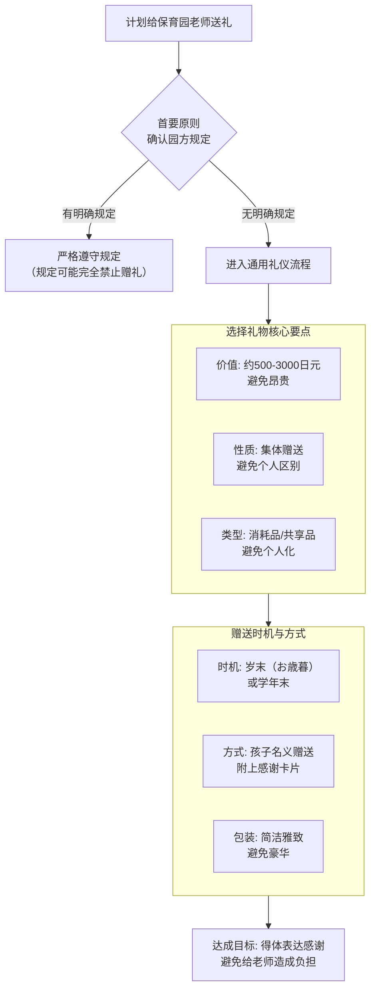

## Z025/12/30（二）
下面给你整理 **这款手表（[CITIZEN XC シチズン クロスシー H030‑T016022]()）** 的市场情况、二手价格、如何换电池/修理等实用信息：

---

## 🕰️ 基本情况

**[CITIZEN XC シチズン クロスシー H030‑T016022]()** 是 Citizen 的女士款

* **电波/电波ソーラー（Radio-Controlled Solar Eco-Drive）**
* **Eco-Drive 太阳能充电**（无需传统电池）
* 珍珠贝母表盘（ピンクシェル）
* 电波接收校时功能

---

## 💴 原始销售价格

官方新品定价没有统一公开数据，但根据同系列 XC Eco-Drive 电波款的参考价格：

* 一般新品 XC 电波Eco-Drive 日常售价在 **¥50,000〜¥70,000 左右**（类似款式参考）([オークファン][1])
* 高配或限定款可能更高

（具体 MSRP 需查 Citizen 原厂资料或日本正规经销商报价）

---

## 📉 二手价格

二手手表的市场行情根据日本拍卖/二手市场统计大致如下：

### 🪙 典型成交（含 XC 同类）

* XC 系列平均落札价约 **¥4,000 左右**（全部型号统计）([オークファン][2])
* 同型号 H030-T016022 在二手平台上有出品如 **约¥5,400〜¥10,200** 区间的报价（状态/功能不定）
* eBay 上类似 Radio Solar Eco-Drive 二手价格大约 **US$200〜US$275（约 ¥30,000〜¥45,000）** 有出现([eBay][3])

📌 注意：

* 成交价格与**运行状况、外观、是否正常接收电波/光充电**会有很大差异
* 即便同款，拍卖上的成交价可能更低（如 ¥1,000〜¥5,000 也常见）([Yahoo!オークション][4])

---

## 🔋 电池与维护（Solar Eco-Drive）

这款是 **Eco-Drive（光动能）** 系统：

### ⛅ 电池类型

* 使用的是**二次电池/电容（光能储存电池）**，靠光（太阳/灯光）充电
* 正常情况下无需定期更换“普通电池”

### 🔧 何时需要更换

* 光照充电不再维持运作
* 表针停走或持续能量位低

### 💡 更换价格与方法

* 官方维修中心或授权服务店通常会：

  * 先检查充电系统/电容
  * 再决定是否更换电池部件

根据手表迷经验：

* **仅更换二次电池（电容）**大约 **$50 左右（约 ¥6,000〜¥7,000）** 有人报告过类似情况（无保修）([Reddit][5])
* **更换整个机芯（movement）** 或电波复杂部分可能更贵，例如**$400+（约 ¥50,000+）**（带电波校时功能的维修成本较高）([Reddit][5])

👉 日本国内 Citizen 授权维修店通常会出**正式报价单**（含检测费、配件费、人件费）。

### 📍 维修步骤概况

1. **送到 Citizen 授权维修点或手表店**
2. 技师先做**机芯/光充电检测**
3. 根据结果：

   * **清洁 + 光能电池更换**
   * **机芯维护 / 电波接收组件检查**
4. 检查密封/防水后返回

---

## ⚠️ 自己换电池/DIY 可能性

* 一些用户分享 Eco-Drive 的电容自行更换（取下后盖直接操作），但**风险较高**：

  * 防水性破坏
  * 零件兼容问题
  * 需要特殊光能二次电池型号
    （不推荐一般用户在无经验下自行操作）([Reddit][6])

官方建议由**专门维修店处理**以保证长期稳定性。

---

## 🛠️ 修理建议（按实际用途）

### ✔ 正常运转但光充电效果下降

* 优先请求**官方检测 + 二次电池更换**

### ✔ 停走/不接收电波

* 有可能是**机芯问题**
* 官方报价通常包括机芯修理/更换

---

## 🧾 如何判断是否修理值得

📊 对比：

* 二手价格低（¥5,000–¥10,000）
* 正常更换维修可能 **¥10,000–¥30,000 或更高**

👉 若手表具有**情感价值或特别款式**，可考虑；
若只是日常佩戴，**可能买新款更经济**。

---

## 📌 简要总结

| 项目      | 情况                                       |
| ------- | ---------------------------------------- |
| 原始新品价格  | 约 ¥50,000+（同系列参考）([オークファン][1])           |
| 二手市场价格  | 大致 ¥4,000–¥10,000（相同/近似型号）([オークファン][1])  |
| 推荐电池/维护 | 河授权店更换二次电池（¥6,000+）或机芯维修（贵）([Reddit][5]) |
| 自行更换    | 不建议，一般由专业店处理                             |

---

如果你需要，我还能帮你：

* 📍 按**日本官网授权维修点地址**整理就近维修建议
* 📩 写一封 **日文询价邮件模板** 给 Citizen 授权维修店
* 📊 比较 **新旧型号购买建议**（是否值得修或换新）

要我继续帮你做哪一个？

[1]: https://aucfan.com/intro/q-~a5b7a5c1a5baa5f3a5afa5eda5b9a5b7a1bca5a8a5b3/?utm_source=chatgpt.com "シチズンクロスシーエコの値段と価格推移は？｜328件の売買データからシチズンクロスシーエコの価値がわかる。販売や買取価格の参考にも。"
[2]: https://aucfan.com/intro/q-~a5b7a5c1a5baa5f320a5afa5eda5b9a5b7a1bc/?utm_source=chatgpt.com "シチズン クロスシーの値段と価格推移は？｜1,468件の売買データからシチズン クロスシーの価値がわかる。販売や買取価格の参考にも。"
[3]: https://www.ebay.com/itm/157432221403?utm_source=chatgpt.com "Citizen XC Solar Watch Radio Solar Replaced Battery 25mm Case Used | eBay"
[4]: https://auctions.yahoo.co.jp/closedsearch/closedsearch/%E3%82%B7%E3%83%81%E3%82%BA%E3%83%B3%20%E3%83%AC%E3%83%87%E3%82%A3%E3%83%BC%E3%82%B9%20xc/0/?b=101&utm_source=chatgpt.com "Yahoo!オークション -「シチズン レディース xc」の落札相場・落札価格(3ページ目)"
[5]: https://www.reddit.com//r/CitizenWatches/comments/1bfegcu?utm_source=chatgpt.com "Citizen Eco-Drive capacitor (battery) replacement question"
[6]: https://www.reddit.com/r/watchmaking/comments/1graxzq?utm_source=chatgpt.com "Watch with solar battery"

## Z025/12/28（日）
这个想法**非常好，也非常适合 2 岁孩子** 🌱🎵
我分成 **「理念 + 具体方案 + 日本可落地地点示例 + 注意事项」** 来给你一个**真正可操作**的音乐体验型小旅行设计（1–2 天即可）。

---

## 一、2 岁孩子「音乐体验」的核心原则（先说结论）

> **不是学音乐，而是“用身体感受声音”**

### 2 岁最适合的音乐体验是：

* 听（风声、水声、鸟声）
* 动（走、摇、敲、跳）
* 看（节奏变化、重复）
* 亲子共鸣（安全感最重要）

❌ 不适合：

* 长时间坐着
* 复杂旋律讲解
* 强节奏刺激

---

## 二、课程设计框架（自然 × 音乐 × 亲子）

### 🎵 模块 1：自然声音探索（上午 30–45 分钟）

**场景**

* 林间小路
* 溪流边
* 海边 / 湖边

**活动**

* 停下来听：「いま、なにが聞こえる？」
* 模仿声音：

  * 风：ふー
  * 鸟：ぴー
  * 水：ちゃぷちゃぷ
* 家长用身体节奏回应（拍腿、轻摇）

👉 本质：**培养“声音注意力”**

---

### 🥁 模块 2：触觉 + 节奏体验（上午或下午）

**简单乐器（可带）**

* 小铃（铃）
* 木鱼 / 木棒
* 沙锤（可用石头+瓶子代替）

**玩法**

* 走三步，敲一下
* 停下来敲 → 再走
* 大人模仿孩子的节奏（非常重要）

👉 关键：**孩子当指挥**

---

### 🎶 模块 3：歌唱 + 语言节奏（傍晚）

**选歌原则**

* 重复句
* 节奏慢
* 音域小

**示例（日语）**

* ぞうさん
* てをたたきましょう
* さんぽ（轻唱版）

📌 在自然里轻声唱，比在教室效果好很多

---

### 🌙 模块 4：夜晚「安静声音」（可选）

* 听虫鸣
* 听远处水声
* 家长哼唱（不用歌词）

👉 建立「音乐＝安心」的感觉

---

## 三、1–2 天游程示例（东京周边可行）

### 🌿 方案 A：轻量型（1 天）

**地点**

* 国营昭和纪念公园
* 明治神宫外苑
* 高尾山 1 号路（前半段）

**节奏**

* 上午：自然听音 + 走
* 午餐后：敲击 + 自由玩
* 下午早回（不透支）

---

### 🏞️ 方案 B：温泉 + 自然（1 泊 2 天）⭐ 推荐

#### 📍 箱根 / 伊豆 / 秩父

**Day 1**

* 上午：森林步道 + 声音游戏
* 下午：旅馆庭院节奏玩
* 晚上：轻哼入睡

**Day 2**

* 早晨：鸟鸣听音
* 上午：亲子律动
* 午后回程

---

### 🌊 方案 C：海边自然音乐（1 泊 2 天）

**地点**

* 三浦半岛
* 房总半岛

**音乐点**

* 海浪节奏（强弱）
* 脚踩沙子节奏
* 风筝 + 风声

---

## 四、日本现成资源（不用自己设计）

### 🎼 亲子自然音乐项目（关键词）

你可以搜：

* **親子 自然 音楽 ワークショップ**
* **森の音あそび**
* **リトミック 自然**

常见主办：

* 自然学校（自然学校）
* 森林幼儿园（森のようちえん）
* 美术馆附属亲子项目

👉 多为 **1 日或 1 泊 2 日**

---

## 五、给你家庭的个性化建议（结合你情况）

考虑你：

* 有 2 岁孩子
* 在日本
* 注重语言、音乐、自然

👉 **最佳组合是：**

> **温泉旅馆 + 自然散步 + 非正式音乐体验**

而不是「课程感很强的活动」。

---

## 六、重要注意事项（非常关键）

⚠️ **时长**

* 单次音乐活动 ≤ 10 分钟
* 一天 3–4 次即可

⚠️ **情绪优先**

* 哭了 → 停
* 累了 → 抱

⚠️ **不要纠正**

* 节奏错没关系
* 音不准没关系

---

## 七、如果你愿意，我可以继续帮你：

* 🎒 **设计“自然音乐体验随身包清单”**
* 🎵 **给你一套“2 岁可用的亲子自然音乐口令”**
* 🗾 **根据你所在地区（东京/千叶/神奈川）直接给具体地点+旅馆**
* 🎼 **把它设计成“可持续每月一次的小课程”**

你更想 **自己带着做**，还是 **找现成项目参加**？

下面整理一个**非常自然、礼貌、日常生活中可能用到的电话模拟对话（日语）**，用于你打电话给 **吉布提三鹰馆**（仮名称）询问是否对**持有障害手帳**的来访者提供优惠。
内容结合了日本博物馆常见的障害者优惠实践（例如：凭手帳本人及陪同者可享有折扣或免费入馆）——日本很多美术馆/博物馆都有类似政策。([東京富士美術館（Tokyo Fuji Art Museum, FAM）][1])

---

## 📞 模拟电话对话（日语）

---

**📱 あなた（来電者）**
もしもし、吉布提三鹰館（ぎふてぃ さんたか かん）ですか？
こんにちは。お伺いしたいことがありましてお電話しました。

こんにちは，我有问题想咨询。

---

**🏛️ 受付（馆方）**
はい、吉布提三鹰館でございます。お電話ありがとうございます。
はい、どういったことでしょうか？

您好，这里是吉布提三鹰馆。请问有什么事？

---

**📱 あなた**
障害者手帳（しょうがいしゃ てちょう）を持っているのですが、入館料（にゅうかんりょう）などの割引（わりびき）はありますでしょうか？

我持有障害手帳，请问是否有入馆费等的优惠？

---

**🏛️ 受付**
少々お待ちください。確認いたします……
……はい、当館では障害者手帳をお持ちの方ご本人様（ほんにんさま）なら、入館料が割引／無料になる場合がございます。

（確認時間）……我们确认一下……
是的，我们这边对于持有障害者手帳的本人，入馆费是可以优惠/免费。

---

**📱 あなた**
ありがとうございます。割引の場合、具体（ぐたい）的にどのような割引（わりびき）でしょうか？例えば本人（ほんにん）と付添者（つきそいしゃ）について教えてください。

谢谢。请问具体是怎样的优惠？比如本人和陪同者的情况。

---

**🏛️ 受付**
はい、障害者手帳を提示（ていじ）していただくと、ご本人様は**（例：半額／無料）**となり、介助者（かいじょしゃ）のお連れの方（いちめい）も同じ条件でご入館いただけます。
※チケット購入（こうにゅう）の際に手帳の確認をお願いいたします。

是的，凭障害者手帳本人的话，门票会是 **（例如：半价／免费）**，陪同的一个人也可以享受同样条件。
※购票时请出示手帳进行确认。

---

**📱 あなた**
ありがとうございます。平日（へいじつ）でも休日（きゅうじつ）でも同じ割引でしょうか？

谢谢。请问平日和节假日也一样优惠吗？

---

**🏛️ 受付**
はい、平日・休日ともに同様の割引（対象／条件）となっております。
はい，无论平日还是节假日，都是同样的优惠。

---

**📱 あなた**
承知（しょうち）いたしました。丁寧（ていねい）に教えていただき、ありがとうございます。
それでは失礼（しつれい）いたします。

明白了。非常感谢您的详细说明。那我先挂了。

---

**🏛️ 受付**
ありがとうございました。失礼いたします。
谢谢，再见。

---

## 📝 小结：日本博物馆/美术馆的典型优惠（参考）

* **凭障害者手帳本人** 入馆费可能**免费或半价**（多见）。
* **陪同一人**也通常享受同等优惠。
* 进馆时需在**购票窗口确认手帳**。
* 公共/地方美术馆往往对障害手帳者**免费入馆**（東京都立など）。([杉並区公式サイト][2])
* 民间博物馆则多为**半价优惠**（如松岡美術館）。([松岡美術館][3])
* 有些博物馆规定需携带**手帳原件**。常见办法是当日现场购买时出示。([大塚国際美術館][4])

---

## 📌 给你的实用话术要点

📍 开头礼貌
「**お世話になっております**」「**お伺いしたいのですが**」是标准开场。

📍 明确核心询问
「**障害者手帳で割引・優遇はありますか**」

📍 追问细节
「**本人だけ/付添者も対象ですか？**」「**平日・休日も同じですか？**」

📍 结束礼貌
「**ありがとうございました。失礼いたします。**」

---

如需，我还能给你：

* 📱 **更简短版电话句子（3–4 句）**
* ✉️ **短信/LINE 版日文问询文案**
* 📍 **针对具体博物馆/观光点的范例对话**
  你想要哪个？

[1]: https://www.fujibi.or.jp/en/visit/accessibility/?utm_source=chatgpt.com "ACCESSIBILITY | Tokyo Fuji Art Museum, FAM"
[2]: https://www.city.suginami.tokyo.jp/s036/7924.html?utm_source=chatgpt.com "都立施設の入場料免除（都立公園等、都立美術館等）｜杉並区公式ホームページ"
[3]: https://www.matsuoka-museum.jp/qa/5564/?utm_source=chatgpt.com "障害者手帳を持っているのですが割引はありますか？ - 松岡美術館"
[4]: https://o-museum.or.jp/en/publics/index/28/?utm_source=chatgpt.com "Basic Information | User Guide | Otsuka Museum of Art - Shikoku and Tokushima Prefecture Museums and Tourist Facilities -"

## Z025/12/23（二）

在日本，向保育园老师赠送礼物是一个需要非常谨慎处理、并严格遵循社会礼仪（マナー）的行为。关键在于表达心意，而非礼物价值。下图清晰地展示了从决策到执行的完整流程与核心规范：

### **核心要点与注意事项**

基于上图流程，在各个环节有以下需要注意的细节：

#### **1. 最重要前提：确认规则**
许多保育园或幼儿园（特别是公立或大型机构）有**明确规定禁止接受家长赠礼**，以防止不公平和贿赂嫌疑。赠送前，请务必：
*   查看保育园的《父母便览》或通知。
*   直接询问园方或家长会（PTA）的代表。

#### **2. 礼物选择的具体建议（若允许赠送）**

**优先选择：**
*   **食品点心礼盒**：如名牌点心、饼干、巧克力、糖果、优质茶叶、咖啡等。这是最安全、最受欢迎的选择，老师可以分享给其他同事。
*   **实用消耗品**：文具套装（笔、便签）、护手霜、优质纸巾等。
*   **礼品卡**：一些书店、咖啡馆或百货商店的礼品卡，金额不宜高。

**绝对避免：**
*   **现金、商品券、预付卡**：这被视为贿赂，极不恰当。
*   **昂贵物品**：珠宝、名牌包、高档化妆品等会给老师带来巨大心理负担。
*   **过于私人化的物品**：衣物、香水等。
*   **手作食品**：出于安全卫生考虑，尽量避免。

#### **3. 赠送方式与时机**

*   **时机**：最合适的时机是**岁末（お歳暮，12月中上旬）** 或**学年末（3月）**。圣诞节并非传统的赠礼节日，新年则更适合赠送“御年贺”，但给老师通常合并到岁末。
*   **名义**：以**孩子的名义**赠送，而非家长个人。
*   **包装**：礼物需用**礼品纸（のし紙）** 包装。给老师送礼通常使用“**御礼**”或“**御挨拶**”的礼签，而不使用庆祝用的“蝶結び”礼签。如果不太确定，可以在商店购买时说明用途，请店员帮忙处理。
*   **附上卡片**：手写的感谢卡（哪怕只有一两句话）比昂贵礼物更显心意。

#### **4. 替代方案：集体赠送**
最推荐、最不容易出错的方式是**班级家长集体凑份子（ちょっとした寄付），共同赠送一份礼物和一张集体签名的感谢卡**。这样既能充分表达谢意，又避免了老师需要回礼或区别对待的压力。

**总结**：在日本，向保育园老师送礼的精髓是 **“轻礼重情”（心づかい）** 。最重要的永远是**对日常辛勤工作的感谢话语**，礼物只是这种心意的象征性载体。遵守规则、选择适度、避免让老师感到困扰，是表达感谢的最高礼仪。

下面给你一份**“日本现实版、零踩雷”**的说明，专门针对**保育园老师 + 圣诞节 / 新年**这种场景。

---

## 一、一句话结论（先记住）

👉 **日本通常不在圣诞节或新年给保育园老师送个人礼物**
👉 **“感谢的话 + 卡片” 比任何礼物都合适**

很多保育园（尤其是公立、认可园）**明确规定不能收礼**，即使没明说，老师也会很为难。

---

## 二、日本的基本风俗与职场逻辑

### 核心原则

* **公平性**（不能厚此薄彼）
* **不制造负担**
* **不形成私人关系**

所以在老师眼里：

* ❌ 贵重 = 压力
* ❌ 单独 = 不公平
* ❌ 私下 = 违规风险

---

## 三、圣诞节（12 月）怎么做最合适 🎄

### ✅ 最推荐（安全度 100%）

### 1️⃣ 感谢卡 / 小卡片（首选）

* 手写或打印都可以
* 以**家庭名义**，不是个人送礼
* 内容以“感谢日常照顾”为主

**日语示例：**

> いつも温かく見守っていただき、ありがとうございます。
> 家族一同、心より感謝しております。

👉 在日本，这**不算礼物**，但非常被珍惜。

---

### ⚠️ 视园方文化而定（需谨慎）

### 2️⃣ 全体共享的小点心

**前提条件：**

* 给“全体老师 / 全班”
* **独立包装**
* 商店购买（非手作）
* 低过敏风险

❌ 不推荐：

* 手工食品
* 生鲜
* 酒类
* 单独送某位老师

---

## 四、新年（お正月）的日本习惯 🎍

### 重点：**新年一般不送礼**

### 推荐做法：

### 1️⃣ 新年第一天的正式问候（非常重要）

接送时说一句就够：

> あけましておめでとうございます。
> 本年もどうぞよろしくお願いいたします。

这是**日本职场级别的标准礼仪**，比礼物更重要。

---

### 2️⃣ 年贺卡（可选）

* 简单
* 班级或家庭名义
* 不写私事、不提要求

---

## 五、什么行为在日本“看起来不合适”

| 行为     | 日本人的真实感受 |
| ------ | -------- |
| 贵重礼物   | 😰 有压力   |
| 只送主担老师 | ❌ 不公平    |
| 新年送实物  | 🤔 不习惯   |
| 私下递礼物  | ⚠️ 违规风险  |

---

## 六、日本老师最在意、但很多外国人忽略的

### 🌱 1️⃣ 具体的感谢语言

例如：

> 最近他在家也会唱园里的歌，我们很感动。

👉 **认可专业能力，比礼物更有价值**

---

### 🌱 2️⃣ 日常态度

* 准时接送
* 沟通清楚
* 尊重园内规则

这些在日本老师眼中，比“送什么”重要得多。

---

## 七、结合你这种家庭情况的最优解

如果孩子还小、正适应期：

* 🎄 圣诞节：**一张感谢卡**
* 🎍 新年：**一句正式问候**
* 🎁 不送实物礼物

👉 这是**日本本地家长最常见、好感度最高、零风险**的做法。

---

如果你需要，我可以直接帮你：

* ✍️ 写一张**圣诞/年末感谢卡完整日文模板**
* 🎍 给你**新年接送时的一句“非常得体”的寒暄话**
* 🧒 按“孩子适应期”定制感谢表达

你要哪一个？

## Z025/12/08（一）

Q：如何引导2岁男孩大小便，一般的过程和周期，年龄段

A：
下面给你一套 **科学、实用、无压力** 的 2 岁男孩如厕训练（大小便训练）方案，包括：

* 适宜开始的年龄
* 训练的阶段与周期
* 全流程操作步骤
* 父母常见问题
* 日本、中国、欧美三方面的经验差异（你现在在日本，特别给你补充日本儿科的建议）

内容尽量简单明确，让你马上就能执行。

---

# ✔ 一、何时开始？适宜年龄 & 判定标准

大多数儿科医生（包括日本小儿科学会）建议：**18 个月～36 个月**之间开始最合适。

更关键的是“准备好”的迹象，而不是年龄：

### **孩子已经准备好的信号：**

1. 白天尿布可保持 **2 小时以上干爽**。
2. 坐马桶或便盆不抗拒，能坐 1–2 分钟。
3. 能理解简单指令（“坐一下”“尿尿”）。
4. 能表达基本的需求：语言或手势（例如拍裤子）。
5. 对大人上厕所感兴趣，会模仿。
6. 有自然规律：每天差不多时间大小便。

**2 岁男孩刚好属于黄金开始期。**

---

# ✔ 二、训练周期（参考值，非强制）

每个孩子不同，但一般规律如下：

### **阶段 0：准备期（1–2 周）**

* 让孩子熟悉便盆或儿童马桶圈
* 认识“尿尿”“便便”
* 让他在尿布里排便时说出来

### **阶段 1：白天如厕训练（2–6 周）**

* 训练坐便盆
* 从尿布 → 训练裤（トレーニングパンツ）
* 2 小时一次坐便盆
* 成功率从偶尔 → 稳定

### **阶段 2：外出如厕（2–6 周）**

* 能在外面厕所也愿意坐
* 外出前提醒尿尿

### **阶段 3：午睡 & 夜间训练（3–12 个月）**

夜间膀胱控制成熟更慢，夜里穿尿布很正常。

➡ 年龄参考：

* 白天脱掉尿布：平均 **2.5 岁–3 岁**
* 夜间脱尿布：平均 **3–5 岁**
  男孩通常比女孩 **晚 3–6 个月** 是正常现象。

---

# ✔ 三、2 岁男孩如厕训练的 **具体流程（逐日执行）**

以下是最实用、失败率最低的方法。

---

## ⭐ 第一步：准备阶段（1–2 周）

1. 买一个孩子喜欢的便盆（トイレトレーニングおまる）或马桶圈。
2. 给便盆命名：“这是宝宝的小厕所哦”。
3. 让他穿尿布时排便也到厕所里站一下，让他建立联想。
4. 看图画书（日本推荐《おむつのなか、みせてみせて！》）。
5. 爸爸自己上厕所时让他跟着看看（男孩会模仿爸爸）。

---

## ⭐ 第二步：开始正式训练（建议从长周末或假期开始）

### **Day 1–Day 3：建立“流程”**

每 **2 小时一次** 带他去厕所：

* “我们去尿尿咯”
* 坐 1–2 分钟，不强迫
* 成功了夸奖（夸行为，不夸结果）：

  * “你坐下来了，真棒！”
  * “尿进去了，厉害！”

若没尿：

* “没关系，下次再试”

**不要骂，不要说“臭”，不要表现厌恶。**

---

## ⭐ 第三步：过渡到训练裤（1–2 周）

开始让他穿 **布训练裤（トレパン）**：

* 尿湿孩子会感觉不舒服 → 更容易意识到“尿来了”
* 不要急着脱掉尿布，一般只在家里试

**关键句子：**

* “想尿尿的时候告诉妈妈/爸爸”
* “尿前会有‘要来了’的感觉哦”

---

## ⭐ 第四步：成功率提升期（2–6 周）

常见节奏：

* 第 1 周：偶尔成功
* 第 2 周：一半能成
* 第 3–4 周：能告诉大人
* 第 5–6 周：错误频率明显减少

男孩在这一阶段特别需要：
✔ 模仿爸爸
✔ 用贴纸奖励表（sticker chart）
✔ 固定上厕所时间（早上起床/吃饭后/洗澡前）

---

## ⭐ 第五步：控制便便（一般晚于尿尿）

很多孩子会先学会尿尿控制，再学会便便（晚 1–3 个月）。

技巧：

* 观察“便意信号”：躲起来、蹲着、不说话
* 一看到信号就温柔带去厕所
* 成功一次奖励要特别热烈，建立强关联

---

## ⭐ 第六步：户外如厕（1–2 个月）

外出前先尿一次
随身带：

* 便携便盆
* 换裤子
* 湿巾
* 塑料袋

外面第一次成功比在家更值得夸。

---

## ⭐ 第七步：午睡与夜间（6–18 个月）

夜间主要靠生理发育，不可强求。

父母只需要：

* 睡前不大量喝水
* 入睡前先尿一次
* 夜里继续穿尿布，干的天数变多后再尝试脱掉

---

# ✔ 四、常见问题（超实用）

### Q1：孩子抗拒坐便盆怎么办？

* 换一个颜色的
* 换到马桶圈（有些男孩喜欢“大人的”）
* 坐下时给他的玩具一起“坐坐”
* 坐时给 1 首歌的时间就好（不要超过 3–4 分钟）

### Q2：孩子不说“要尿尿”？

正常！多数孩子一开始都不会。

通过“流程 + 模仿 + 语言提示”自然会学会。

### Q3：反复失败，会倒退吗？

会。尤其生病、换环境、压力大时。

别责备，回到上一步继续。

### Q4：便秘影响训练吗？

影响很大。
建议吃：香蕉、酸奶、蔬菜汤，增加水分、每天固定时间坐厕所。

### Q5：尿裤子要不要责备？

绝对不要。
一句：“你湿了，我们一起换一换。” 再继续下一次。

---

# ✔ 五、2 岁男孩如厕训练的 **日本特别建议**

（来源：日本小児科学会 & 保育園实践经验）

* 日本强调“无压力训练”（プレッシャー無し）
* 多用“絵本 + まねる（模仿）”的方式
* 保育园一般从 **2岁班** 开始集体坐便训练
* 大多数孩子在 **2.5–3 岁** 白天完全脱尿布

你家孩子在日本环境中训练会更轻松，因为周围的小朋友会一起学。

---

# ✔ 六、总结（最重要的三句话）

### **1. 不是年龄，而是准备信号开始训练。**

### **2. 用固定流程 + 小奖励 + 不责备。**

### **3. 男孩一般要 2–8 周掌握白天如厕，夜间更久。**

---

如果你愿意，我可以继续帮你：

A. 为你家的孩子（你描述一下性格/作息）制定 **个性化 14 天训练计划**
B. 推荐 **日本本地可以买到的训练工具、绘本**
C. 为你写一个 **父母每日打卡表（日历可打印版）**

你想选哪个？
