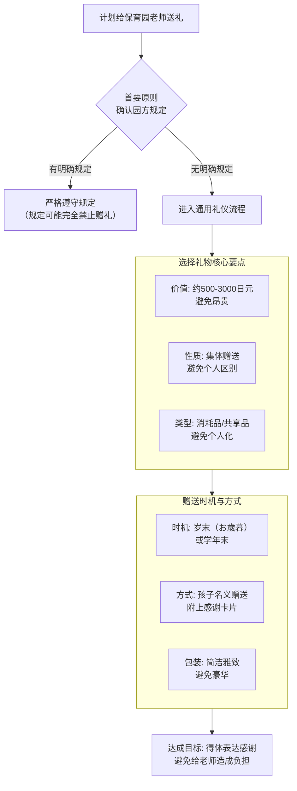

## Z026/05/10（日）

### Q：小孩吃饭刷手机，对发育影响，如何处理

### A：Deep seek

小孩吃饭时刷手机，是现代家庭中非常普遍的挑战。这不仅影响当前的一顿饭，长期来看确实会对孩子的**身体发育、心理行为**产生深远影响。

---

### 一、对发育的具体影响

#### 1. 生理层面
| 影响维度 | 具体表现 | 原理解析 |
|----------|----------|----------|
| **消化吸收不良** | 长期进食不足/过量，体重异常 | 大脑同时处理屏幕内容，血液优先供脑，胃肠蠕动减慢，消化液分泌减少 |
| **进食量失控** | 不饿也吃、吃饱了继续吃 | 注意力被手机占据，无法接收“饱腹信号”（饱食中枢被干扰） |
| **营养不良/肥胖两极** | 只吃喜欢的、高热量低营养 | 手机分散对食物多样性感知，偏爱重口味、高糖高油 |
| **运动发育迟缓** | 更不愿意自主进食 | 长期被喂食+看手机，手口协调、精细动作锻炼不足 |
| **睡眠障碍** | 入睡困难、夜醒频繁 | 蓝光抑制褪黑素分泌，破坏生物钟 |

#### 2. 心理与行为
| 影响维度 | 具体表现 | 长期后果 |
|----------|----------|----------|
| **专注力下降** | 吃饭坐不住，做事三分钟热度 | 学龄期注意力缺陷风险增加 |
| **情绪调节能力弱** | 不吃饭哭闹→给手机→继续哭闹 | 强化“哭闹=得到手机”的负向循环 |
| **社交退缩** | 只与手机互动，不与人眼神/语言交流 | 影响语言发育、同伴交往能力 |
| **亲子关系异化** | 餐桌变成“交易场” | 孩子学会用吃饭换取“屏幕时间” |

---

### 二、处理原则：不斗争，用系统替代

**核心原则**：不要只在“吃饭那几分钟”斗争，而要改变整个**餐桌环境 + 日常规则**。

#### 2.1 分龄策略

##### ✅ 0–2岁：绝对不给（最易执行）
- 手机、平板、电视**完全不出现在餐桌**
- 孩子哭闹 → 抱离餐桌，平静后返回
- 2岁内是**建立“吃饭=坐餐桌”习惯的黄金期**，错过后期更难纠正

##### ✅ 2–5岁：引入“先吃饭，后屏幕”
- **可视化计时器**：沙漏或计时器，“沙漏流完，妈妈收走，然后你可以看5分钟”
- **固定规则**：“所有屏幕留在客厅，不上餐桌”
- **后果法**：“如果你现在要看手机，那我们就停止吃饭，等你饿了告诉我，我们再继续”——让孩子承担后果

##### ✅ 5岁以上：谈判 + 契约
- 与孩子商量，“一集动画片20分钟，你希望放在饭前还是饭后？”
- 制定纸质“屏幕时间表”，全家执行
- 引入“餐桌话题罐”：每人抽一个问题（“今天最开心的事？”“如果你是超人……”）

---

### 三、给家长的具体操作清单（马上可用）

| 步骤 | 做什么 | 怎么说（话术） |
|------|--------|----------------|
| **1. 环境改造** | 全家手机放入“停机坪”（门外篮子） | “我们的新规则——吃饭的时候手机去度假。” |
| **2. 过渡期替代** | 准备餐桌玩具：磁力片、小画本、简单桌游 | “吃饱饭，我们一起玩这个！” |
| **3. 提前预告** | 饭前5分钟提醒“屏幕时间结束” | “还有5分钟，动画片要休息了，我们要去吃饭啦。” |
| **4. 接纳情绪** | 孩子哭闹时平静陪伴，不妥协 | “妈妈知道你很生气。你可以在沙发上哭一会，妈妈在厨房等你。” |
| **5. 强化正向行为** | 哪怕只吃了三口、只坐了2分钟，也肯定 | “你今天自己拿勺子啦！下次我们一起吃更多。” |

---

### 四、常见误区

| ❌ 误区 | ✅ 正确做法 |
|--------|------------|
| “偶尔一次没关系，反正现在也管不住” | 一次妥协，需要十次纠正。“下次”永远是明天，今天必须开始 |
| “老人给看，我也没办法” | 全家统一规则，或向老人说明危害（直接说“医生说的”） |
| “他不看就不吃啊！” | 饿一两顿不会伤害身体，但坏习惯会伤害一辈子。要敢于接受短期“餐费减少” |
| “我太累了，给手机让我安静吃顿饭” | 短期“安静”换来长期“更累”。用5天时间建立新习惯，胜过5年的拉锯战 |

---

### 五、从“看”转为“听”——折中方案

如果早期习惯太深，无法一步取消，可以过渡：
- 关掉视频，只播放**音频（有声书、儿歌）**
- 播放位置放在**餐桌旁边（不放在孩子面前）**
- 最终过渡到“纯聊天、纯吃饭”

---

### 六、一句话总结

> **手机是精神零食，不是主食。餐桌是家庭联结的场所，不是另一个播放器。**

建立新习惯的第一个3天最难，但只要全家人保持一致，通常 **1–2周** 就能看到显著改善：孩子开始聊天、自己吃饭，饭量反而比看手机时更稳定。你值得一个不抢手机也能好好吃饭的孩子。

### Q2：7天戒手机吃饭训练计划（每天具体做什么），2岁半吃饭互动脚本（中文+日语+英语）

### A2：

## 一、7天戒手机吃饭训练计划（每天具体做什么）

这套计划的核心是：**不靠吼，靠环境设计 + 预期管理 + 正向强化**。2岁半的孩子，行为改变大约需要5-7天。

---

### 📅 Day 1：环境改造 + 预告

| 时段 | 做什么 | 具体操作 |
|------|--------|----------|
| **上午** | 全家宣布“新规则” | “从今天开始，吃饭的时候，手机/平板要去‘充电站’休息。我们专心吃饭、聊天。” |
| **饭前30分钟** | 手机全部放入“停机坪”（门外/高处篮子） | 家长自己的手机也放进去，做榜样 |
| **吃饭时** | 不主动提手机；孩子哭闹，平静抱离餐桌 | “你想哭，妈妈陪你到沙发哭。哭完了我们再回来吃。” |
| **饭后** | 如果孩子哭了但没给手机，给予肯定 | “你今天哭了一会，但还是吃了几口饭，妈妈为你骄傲！” |

> ⚠️ 第一天可能会哭很久，但**绝不能妥协**。

---

### 📅 Day 2：引入“餐桌玩具”

| 时段 | 做什么 | 具体操作 |
|------|--------|----------|
| **饭前** | 带孩子一起选“餐桌玩具” | 磁力片、小画本、小汽车（不是声光玩具），告诉他“这是吃饭时的好朋友” |
| **吃饭时** | 玩具放桌上，孩子边吃边玩 | 不要求“专心吃饭”，玩着吃也可以，目标只是“不哭+不使用屏幕” |
| **饭后** | 用计时器奖励“屏幕时间” | “你吃完饭了，沙漏流完前，你可以看5分钟。” |

---

### 📅 Day 3：强化“先吃饭，后屏幕”

| 时段 | 做什么 | 具体操作 |
|------|--------|----------|
| **饭前** | 用沙漏预告 | “沙漏开始流了，我们开始吃饭。等沙漏流完，妈妈收碗，然后你可以看一集。” |
| **吃饭时** | 家长主动发起互动 | “你看，胡萝卜像不像一艘小船？”（见后文互动脚本） |
| **饭后** | 立即兑现屏幕时间 | “你真棒，自己吃了好多。现在你可以看5分钟。” |

---

### 📅 Day 4：引入“餐桌话题罐”

| 时段 | 做什么 | 具体操作 |
|------|--------|----------|
| **上午** | 和孩子一起做“话题罐” | 在纸条上画简单图案：笑脸（今天开心的事）、星星（你最喜欢什么）、车（今天看到什么车） |
| **吃饭时** | 每人抽一张，轮流回答 | 家长先说：“妈妈抽到星星，我最喜欢和你一起玩积木。” |
| **饭后** | 强化正向行为 | “今天你回答了问题，妈妈好开心！” |

---

### 📅 Day 5：家长“表演式吃饭”

| 时段 | 做什么 | 具体操作 |
|------|--------|----------|
| **吃饭时** | 家长夸张表演“好吃” | “哇——这个鸡蛋太好吃了！妈妈吃了一口，好香啊！” |
| **孩子吃一口** | 立刻给予描述性表扬 | “你自己用勺子舀了一口，你做到了！” |
| **不催、不给手机** | 孩子不吃就收走 | “你不吃了吗？那妈妈收碗了，下一顿饭是点心时间。” |

---

### 📅 Day 6：加入“假装游戏”

| 时段 | 做什么 | 具体操作 |
|------|--------|----------|
| **吃饭时** | 把食物变成角色 | “小番茄是红色的球，要滚进山洞（嘴巴）啦——啊呜！” |
| **孩子喂家长** | 互换角色 | “你来喂妈妈吃一口，妈妈张开大嘴——啊——” |
| **饭后** | 画画记录 | “今天我们吃了什么？我们来画胡萝卜！” |

---

### 📅 Day 7：巩固 + 仪式感

| 时段 | 做什么 | 具体操作 |
|------|--------|----------|
| **上午** | 和孩子一起布置“仪式餐桌” | 铺桌布、放小花、用特别的盘子 |
| **吃饭时** | 全家拍照 | “今天我们完成了‘吃饭不用看手机’的一周！咔嚓——” |
| **饭后** | 小奖励 | 贴纸、一本新绘本、去公园多玩10分钟 |

> 🎉 一周后进入“维持期”，保持规则一致。

---

## 二、2岁半吃饭互动脚本（中文 + 日语 + 英语）

以下脚本用于**孩子哭闹要手机**或**需要吸引注意力**时使用。

---

### 场景1：孩子伸手要手机

| 语言 | 话术 |
|------|------|
| **中文** | “手机去充电站休息了。它吃饱了，现在该我们吃饭啦。你看，胡萝卜在等你呢——啊呜，它跳进妈妈嘴巴了！” |
| **日本語** | 「スマホは充電ステーションでお休み中。もうお腹いっぱいなんだって。さあ、今は私たちのご飯の時間だよ。にんじんが『食べて〜』って呼んでるよ。」 |
| **English** | “The phone is resting at the charging station. It’s full now. Look — the carrot is waiting for you! Yum, it just jumped into Mommy’s mouth!” |

---

### 场景2：孩子哭闹不上桌

| 语言 | 话术 |
|------|------|
| **中文** | “你想哭，妈妈陪你去沙发上哭。哭完了，我们回来吃饭。妈妈等你。” |
| **日本語** | 「泣きたいなら、ママと一緒にソファで泣こう。泣き終わったら、ご飯に戻ろうね。待ってるよ。」 |
| **English** | “You want to cry. Let’s go cry on the sofa. When you’re done, we’ll come back to eat. I’ll wait for you.” |

---

### 场景3：孩子吃了一口（描述性表扬）

| 语言 | 话术 |
|------|------|
| **中文** | “你自己用勺子舀了一口！你做到了！米饭进嘴巴啦——” |
| **日本語** | 「自分でスプーンを持って食べたね！やったね！ごはんがお口に入ったよ——」 |
| **English** | “You scooped it up with your spoon all by yourself! You did it! The rice went into your mouth — yay!” |

---

### 场景4：孩子不想吃了，想跑

| 语言 | 话术 |
|------|------|
| **中文** | “你吃饱了吗？吃饱了就说‘吃饱了’，妈妈收碗。下一顿饭是点心时间。” |
| **日本語** | 「もうお腹いっぱい？『ごちそうさま』って言ってね。ママはお皿を片付けるよ。次のご飯はおやつの時間だよ。」 |
| **English** | “Are you full? Say ‘all done’, and I’ll take the plate away. The next meal is snack time.” |

---

### 场景5：假装游戏（吸引坐住）

| 语言 | 话术 |
|------|------|
| **中文** | “小番茄是红色的球球。它说：『我要滚进山洞——啊呜！』你来当山洞，啊——” |
| **日本語** | 「ミニトマトは赤いボールだよ。『私はトンネルに転がり込むぞ——パクッ！』って言ってるよ。〇〇ちゃんがトンネルになって、あーんして！」 |
| **English** | “The cherry tomato is a little red ball. It says, ‘I’m going to roll into the cave — yum!’ You be the cave. Open wide — ahh —” |

---

### 场景6：孩子看别人家吃饭问“为什么他有手机”

| 语言 | 话术 |
|------|------|
| **中文** | “每个家的规则不一样。我们家的规则是：吃饭时让手机休息、让我们聊天。你看，妈妈也没有手机。” |
| **日本語** | 「お家によってルールが違うんだ。うちのルールは、ご飯の時はスマホをお休みさせて、一緒にお話しすること。見て、ママもスマホ持ってないでしょ。」 |
| **English** | “Every family has different rules. Our rule is: phones rest while we eat and talk. See? Mommy doesn’t have a phone either.” |

---

## 三、家庭“手机契约”模板（可打印贴在冰箱上）

> **我们家吃饭时的约定**
>
> 🚫 手机、平板去“充电站”休息  
> ✅ 我们聊天、玩小游戏、好好吃饭  
> ✅ 谁想拿手机，就要说出一个“今天最开心的事”  
> ❤️ 妈妈、爸爸也一样遵守

> **Our Table Rule**
>
> 🚫 Phones & tablets go to the “charging station”  
> ✅ We talk, play little games, and eat together  
> ✅ If you want the phone, you have to name one happy thing today  
> ❤️ Mommy & Daddy follow the same rule

> **うちのご飯のルール**
>
> 🚫 スマホは「充電ステーション」でお休み  
> ✅ お話ししたり、ちょっとしたゲームをしたり、ご飯をしっかり食べる  
> ✅ スマホが欲しくなったら、「今日一番楽しかったこと」を言う  
> ❤️ ママもパパも同じルール

---

**最后一句提醒**：前3天是“行为消退期”，哭闹会更厉害——这是习惯在“垂死挣扎”。第4天开始明显好转。坚持7天，你会得到一个不需要抢手机也能好好吃饭的孩子。

### Q3：吃饭互动台词升级版（情绪+语言训练）吃饭儿歌（中日英）让孩子自动进入状态

### A3：

2岁半是语言和情绪发展的关键窗口。吃饭时间如果能设计成轻松、节奏稳定的互动，孩子会逐渐把“坐餐桌”和“安全感、语言游戏”联系起来，而不是“失去手机的战场”。

下面是 **升级版互动台词** + **情绪命名模板** + **吃饭入座儿歌（中日英）**，重点在于：**用简单的旋律和重复，让孩子自动进入“吃饭模式”**。

---

## 一、吃饭互动：情绪 + 语言训练版（分场景话术）

### 1️⃣ 引导入座 / 转换活动

| 语言 | 互动话术（蹲下、平视、温和但坚定） |
|------|----------------------------------|
| **中文** | “玩具先休息一下，我们要去吃饭啦。吃完饭，再回来找它们玩。” |
| **日本語** | 「おもちゃはちょっとお休み。ご飯を食べに行こうね。食べ終わったら、また遊ぼうね。」 |
| **English** | “Toys are taking a little nap. Let’s go eat. When we’re done, we’ll come back to play.” |

📌 **重点**：不突然中断，提前2分钟预告，“再玩2分钟，然后去吃饭”。

---

### 2️⃣ 孩子拒绝坐下 / 想拿手机（情绪命名）

| 语言 | 互动话术 |
|------|----------------------------------|
| **中文** | “你现在很生气，因为不能看手机。没关系，妈妈陪你。先坐一下，喝口水。” |
| **日本語** | 「今すごく怒ってるね。スマホが見られなくて悲しいんだね。大丈夫だよ。まず座って、お茶を飲もう。」 |
| **English** | “You’re really upset because you can’t have the phone. I know. I’m with you. Let’s just sit down first and have some water.” |

📌 **重点**：命名情绪 = 帮助孩子认识自己。2岁半能学会“生气”“难过”的意思。

---

### 3️⃣ 孩子吃了第一口（语言强化 + 因果关系）

| 语言 | 互动话术 |
|------|----------------------------------|
| **中文** | “你吃了胡萝卜！胡萝卜说‘谢谢你吃我’，它会让你长得高高壮壮。” |
| **日本語** | 「人参を食べたね！人参が『食べてくれてありがとう』って言ってるよ。大きくなるね。」 |
| **English** | “You ate the carrot! The carrot says, ‘Thank you for eating me!’ It will make you big and strong.” |

📌 **重点**：建立因果信念（吃蔬菜 = 帮自己长大），比“乖不乖”有效。

---

## 二、吃饭入座儿歌（中日英）

🎵 使用方法：**每次坐餐椅时唱同一首歌**，一周后孩子一听到旋律就会不自觉地配合。

---

### 🎶 儿歌1：准备吃饭

**🎈 中文版（适合《小星星》或自创音调）**

> 吃饭 吃饭 坐坐好，  
> 碗和 勺子 准备好。  
> 一口 菜菜 一口饭，  
> 吃饱 长高 乖宝宝。

**🎈 日本語版（《きらきら星》のメロディで）**

> ごはん ごはん すわろう  
> おわん と スプーン そろえる  
> おやさい ぱくっ ごはん もぐ  
> おなか いっぱい げんきなこ

**🎈 English version (to the tune of “Twinkle Twinkle”)**

> Time to eat, sit up tall  
> Spoon and bowl, one for all  
> Take a bite, chew it slow  
> Eat your food and watch you grow  
> Time to eat, sit up tall  
> Good food, good friends, that’s our call

---

### 🎶 儿歌2：劝饭 / 互动（角色代入）

**🎈 中文版**

> 小汤匙 坐火车，  
> 呜呜呜 进山洞。  
> 山洞里 是什么？  
> 是宝宝 的 大嘴巴！

**🎈 日本語版**

> スプーンが きかんしゃ  
> シュッシュ トンネルへ  
> トンネルの なかは  
> 〇〇ちゃんの おくち

**🎈 English version**

> Spoon goes chugging like a train  
> Choo choo choo through the tunnel lane  
> What’s inside that little cave?  
> It’s your mouth, so big and brave

---

## 三、极简短指令卡（贴在餐椅旁，方便重复）

### 🟢 入座指令

| 中文 | 日语 | English |
|------|------|---------|
| 屁股坐下 | おしりをつけて | bottom down |
| 手放桌上 | お手てをテーブルに | hands on the table |

### 🟡 暂停 / 冷静

| 中文 | 日语 | English |
|------|------|---------|
| 先停一下 | ちょっと止まって | pause |
| 深呼吸 | 深呼吸しよう | take a deep breath |

### 🔴 感谢 / 结束

| 中文 | 日语 | English |
|------|------|---------|
| 谢谢妈妈／爸爸 | ママ／パパ、ありがとう | thank you, mama / papa |
| 我吃饱了 | ごちそうさまでした | all done, yum yum |

---

## 四、一个真实有效的“2周转变规律”

- **Day 1–3**：哭闹明显（这是习惯消退的高峰，关键时期）
- **Day 4–6**：模式建立（看到儿歌道具就开始配合）
- **Day 7–10**：餐桌互动增加（会跟着哼旋律）
- **Day 14+**：新习惯稳定

> 💡 非常有效的做法是：**拿一个固定的“餐桌小道具”**（比如一个会摇的铃铛），每次唱儿歌的时候摇一下。孩子会渐渐建立起“听到铃声→坐好吃饭”的条件反射。


### A：GPT

先说结论：**边吃饭边刷手机，对小孩的发育是有实质影响的，而且越小影响越明显。**但完全“硬停”往往会引发对抗，更有效的是**逐步替代 + 建立固定用餐规则**。

---

# 📱 一、可能的影响（按你孩子年龄段重点）

## 1️⃣ 饮食与身体发育

* **注意力被屏幕占用** → 吃得快/慢不稳定，容易**过量或偏食**
* **不看食物** → 饱腹感信号变弱，长期影响食量判断
* **进食节奏被打乱** → 消化负担加重

👉 长期可能：体重异常（偏瘦或偏胖）、挑食加重

---

## 2️⃣ 语言与认知发展

* 吃饭本来是**最自然的语言互动时间**
* 看屏幕 → **减少对话、模仿、表达机会**

👉 结果：词汇量增长变慢、表达能力受影响

---

## 3️⃣ 情绪与行为习惯

* 容易形成：

  ```text
  吃饭 = 必须有手机
  ```
* 一旦没有 → 哭闹、拒吃

👉 本质是**外部刺激依赖**

---

## 4️⃣ 亲子关系

* 用餐时间变成“各自沉浸屏幕”
* 缺少眼神交流与互动

👉 影响安全感与依附关系

---

# ⚠️ 二、很多家长的误区

👉 常见想法：

* “不看手机就不吃”
* “先让他吃进去再说”

👉 实际效果：

* **短期有效，长期更难戒**

---

# 🧠 三、正确处理思路（核心原则）

```text
不是“禁止手机”
而是“建立新的吃饭模式”
```

---

# 🍽️ 四、实操方法（最关键）

## 🟢 方法1：逐步替代（不要直接断）

👉 3步走：

### 第一步（过渡）

* 手机 → **音频（故事/音乐）**
* 眼睛离开屏幕

---

### 第二步

* 音频 → **家长讲故事/聊天**

---

### 第三步

* 完全专注吃饭 + 互动

---

---

## 🟢 方法2：固定规则（简单清晰）

👉 比如：

```text
吃饭的时候，不看手机
吃完以后，可以看10分钟
```

👉 重点：

* **提前说清楚**
* **全家一致执行**

---

---

## 🟢 方法3：让吃饭变“有趣”

👉 小孩不吃，往往不是手机问题，而是：

👉 👉 吃饭太无聊

---

可以这样做：

* 🍙 捏饭团（让孩子参与）
* 🎭 边吃边讲“食物故事”
* 🐻 “小熊也要吃一口”

---

---

## 🟢 方法4：减少依赖触发点

👉 避免：

* 一开始就给手机
* 一哭就给

👉 否则：

```text
哭 = 得到手机
```

---

---

## 🟢 方法5：父母示范（最关键）

👉 如果大人吃饭也看手机：

👉 👉 孩子100%会学

---

---

# ⏳ 五、过渡期会发生什么（提前告诉你）

👉 你可能会遇到：

* 第1–3天：哭闹、拒吃
* 第4–7天：开始适应
* 1–2周：明显改善

👉 👉 这是正常过程，不是失败

---

# 🧠 六、一个简单模型（很好用）

```text
屏幕喂饭 → 被动吃
互动吃饭 → 主动吃
```

---

# 🌈 七、一句话建议

👉
**吃饭不是“把食物喂进去”，而是“让孩子学会和食物、和人建立关系”。**

---

# 👍 如果你想更细（很适合你现在情况）

我可以帮你👇

👉 📅 做一个：
**“7天戒手机吃饭训练计划（每天具体做什么）”**

👉 或
👉 🎭 设计：
**“2岁半吃饭互动脚本（中文+日语）”**

这个阶段处理好，以后会轻松很多 👍

### Q2：2岁半吃饭互动脚本（中文+日语+英语）

### A2：

下面给你一套**2岁半孩子吃饭互动脚本（中文 + 日语 + 英语）**，直接可以在餐桌上用。
设计原则：**短句 + 重复 + 游戏感 + 情绪引导**，帮助替代“看手机吃饭”。

---

# 🍽️ 一、开场（建立期待）

---

👨‍👩‍👧 家长说：

* 🇨🇳
  👉 “吃饭时间到啦，我们一起吃，好吗？”

* 🇯🇵
  👉 「ごはんの時間だよ。一緒に食べよう？」

* 🇬🇧
  👉 “It’s mealtime! Let’s eat together!”

---

👶 孩子回应（引导）：

* 🇨🇳 👉 “好！”
* 🇯🇵 👉 「はーい！」
* 🇬🇧 👉 “Okay!”

---

---

# 🐻 二、角色游戏（最有效替代手机）

---

👨‍👩‍👧：

👉 “小熊也来吃饭啦！”

* 🇯🇵
  👉 「くまさんも食べるよ！」

* 🇬🇧
  👉 “The teddy bear is eating too!”

---

👉 “小熊吃一口，你吃一口，好吗？”

* 🇯🇵
  👉 「くまさんが一口、○○も一口ね」

* 🇬🇧
  👉 “Teddy takes a bite, you take a bite!”

---

👉 “哇，小熊吃得真棒！”

* 🇯🇵
  👉 「すごいね！くまさん上手！」

* 🇬🇧
  👉 “Wow! Teddy is doing great!”

---

👉 引导孩子模仿👇

---

# 🚂 三、节奏游戏（吃饭不无聊）

---

👉 “小火车来了——啊呜！”

* 🇯🇵
  👉 「電車が来たよ〜あーん！」

* 🇬🇧
  👉 “Here comes the train—open wide!”

---

👉 “飞机飞过来啦——吃掉！”

* 🇯🇵
  👉 「飛行機が来たよ〜パク！」

* 🇬🇧
  👉 “Here comes the airplane—yum!”

---

👉 用节奏：

```text
来啦 → 停一下 → 吃
```

👉 👉 提高专注力

---

---

# 😊 四、情绪引导（关键）

---

👉 孩子不想吃时：

---

👨‍👩‍👧：

👉 “你现在不想吃，是有点累吗？”

* 🇯🇵
  👉 「今は食べたくない？ちょっと疲れた？」

* 🇬🇧
  👉 “Don’t feel like eating? Are you tired?”

---

👉 “我们休息一下，再吃一口，好吗？”

* 🇯🇵
  👉 「少し休んで、また一口食べよう？」

* 🇬🇧
  👉 “Let’s take a break, then one more bite?”

---

👉 👉 不强迫，降低对抗

---

---

# 🥕 五、食物互动（建立兴趣）

---

👉 “这是胡萝卜，橙色的！”

* 🇯🇵
  👉 「これはにんじん、オレンジだね！」

* 🇬🇧
  👉 “This is a carrot, it’s orange!”

---

👉 “咬一口，脆不脆？”

* 🇯🇵
  👉 「かじってみて、パリパリ？」

* 🇬🇧
  👉 “Take a bite, is it crunchy?”

---

👉 👉 用感官引导

---

---

# 🎉 六、鼓励（强化行为）

---

👉 “你刚刚自己吃了一口，好棒！”

* 🇯🇵
  👉 「自分で食べたね、えらい！」

* 🇬🇧
  👉 “You took a bite by yourself, great job!”

---

👉 “再来一口就更厉害了！”

* 🇯🇵
  👉 「もう一口で、もっとすごいよ！」

* 🇬🇧
  👉 “One more bite, even better!”

---

---

# ⏳ 七、结束仪式（建立规则）

---

👉 “吃完饭，我们可以看10分钟动画哦”

* 🇯🇵
  👉 「食べ終わったら、10分だけ動画見ようね」

* 🇬🇧
  👉 “After eating, you can watch for 10 minutes”

---

👉 “现在是吃饭时间，不看手机”

* 🇯🇵
  👉 「今はごはんの時間、スマホは見ないよ」

* 🇬🇧
  👉 “Now it’s mealtime, no phone”

---

---

# 🧠 八、最重要的3个技巧

---

## 🟢 1️⃣ 短句 + 重复

👉 2岁孩子只能处理简单信息

---

## 🟢 2️⃣ 游戏化 > 说教

👉 不讲道理
👉 👉 用“玩”

---

## 🟢 3️⃣ 情绪优先

👉 先接住情绪，再引导吃

---

---

# 🌈 一句话总结

👉
**让吃饭变成“互动游戏”，而不是“完成任务”。**

---

---

# 👍 如果你想更进阶（很适合你）

我可以帮你👇

👉 🎭 设计：
**7天戒手机吃饭训练剧本（每天具体台词）**

👉 或
👉 🎵 做一个：
**吃饭节奏儿歌（中日英）**

你现在这个阶段处理好，后面会非常轻松 👍


### Q3：7天戒手机吃饭训练计划（每天具体做什么）

### A3：

下面是一套**可落地的「7天戒手机吃饭训练计划」**，按你孩子2岁半的特点设计：**渐进替代 + 固定规则 + 游戏互动**。每天都有**目标、具体做法、话术（三语）、注意点**，照着做就行。

---

# 📅 总原则（每天都适用）

```text
吃饭=专注+互动
手机=吃完后奖励（固定10分钟）
```

* 不在饭桌上拿出手机
* 全家一致执行
* 每天固定时间吃饭（稳定节律）

---

# 🟢 DAY 1：不看视频 → 改为“听音频”

## 🎯 目标

👉 先让“眼睛离开屏幕”

---

## 🍽️ 做法

* 吃饭时播放**轻音乐 / 故事音频**
* 手机**不让孩子看到画面**

---

## 🗣️ 话术

* 🇨🇳
  👉 “今天我们用耳朵听故事，不看手机哦”

* 🇯🇵
  👉 「今日は見るのじゃなくて、聞くよ」

* 🇬🇧
  👉 “Today we listen, no watching”

---

## ⚠️ 注意

* 不要突然完全取消，否则容易崩溃

---

---

# 🟢 DAY 2：加入互动（音频 + 游戏）

## 🎯 目标

👉 从“被动吃” → “开始互动”

---

## 🍽️ 做法

* 保留音频
* 加入**小火车 / 小熊游戏**

---

## 🗣️ 话术

👉 “小火车来了——啊呜！”

* 🇯🇵 「電車が来たよ〜あーん！」
* 🇬🇧 “Here comes the train!”

---

## ⚠️ 注意

👉 多笑、多表情（比语言更重要）

---

---

# 🟢 DAY 3：减少音频（开始对话）

## 🎯 目标

👉 用“人”替代“设备”

---

## 🍽️ 做法

* 音频音量调低 / 部分关闭
* 多问问题：

👉 “这个好吃吗？”
👉 “是什么颜色？”

---

## 🗣️ 话术

* 🇨🇳 👉 “你喜欢这个吗？”
* 🇯🇵 👉 「これ好き？」
* 🇬🇧 👉 “Do you like this?”

---

## ⚠️ 注意

👉 不要连续问，避免压力

---

---

# 🟢 DAY 4：完全无设备（关键突破）

## 🎯 目标

👉 实现“无手机吃饭”

---

## 🍽️ 做法

* 不放音频
* 全程互动 + 游戏

---

## 🗣️ 话术

👉 “今天我们一起聊天吃饭！”

* 🇯🇵 「今日はお話しながら食べよう」
* 🇬🇧 “Let’s talk and eat!”

---

## ⚠️ 注意（重要）

👉 可能会出现：

```text
哭闹 / 拒吃
```

👉 👉 正常！坚持

---

---

# 🟢 DAY 5：建立规则

## 🎯 目标

👉 形成稳定习惯

---

## 🍽️ 做法

👉 明确规则：

```text
吃饭不看手机
吃完可以看10分钟
```

---

## 🗣️ 话术

* 🇨🇳
  👉 “吃完饭我们再看，好吗？”

* 🇯🇵
  👉 「食べたら見ようね」

* 🇬🇧
  👉 “After eating, you can watch”

---

## ⚠️ 注意

👉 一定要兑现（建立信任）

---

---

# 🟢 DAY 6：让孩子参与

## 🎯 目标

👉 提升主动性

---

## 🍽️ 做法

👉 让孩子参与：

* 拿勺子
* 选食物
* 摆餐具

---

## 🗣️ 话术

👉 “你想先吃哪个？”

* 🇯🇵 「どれから食べる？」
* 🇬🇧 “Which one first?”

---

## ⚠️ 注意

👉 给选择，不给命令

---

---

# 🟢 DAY 7：巩固 + 仪式感

## 🎯 目标

👉 形成长期习惯

---

## 🍽️ 做法

👉 建立固定流程：

1. 洗手
2. 坐好
3. 开始吃
4. 结束说“谢谢食物”

---

## 🗣️ 话术

👉 “我们今天吃得很好！”

* 🇯🇵 「今日は上手に食べたね」
* 🇬🇧 “You did great today!”

---

---

# 🧠 关键应对策略（非常重要）

---

## 😭 孩子哭怎么办？

👉 三步：

1️⃣ 接情绪
👉 “你想看手机，对吗？”

2️⃣ 坚持规则
👉 “吃饭的时候不看”

3️⃣ 给替代
👉 “我们玩小火车好不好？”

---

---

## ❌ 绝对不要做

```text
哭 → 给手机
```

👉 否则训练失败

---

---

# 📊 7天变化预期

| 天数  | 状态  |
| --- | --- |
| 1–2 | 适应期 |
| 3–4 | 抗拒期 |
| 5–6 | 改善  |
| 7   | 稳定  |

---

---

# 🌈 一句话总结

👉
**不是“让孩子不看手机”，而是“让吃饭变得比手机更有吸引力”。**

---

---

# 👍 如果你想更深入（很适合你）

我可以帮你👇

👉 🎭 做一个：
**“吃饭互动台词升级版（情绪+语言训练）”**

👉 或
👉 🎵 做一个：
**吃饭儿歌（中日英）让孩子自动进入状态**

这个训练成功后，你会轻松很多 👍

### A4：

很好，这一步我们把“吃饭”升级成**情绪训练 + 语言输入 + 习惯建立**三合一场景。下面给你两套可以直接用的内容👇

---

# 🍽️ 一、吃饭互动台词（升级版：情绪 + 语言训练）

👉 结构：
**情绪识别 → 表达 → 引导 → 强化**

---

## 🟡 1️⃣ 情绪识别（先接住孩子）

👉 孩子不想吃 / 想看手机时：

* 🇨🇳
  👉 “你现在是不是不想吃，有点不开心？”

* 🇯🇵
  👉 「今は食べたくないの？ちょっといやな気持ち？」

* 🇬🇧
  👉 “You don’t feel like eating? A bit upset?”

---

👉 目的：
**让孩子学会表达情绪（而不是哭）**

---

---

## 🟡 2️⃣ 情绪命名（语言训练重点）

👉 引导孩子说：

* 🇨🇳
  👉 “我不想吃 / 我累了 / 我生气了”

* 🇯🇵
  👉 「食べたくない / つかれた / いやだ」

* 🇬🇧
  👉 “I don’t want to eat / I’m tired / I’m upset”

---

👉 👉 关键：

```text
不会表达 → 用哭
会表达 → 用语言
```

---

---

## 🟡 3️⃣ 给选择（降低对抗）

👉 不要命令，用选择👇

* 🇨🇳
  👉 “你想先吃饭还是先喝汤？”

* 🇯🇵
  👉 「ごはんから？それともスープ？」

* 🇬🇧
  👉 “Rice first or soup first?”

---

👉 👉 孩子会感觉“我有控制感”

---

---

## 🟡 4️⃣ 游戏引导（替代手机核心）

---

### 🎭 角色法

👉 “小熊今天饿了，它想看你怎么吃”

* 🇯🇵
  👉 「くまさん、お手本見たいって」

* 🇬🇧
  👉 “Teddy wants to see how you eat”

---

---

### 🚂 节奏法

👉 “来啦——停——吃！”

* 🇯🇵
  👉 「来たよ〜ストップ〜あーん！」

* 🇬🇧
  👉 “Here it comes—wait—bite!”

---

---

## 🟡 5️⃣ 描述食物（语言爆发点）

👉 多说这些👇

* 🇨🇳
  👉 “这个是软软的 / 甜甜的 / 热热的”

* 🇯🇵
  👉 「やわらかい / あまい / あったかい」

* 🇬🇧
  👉 “Soft / Sweet / Warm”

---

👉 👉 这是语言发展黄金点

---

---

## 🟡 6️⃣ 正向强化（非常关键）

👉 不说“你真乖”，要具体👇

* 🇨🇳
  👉 “你刚刚自己吃了一口，很棒！”

* 🇯🇵
  👉 「自分で食べたね、すごい！」

* 🇬🇧
  👉 “You took a bite by yourself, great!”

---

---

## 🟡 7️⃣ 结束总结（建立自信）

👉 吃完：

* 🇨🇳
  👉 “今天你吃得很好，还会表达自己的想法”

* 🇯🇵
  👉 「今日は上手に食べたし、ちゃんと言えたね」

* 🇬🇧
  👉 “You ate well and used your words!”

---

---

# 🎵 二、吃饭儿歌（让孩子自动进入状态）

👉 目标：
**一听就知道“要吃饭了”**

---

## 🇨🇳 中文版（简单节奏）

🎶
吃饭啦 吃饭啦
小手洗一洗
坐下来 张开嘴
一口一口吃

小肚子 咕噜噜
食物进肚里
吃完饭 笑一笑
我们最棒啦 🎶

---

---

## 🇯🇵 日本語版

🎶
ごはんだよ ごはんだよ
手（て）をあらおう
すわってね あーんして
ひとくちパクッ

おなかが グーグー
ごはんが はいるよ
たべたあと にっこり
みんなえらいね 🎶

---

---

## 🇬🇧 English version

🎶
It’s time to eat, it’s time to eat
Wash your hands so nice and neat
Sit right down and open wide
Take a bite, one at a time

Tummy says “I’m hungry now”
Food goes in—yum yum wow
All done now, big smile bright
You did great, what a bite! 🎶

---

---

# 🧠 三、使用方法（关键）

---

## 🟢 方法1：固定触发

👉 每次吃饭前都唱👇

```text
儿歌 = 开关
```

👉 孩子会形成条件反射

---

---

## 🟢 方法2：动作配合

👉 一边唱一边做：

* 洗手
* 坐下
* 张嘴

---

---

## 🟢 方法3：全家一起

👉 父母一起唱 → 效果翻倍

---

---

# 🌈 四、一句话总结

👉
**用“情绪语言 + 游戏 +节奏”，把吃饭从任务变成互动体验。**

---

---

# 👍 如果你想更系统（非常适合你）

我可以帮你👇

👉 📊 做一个：
**“2岁半语言爆发训练（吃饭+洗澡+睡觉全场景）”**

👉 或
👉 🎤 做一个：
**中日英亲子日常100句（直接用）**

你现在这一步做对，孩子后面语言和习惯会非常好 👍


## Z026/02/10（二）

### Q：小孩吃饭要看YouTube视频，如何引导改变习惯

### A：GPT

这是很多2–4岁孩子都会遇到的问题，你问得非常好 👍。
先给你一个结论：

> 👉 **吃饭配 YouTube，会让孩子形成“靠刺激进食”的习惯，久了会影响专注力、自主进食和情绪控制，但可以温和、循序地改掉。**

我结合你之前提到孩子大约2岁、在保育园、最近也有咳嗽的情况，方法要**稳、慢、温柔**，不能硬断。

下面分成：**为什么会依赖 → 常见误区 → 具体引导步骤 → 周期 → 成功标志**。

---

## 一、为什么孩子会边看边吃？

2岁孩子的大脑特点是：

* 🧠 自控力弱
* 👀 对动态画面高度敏感
* 😋 吃饭本身刺激不够
* 😌 视频能减少抗拒感

结果就是：

> **视频 = 安抚器 + 兴奋剂 + 吃饭开关**

孩子不是饿不饿，而是“没视频就不开吃”。

---

## 二、常见但无效的方法

❌ 突然禁止 → 大哭、拒食
❌ 边追边喂 → 剥夺自主
❌ 用视频谈条件 → 强化依赖
❌ 一边吃一边刷 → 家长示范错误

---

## 三、正确的改变路线（核心）

原则只有一句话：

> ✅ **从“看着吃” → “先吃再看” → “不看也能吃”。**

不是一次断。

---

## 四、具体可执行步骤（非常重要）

---

### ✅ 第一步：设定“视频时间边界”（第1–3天）

不是说“不能看”，而是：

👉 吃饭前说：

> 🍚 我们先吃3口饭，然后看30秒小视频。

用**量化**：

* 3口
* 5口
* 一首歌时间

让孩子知道规则，而不是争执。

---

### ✅ 第二步：慢慢拉长“无视频吃饭时间”（第4–7天）

从：

* 3口 → 5口 → 半碗
* 30秒 → 吃完再看

例如：

> 吃完这碗饭，我们一起看一首歌。

孩子开始学会：
👉 吃饭 ≠ 视频同步。

---

### ✅ 第三步：用“互动替代视频”（关键）

代替刺激源：

* 👂 聊天
* 🧸 讲故事
* 🚗 让勺子变成小火车
* 🎵 唱歌
* 🥕 问颜色形状

例如：

> 胡萝卜小车要进山洞啦～

孩子需要**参与感**。

---

### ✅ 第四步：建立“吃饭仪式感”

固定流程：

* 洗手
* 坐好
* 说：いただきます
* 开吃
* 吃完说：ごちそうさま

孩子喜欢预测性。

---

### ✅ 第五步：家长示范

孩子会模仿：

👉 大人吃饭时也不刷手机。

---

## 五、一个现实周期参考

| 阶段    | 表现     |
| ----- | ------ |
| 第1–3天 | 哭、找视频  |
| 第4–7天 | 抗拒下降   |
| 第1–2周 | 可以不看也吃 |
| 第3周   | 形成新习惯  |

⚠️ 关键不是快，而是**每天一致**。

---

## 六、哭闹时怎么办？

👉 不讲道理，只共情 + 给选择。

例如：

> 我知道你想看视频。
> 我们先吃5口，还是先吃胡萝卜？

给选择权，而不是对抗。

---

## 七、如果孩子最近生病咳嗽

你之前提过孩子咳嗽：

* 生病时食欲差
* 情绪依赖更强

👉 这阶段可以**更慢**，先稳定情绪，再改习惯。

---

## 八、什么时候不用太焦虑？

如果孩子：

* ✔ 体重正常
* ✔ 能咀嚼
* ✔ 不抗拒坐餐椅
* ✔ 在保育园能正常吃

那只是**家庭环境问题，不是能力问题**。

---

## 九、一句话核心

> 🌱 **不是不让看，而是让“吃饭本身变有趣”。**

---

## 十、如果你愿意

你可以告诉我：

* 一天几餐用视频？
* 是谁先给的视频？
* 孩子会自己吃还是喂？

我可以帮你**定制你家专用的7天引导表**。

### A：Deep seek

这是一个非常普遍的现代育儿难题。让孩子从“边看视频边吃饭”转变为“专心吃饭”，需要的是一个 **温和而坚定** 的引导过程，目标是建立新的、更健康的餐桌习惯，而不是一场权力斗争。

以下是系统的引导策略、步骤和沟通话术。

---

### **一、核心理念：理解为什么难，以及你的目标**

1.  **为什么难？**
    - **习惯已成自然**：孩子的大脑已将“吃饭”与“看视频的愉悦”紧密绑定。
    - **视频是强刺激**：快速切换的画面和音效，比食物的味道更具吸引力。
    - **家长需求**：视频曾是一个高效的“安抚工具”，让你能安静喂饭或自己吃饭。

2.  **你的目标是什么？**
    - **短期**：建立餐桌专注力，享受食物和家人交流。
    - **长期**：培养孩子的自我调节能力、对饥饿/饱腹信号的感知，以及健康的媒体使用习惯。

---

### **二、四阶段引导法（推荐用时4-8周）**

#### **第一阶段：准备与沟通（1周）**
**目标**：让孩子有心理准备，而不是突然剥夺。
- **召开家庭会议**：用轻松的语气告诉全家（包括孩子）：“我们一起来玩一个‘专心吃饭大挑战’的游戏，让我们的餐桌变得更开心。”
- **解释原因（用孩子能懂的语言）**：
    - “吃饭的时候看iPad，小肚子和大脑就没办法好好聊天了，都不知道自己吃饱了没有。”（**促进内感受**）
    - “我们都看着屏幕，就没法讲今天发生的趣事啦！”（**强调家庭联结**）
    - “医生阿姨说，专心吃饭，食物才会变成超级能量哦！”（**利用权威**）
- **设定清晰规则**：“从下周一/下周一开始，我们吃饭时会把iPad/手机放到‘充电站’（指定地点），吃完饭后再看。”

#### **第二阶段：引入替代方案与逐步实施（第2-3周）**
**目标**：用更有趣的餐桌活动替代视频，平稳过渡。
- **创造愉悦的餐桌环境**：
    - **有趣的餐具**：印有他喜欢图案的碗勺。
    - **参与准备**：让他帮忙摆筷子、端不烫的菜。
    - **“话题罐”**：在罐子里放一些话题纸条，“今天最开心的事？”“如果变成小动物，你想变成什么？”
- **从一餐开始**：**先改变抵触最小的一餐**（通常是早餐或午餐），成功后再推广到晚餐。
- **使用可视化计时器**：告诉孩子，“这个沙漏漏完（或计时器响），我们就专心吃饭，不看视频。” 给他一个明确的结束预期。
- **“视频票”制度（过渡方案）**：如果孩子反抗激烈，可以约定每周有2-3张“视频票”，可以在吃饭时使用，用完后本周就没有了。让他自己选择用在哪一餐。

#### **第三阶段：坚持与应对抗拒（第3-6周）**
**目标**：温柔而坚定地执行规则，处理孩子的情绪。
- **孩子哭闹时**：
    1.  **共情**：“妈妈知道你好想看汪汪队，不能看让你很生气、很难过。”（**给情绪命名**）
    2.  **重申规则**：“但我们约定好了，吃饭时间是专心吃饭和聊天的时间。”
    3.  **提供选择**：“你是想先吃西兰花，还是先吃一口鸡肉？”“你是想自己关掉iPad，还是妈妈帮你关？”
    4.  **转移注意力**：“快看，这块胡萝卜像不像一艘小船？它要开进你的小港口（嘴巴）啦！”
- **家长要坚守的底线**：
    - **绝不妥协**：一旦哭闹就妥协，会让孩子学会“哭闹是有效的”。
    - **全家人统一战线**：父母、祖辈执行同一标准。
    - **管理自己的情绪**：你的平静是孩子安全感的基础。避免说教和发火。

#### **第四阶段：巩固与庆祝（第6周后）**
**目标**：让新习惯自然化，并给予正向强化。
- **积极描述进步**：“哇，今天你全程都自己吃饭，还跟我们讲了幼儿园的故事，这顿饭吃得太开心了！”
- **建立专属的“视频时间”**：饭后或周末的某个固定时段，作为可以安心看视频的时光。这让他明白，不是不能看，而是要在合适的时间看。
- **庆祝里程碑**：坚持一周专心吃饭，可以换取一个家庭小奖励（如一起去公园、多讲一个睡前故事），**而不是用食物或视频作为奖励**。

---

### **三、关键技巧与话术示例**

| 场景 | **无效说法** | **有效引导话术** |
| :--- | :--- | :--- |
| **开饭前** | “不准看了！拿来！” | “宝贝，我们要开饭啦！请帮iPad送到它的充电站睡觉吧，吃完饭我们再叫醒它。” |
| **吃饭时索要** | “说了不能看！再闹揍你！” | “哦，你很想看对吗？等我们吃完饭，你就可以看一集。现在，我们来比赛，看谁先找到碗里藏着的‘宝藏豌豆’？” |
| **哭闹时** | “哭什么哭！烦死了！” | “不能看视频，真是让人失望啊。妈妈抱抱。我们喝口水，然后尝尝这个，你猜是什么味道？” |
| **有进步时** | （忽略） | “今天你吃饭时给爸爸讲的故事太好玩了！没有视频，我们聊天真开心。你感觉怎么样？” |

---

### **四、给家长的心理建设**

1.  **预期会有反复**：生病、旅行、家庭变故后，习惯可能会倒退。正常，重新温和引导即可。
2.  **先从家庭环境做起**：家长自己吃饭时也绝对不要看手机。你是孩子最重要的榜样。
3.  **关注背后的需求**：孩子是无聊，还是食物太硬/没味道？是渴望关注，还是用餐时间太长？解决根本问题。
4.  **成功标准不是“不哭”**：而是孩子能逐渐接受规则，并在餐桌上找到新的乐趣。初期哭闹是他在学习和适应。

**这个过程，与其说是“改正孩子的坏习惯”，不如说是“帮助全家建立一种更健康、更有联结的生活方式”。** 需要的是耐心、策略和一致的行动。当你坚持下来，你会发现，餐桌不再是战场，而是家庭温暖的交流中心。

## Z026/02/04（三）

### Q：2岁小孩到保育园总是哭，要如何疏导，过程和周期


### A：Deep seek
这是一个非常常见且令家长心疼的阶段。2岁孩子入园哭泣是“分离焦虑”的典型表现，疏导的核心是 **“建立安全感”** 和 **“温柔的坚持”**。以下是详细的过程、方法和周期预期，结合了儿童心理学和幼儿园的实务经验。

---

### **一、根本原因：孩子为什么哭？**
1.  **分离焦虑**：认知上还未理解“妈妈走了还会回来”。
2.  **环境巨变**：从熟悉的家庭到陌生的集体，规则、面孔、作息全变了。
3.  **表达能力有限**：无法用语言表达“我害怕”、“我想妈妈”，只能用哭来表达。
4.  **秩序敏感期（2岁特质）**：习惯的生活流程被打破，感到不安。

**重要前提**：哭泣不是“不乖”，而是他/她在努力适应，是在向最信任的你求助。

---

### **二、疏导过程（家长的行动指南）**

#### **阶段一：入园前准备（提前1-2周）**
- **心理建设**：
  - 用绘本讲故事：《小猫上幼儿园》、《妈妈一定来接你》。
  - 正面描述：“保育园有很多玩具和小朋友，老师会像妈妈一样爱你。”
  - 绝对禁止负面威胁：“再哭就把你送幼儿园！”
- **熟悉环境**：
  - 带孩子在园外玩耍，看里面小朋友活动。
  - 参加园方的体验日，认识老师和教室。
- **生活节奏对接**：
  - 逐步调整作息，向保育园的吃饭、午睡时间靠拢。
- **建立告别仪式**：
  - 设计一个简短、快乐的告别动作（如“魔法亲亲”、击掌、飞吻），并每次坚持。

#### **阶段二：入园初期（第1-2周）——“坚决而温柔”的告别**
这是最关键时期，**家长的态度决定孩子的安全感**。

1.  **送园时**：
    - **保持平静，情绪稳定**：你的焦虑孩子能敏锐感知。即使心疼，也要微笑。
    - **明确告知，绝不欺骗**：“妈妈要去上班了，吃过午饭、睡醒觉，太阳公公还在的时候就来接你。” （给出具体的、孩子能理解的接园信号）
    - **果断告别，遵守承诺**：完成告别仪式后，将孩子交给老师，**说走就走，不要回头张望**。你的犹豫会加剧孩子的恐慌。
    - **信任老师**：对老师说“麻烦您了”，然后放心离开。专业的老师有丰富的安抚方法。

2.  **接园时**：
    - **准时或稍早接**：这是建立信任的基石。让孩子一出教室就看到你。
    - **积极强化**：大力拥抱，然后问“今天玩了什么好玩的？”而不是“有没有哭？”“有人欺负你吗？”
    - **与老师沟通**：了解孩子一天中情绪稳定的时刻（如什么时候不哭了、喜欢玩什么），回家后多提及这些积极点。

#### **阶段三：适应期（第2-4周）——巩固与坚持**
- **坚持固定流程**：每天重复相同的送园流程，形成可预测的安全感。
- **接纳反复**：可能某天不哭了，但隔天又大哭。这非常正常，与孩子状态、天气、前晚睡眠都有关。不要崩溃，平静对待。
- **引入“安抚物”**：与老师商量，是否可以带一件孩子依恋的小手帕、小玩偶（确保安全）。

#### **阶段四：稳定期（1-3个月后）——融入与享受**
- 孩子开始谈论老师、朋友的名字。
- 送园时哭泣时间缩短，或变为哼哼几声。
- 能主动参与活动，接园时表现出开心。

---

### **三、不同哭泣类型的应对策略**

| 哭泣类型 | 特征 | 家长应对核心 |
| :--- | :--- | :--- |
| **崩溃型** | 抱住大腿撕心裂肺哭 | **果断交接**。相信老师，迅速离开。你走后，老师通常能很快安抚。 |
| **断断续续型** | 送时哭，一天中想起就哭 | **强调“妈妈会来”**。让老师在你离开后，再次强化接他的具体时间点。 |
| **撒娇型** | 看到你就哭，但老师抱过去就好 | **缩短告别时间**。微笑着说再见，仪式完成立刻走。 |
| **后反劲型** | 送时不哭，几天后开始哭 | **这是认知进步**。他刚明白“原来每天都要来”。坚持流程，给予更多拥抱。 |

---

### **四、预期周期与心态调整**

- **第一阶段（强烈抗拒期）**：**第1-2周**。每天送都哭是正常的。目标不是让他不哭，而是建立告别流程。
- **第二阶段（波动适应期）**：**第3-6周**。时好时坏，总体趋势是哭的时间和强度下降。可能生病后又会倒退。
- **第三阶段（基本适应期）**：**1.5-3个月**。大部分孩子只在分离瞬间哼唧或小声哭，能很快被活动吸引。
- **完全适应**：**3-6个月**。能开心地说“我去保育园啦！”

**重要提醒**：
- **不要比较**：每个孩子气质不同，适应期长短没有好坏之分。
- **“5分钟理论”**：大部分孩子会在家长离开后**5-15分钟内**停止哭泣，被活动吸引。
- **相信孩子的韧性**：适应集体生活是社会化的第一步，这是孩子在学习独立和信任。

---

### **五、给家长的定心丸（老师视角）**
保育园老师经验丰富，他们通常这样做：
1.  **接纳情绪**：会抱着孩子，说“想妈妈了，好难过对吧？”
2.  **转移注意力**：用孩子感兴趣的玩具、活动或任务（“帮老师给小鱼喂饭吧！”）来吸引。
3.  **群体带动**：让适应好的小朋友带着他一起玩。
4.  **给予特别职责**：让他当小帮手，建立价值感和归属感。

### **六、什么情况需要警惕？**
如果超过**3个月**，孩子仍出现以下情况，需与老师及儿科医生深入探讨：
- 每日哭泣持续整天，无法被任何活动安抚。
- 出现严重退化行为（如已学会的如厕能力丧失、长时间不语）。
- 伴随持续的身体症状（呕吐、腹痛、夜间频繁惊醒）。
- 接园后情绪长期低落，对以往热衷的事也失去兴趣。

---

**最后，请照顾好自己**。听到孩子哭，妈妈的心里最难受。你的坚持和温柔，正是孩子最终能展翅高飞的安全基地。这个过程，是孩子和父母共同的一次成长。坚持下去，曙光就在前方。

### A：GPT

这是很多家庭都会经历的阶段，尤其**2岁左右入园或换班后**特别常见。你家孩子之前也有咳嗽、去医院、在宅等情况，更容易让孩子产生**分离不安**。先安心一点：👉**这是正常发展现象，不是你做错了。**

我给你从：
**原因 → 疏导方法 → 实际流程 → 大致周期 → 家长心态**
一套可执行方案。

---

# 👶 2岁孩子上保育园总哭的完整疏导方案

---

## 一、为什么2岁特别容易哭？

2岁孩子大脑发展特点：

* ✅ 已经认识“妈妈爸爸是谁”
* ✅ 但还不能理解“等一下就回来”
* ✅ 对环境变化很敏感
* ✅ 安全感主要来自熟人

所以入园时孩子心里其实是：

> **“你走了＝不见了。”**

不是任性，是本能反应。

---

## 二、疏导核心原则（非常重要）

### 🌱 不偷偷走

一定要告别。

### 🌱 不拖太久

哭时拉扯反而加深痛苦。

### 🌱 不反复回来

回来一次，孩子更不安。

### 🌱 稳定节奏

每天流程一样。

### 🌱 父母表情要平稳

孩子会读你的脸。

---

## 三、实际操作流程（每天接送）

---

### ① 出门前预告

在家说：

👉 **今日は保育園だよ。**
👉 **あとでママ（パパ）迎えに来るよ。**
👉 **おやつのあとね。**

让孩子提前知道，不是突然发生。

---

### ② 到园固定动作

固定3步：

1️⃣ 抱一抱
2️⃣ 说一句话
3️⃣ 放下走人

例句：

👉 **大好きだよ。**
👉 **あとで迎えに来るね。**
👉 **いってらっしゃい。**

不解释太多。

---

### ③ 哭也要走

哪怕哭，也要温柔坚定离开。

孩子的哭通常：

👉 家长走后 1–5 分钟就停。

---

### ④ 放学后强化安全感

回家：

👉 多抱
👉 多玩
👉 多回应

让孩子知道：
**“我去了，也一定会回来。”**

---

## 四、在家的心理铺垫

### 📖 用故事

讲：

👉 小熊去幼儿园
👉 妈妈下班来接

重复讲。

---

### 🎭 玩分离游戏

藏猫猫：

👉 “妈妈不见了”
👉 “回来啦！”

训练孩子理解：**离开不是消失。**

---

### 🧸 带一个安心物

允许带：

👉 小毛巾
👉 小玩偶

代表家的气味。

---

## 五、老师配合点

可以和老师说：

👉 最近分离时会哭，希望老师接手快一点。

老师通常会：

👉 马上抱
👉 马上转移注意力

---

## 六、正常改善周期

一般情况：

* 🗓 第1周：每天哭
* 🗓 第2周：哭变短
* 🗓 第3周：进门犹豫
* 🗓 第4周：基本适应

如果：

👉 超过6周每天严重哭 + 在园不吃不睡
👉 回家情绪也不好

再考虑深入调整。

---

## 七、千万别做的事

🚫 威胁
🚫 说“不要哭”
🚫 偷偷跑
🚫 反复心软
🚫 把焦虑传给孩子

---

## 八、给你一句安心话

你现在看到的是：

> **孩子在学会独立的过程。**

哭不是退步，是成长。

---

## 九、如果你愿意更精准

可以告诉我：

👉 入园多久了？
👉 是早上哭，还是全天？
👉 老师说在园里多久后能安静？
👉 最近家里有没有变化？（生病、请假、搬家等）

我可以按你家实际情况再细化 😊


## Z026/02/03（二）

「**お弁当の日**」について、**意味・由来・教育的目的・准备方法・亲子实践例**まで，给你一套实用版说明，方便和孩子一起聊、一起做 🍱

---

## 一、什么是「お弁当の日」

**お弁当の日（おべんとうのひ）**
指的是：
👉 **孩子自己思考、自己准备便当的一天**。
不是家长全部包办，而是让孩子**参与计划、选择、制作与收拾**。

最早起源于日本爱媛县一所中学，后来在日本全国小学、中学、保育园广泛推广。

---

## 二、教育意义

お弁当の日不只是吃饭，而是在学：

* ✅ 感谢食物
* ✅ 培养生活自理能力
* ✅ 理解父母的辛劳
* ✅ 学会计划与责任
* ✅ 建立「我能做到」的自信

日本常说：

> **「作る力は生きる力。」**
> 会做饭的能力，就是活下去的能力。

---

## 三、孩子要做什么？

根据年龄不同参与程度不同：

### 👶 幼儿

* 选择菜品
* 帮忙洗菜
* 摆放食物

### 👦 小学生

* 设计菜单
* 煎蛋、切菜（安全范围内）
* 装盒
* 收拾饭盒

### 👧 中学生

* 独立完成
* 控制营养搭配
* 自己准备第二天的便当

---

## 四、便当基本结构（简单好记）

日本便当基本是：

🍙 **主食 + 主菜 + 配菜 + 颜色**

例如：

* 🍚 米饭 / 饭团
* 🍳 鸡蛋烧
* 🥦 西兰花 / 胡萝卜
* 🍗 香肠 / 炸鸡
* 🍓 水果

口诀：

> **赤・黄・緑を入れる。**
> 放入红黄绿三色，营养就平衡。

---

## 五、如何和孩子一起准备

### ① 一起商量

日语可以这样说：

👉 **何を入れたい？**
👉 **どんなお弁当にする？**

---

### ② 一起做

让孩子动手：

👉 洗
👉 切
👉 摆
👉 装

哪怕慢一点，也不要代替。

---

### ③ 一起感谢

吃前可以说：

👉 **いただきます。**
👉 **作ってくれてありがとう。**

---

### ④ 一起回顾

放学后问：

👉 **お弁当どうだった？**
👉 **おいしかった？**

---

## 六、给家长的小建议

* 🌱 不追求完美
* 🌱 不比较
* 🌱 不批评造型
* 🌱 重在参与感
* 🌱 重在开心

お弁当の日的核心不是「漂亮」，而是：

> **自分で考えたこと。**

---

## 七、日语介绍范文（可给学校或家长群）

### 日文版

お弁当の日は、子どもたちが自分で考え、自分で作ることを大切にする日です。
何を入れるか考えたり、準備したりすることで、食べ物への感謝や生活力を身につけます。
親子で一緒に楽しみながら、お弁当作りに挑戦しましょう。

---

### 中文版

“便当日”是让孩子自己思考、自己动手准备便当的一天。
通过选择食材和制作过程，孩子能学会感谢食物、培养生活能力。
希望家长和孩子一起享受做便当的过程。

---

## 八、如果你愿意

我可以：
✅ 给你设计**幼儿园 / 小学生版便当示例菜单**
✅ 做一份**お弁当の日亲子对话日语表**
✅ 按你孩子年龄定制准备流程

可以告诉我：
👉 孩子多大？
👉 是保育园还是小学？ 😊

太好了，**2岁 + 保育园**的「お弁当の日」，重点是：**安全、简单、参与感、开心吃完** 😊🍱
我给你一份**适合2岁孩子的实用版方案**，包括：理念、菜单例、准备步骤、日语亲子用语、注意点。

---

# 🍱 2岁宝宝的「お弁当の日」完整指南（保育园版）

---

## 一、2岁孩子的目标

2岁不追求“会做”，而是：

✅ 感觉“这是我参与的”
✅ 愿意吃完
✅ 认识食物
✅ 建立期待感

核心一句话：

> **一緒にやった気持ちが一番大事。**

---

## 二、适合2岁的便当结构

原则：

* 🌱 软
* 🌱 小
* 🌱 好咬
* 🌱 不呛
* 🌱 不辣
* 🌱 不硬

### 🍙 示例菜单

**主食**

* 小饭团
* 软面条
* 蛋包饭

**主菜**

* 鸡肉丸
* 玉子烧
* 豆腐汉堡

**配菜**

* 西兰花
* 南瓜
* 胡萝卜
* 土豆泥

**水果**

* 香蕉
* 草莓
* 苹果煮软

---

## 三、和孩子一起准备（2岁版）

### ① 选

👉 **どれにする？**
👉 让孩子指。

---

### ② 洗

👉 让他洗西兰花。

日语：
👉 **きれいきれいしよう。**

---

### ③ 摆

👉 让孩子放进盒子。

日语：
👉 **ここに入れてみよう。**

---

### ④ 关盒

👉 让孩子自己合上。

日语：
👉 **ぱちん、できたね。**

---

## 四、亲子日语会话（超简单）

早上准备：

👉 **今日はお弁当の日だよ。**
👉 **いっしょに作ろう。**
👉 **どれ入れる？**
👉 **じょうず〜！**

吃前在园里：

👉 **いただきます。**

回家后：

👉 **お弁当どうだった？**
👉 **おいしかった？**

---

## 五、份量小技巧

2岁重点：

* 一口量
* 不堆高
* 留空隙
* 看得清楚

宁可少一点，吃完有成就感 👍

---

## 六、安全注意点（很重要）

🚫 不放：

* 整颗葡萄
* 坚果
* 年糕
* 香肠大块
* 太干的肉

✅ 要：

* 切小
* 煮软
* 不调味或淡味

---

## 七、老师最喜欢看到的

* 不漏
* 不难开
* 不会滚
* 不需要老师额外切

---

## 八、给家长的安心话

2岁的便当不是作品，是：

> **爱的体验。**

哪怕只有饭团 + 蛋 + 水果，也已经非常棒了 🌸

---

## 九、日语简短说明（可给保育园）

もし需要：

お弁当の日は、子どもが食べやすく、安全な内容で準備しました。
本人も少しお手伝いして、一緒に作りました。
よろしくお願いいたします。

---

## 十、如果你愿意

我可以：
✅ 给你做**一周便当轮换表**
✅ 按**过敏情况定制**
✅ 给你设计**2岁食量参考表**

可以告诉我：
👉 孩子是否有过敏？
👉 喜欢米饭还是面？ 😊


## Z025/12/30（二）
下面给你整理 **这款手表（[CITIZEN XC シチズン クロスシー H030‑T016022]()）** 的市场情况、二手价格、如何换电池/修理等实用信息：

---

## 🕰️ 基本情况

**[CITIZEN XC シチズン クロスシー H030‑T016022]()** 是 Citizen 的女士款

* **电波/电波ソーラー（Radio-Controlled Solar Eco-Drive）**
* **Eco-Drive 太阳能充电**（无需传统电池）
* 珍珠贝母表盘（ピンクシェル）
* 电波接收校时功能

---

## 💴 原始销售价格

官方新品定价没有统一公开数据，但根据同系列 XC Eco-Drive 电波款的参考价格：

* 一般新品 XC 电波Eco-Drive 日常售价在 **¥50,000〜¥70,000 左右**（类似款式参考）([オークファン][1])
* 高配或限定款可能更高

（具体 MSRP 需查 Citizen 原厂资料或日本正规经销商报价）

---

## 📉 二手价格

二手手表的市场行情根据日本拍卖/二手市场统计大致如下：

### 🪙 典型成交（含 XC 同类）

* XC 系列平均落札价约 **¥4,000 左右**（全部型号统计）([オークファン][2])
* 同型号 H030-T016022 在二手平台上有出品如 **约¥5,400〜¥10,200** 区间的报价（状态/功能不定）
* eBay 上类似 Radio Solar Eco-Drive 二手价格大约 **US$200〜US$275（约 ¥30,000〜¥45,000）** 有出现([eBay][3])

📌 注意：

* 成交价格与**运行状况、外观、是否正常接收电波/光充电**会有很大差异
* 即便同款，拍卖上的成交价可能更低（如 ¥1,000〜¥5,000 也常见）([Yahoo!オークション][4])

---

## 🔋 电池与维护（Solar Eco-Drive）

这款是 **Eco-Drive（光动能）** 系统：

### ⛅ 电池类型

* 使用的是**二次电池/电容（光能储存电池）**，靠光（太阳/灯光）充电
* 正常情况下无需定期更换“普通电池”

### 🔧 何时需要更换

* 光照充电不再维持运作
* 表针停走或持续能量位低

### 💡 更换价格与方法

* 官方维修中心或授权服务店通常会：

  * 先检查充电系统/电容
  * 再决定是否更换电池部件

根据手表迷经验：

* **仅更换二次电池（电容）**大约 **$50 左右（约 ¥6,000〜¥7,000）** 有人报告过类似情况（无保修）([Reddit][5])
* **更换整个机芯（movement）** 或电波复杂部分可能更贵，例如**$400+（约 ¥50,000+）**（带电波校时功能的维修成本较高）([Reddit][5])

👉 日本国内 Citizen 授权维修店通常会出**正式报价单**（含检测费、配件费、人件费）。

### 📍 维修步骤概况

1. **送到 Citizen 授权维修点或手表店**
2. 技师先做**机芯/光充电检测**
3. 根据结果：

   * **清洁 + 光能电池更换**
   * **机芯维护 / 电波接收组件检查**
4. 检查密封/防水后返回

---

## ⚠️ 自己换电池/DIY 可能性

* 一些用户分享 Eco-Drive 的电容自行更换（取下后盖直接操作），但**风险较高**：

  * 防水性破坏
  * 零件兼容问题
  * 需要特殊光能二次电池型号
    （不推荐一般用户在无经验下自行操作）([Reddit][6])

官方建议由**专门维修店处理**以保证长期稳定性。

---

## 🛠️ 修理建议（按实际用途）

### ✔ 正常运转但光充电效果下降

* 优先请求**官方检测 + 二次电池更换**

### ✔ 停走/不接收电波

* 有可能是**机芯问题**
* 官方报价通常包括机芯修理/更换

---

## 🧾 如何判断是否修理值得

📊 对比：

* 二手价格低（¥5,000–¥10,000）
* 正常更换维修可能 **¥10,000–¥30,000 或更高**

👉 若手表具有**情感价值或特别款式**，可考虑；
若只是日常佩戴，**可能买新款更经济**。

---

## 📌 简要总结

| 项目      | 情况                                       |
| ------- | ---------------------------------------- |
| 原始新品价格  | 约 ¥50,000+（同系列参考）([オークファン][1])           |
| 二手市场价格  | 大致 ¥4,000–¥10,000（相同/近似型号）([オークファン][1])  |
| 推荐电池/维护 | 河授权店更换二次电池（¥6,000+）或机芯维修（贵）([Reddit][5]) |
| 自行更换    | 不建议，一般由专业店处理                             |

---

如果你需要，我还能帮你：

* 📍 按**日本官网授权维修点地址**整理就近维修建议
* 📩 写一封 **日文询价邮件模板** 给 Citizen 授权维修店
* 📊 比较 **新旧型号购买建议**（是否值得修或换新）

要我继续帮你做哪一个？

[1]: https://aucfan.com/intro/q-~a5b7a5c1a5baa5f3a5afa5eda5b9a5b7a1bca5a8a5b3/?utm_source=chatgpt.com "シチズンクロスシーエコの値段と価格推移は？｜328件の売買データからシチズンクロスシーエコの価値がわかる。販売や買取価格の参考にも。"
[2]: https://aucfan.com/intro/q-~a5b7a5c1a5baa5f320a5afa5eda5b9a5b7a1bc/?utm_source=chatgpt.com "シチズン クロスシーの値段と価格推移は？｜1,468件の売買データからシチズン クロスシーの価値がわかる。販売や買取価格の参考にも。"
[3]: https://www.ebay.com/itm/157432221403?utm_source=chatgpt.com "Citizen XC Solar Watch Radio Solar Replaced Battery 25mm Case Used | eBay"
[4]: https://auctions.yahoo.co.jp/closedsearch/closedsearch/%E3%82%B7%E3%83%81%E3%82%BA%E3%83%B3%20%E3%83%AC%E3%83%87%E3%82%A3%E3%83%BC%E3%82%B9%20xc/0/?b=101&utm_source=chatgpt.com "Yahoo!オークション -「シチズン レディース xc」の落札相場・落札価格(3ページ目)"
[5]: https://www.reddit.com//r/CitizenWatches/comments/1bfegcu?utm_source=chatgpt.com "Citizen Eco-Drive capacitor (battery) replacement question"
[6]: https://www.reddit.com/r/watchmaking/comments/1graxzq?utm_source=chatgpt.com "Watch with solar battery"


## Z025/12/28（日）
这个想法**非常好，也非常适合 2 岁孩子** 🌱🎵
我分成 **「理念 + 具体方案 + 日本可落地地点示例 + 注意事项」** 来给你一个**真正可操作**的音乐体验型小旅行设计（1–2 天即可）。

---

## 一、2 岁孩子「音乐体验」的核心原则（先说结论）

> **不是学音乐，而是“用身体感受声音”**

### 2 岁最适合的音乐体验是：

* 听（风声、水声、鸟声）
* 动（走、摇、敲、跳）
* 看（节奏变化、重复）
* 亲子共鸣（安全感最重要）

❌ 不适合：

* 长时间坐着
* 复杂旋律讲解
* 强节奏刺激

---

## 二、课程设计框架（自然 × 音乐 × 亲子）

### 🎵 模块 1：自然声音探索（上午 30–45 分钟）

**场景**

* 林间小路
* 溪流边
* 海边 / 湖边

**活动**

* 停下来听：「いま、なにが聞こえる？」
* 模仿声音：

  * 风：ふー
  * 鸟：ぴー
  * 水：ちゃぷちゃぷ
* 家长用身体节奏回应（拍腿、轻摇）

👉 本质：**培养“声音注意力”**

---

### 🥁 模块 2：触觉 + 节奏体验（上午或下午）

**简单乐器（可带）**

* 小铃（铃）
* 木鱼 / 木棒
* 沙锤（可用石头+瓶子代替）

**玩法**

* 走三步，敲一下
* 停下来敲 → 再走
* 大人模仿孩子的节奏（非常重要）

👉 关键：**孩子当指挥**

---

### 🎶 模块 3：歌唱 + 语言节奏（傍晚）

**选歌原则**

* 重复句
* 节奏慢
* 音域小

**示例（日语）**

* ぞうさん
* てをたたきましょう
* さんぽ（轻唱版）

📌 在自然里轻声唱，比在教室效果好很多

---

### 🌙 模块 4：夜晚「安静声音」（可选）

* 听虫鸣
* 听远处水声
* 家长哼唱（不用歌词）

👉 建立「音乐＝安心」的感觉

---

## 三、1–2 天游程示例（东京周边可行）

### 🌿 方案 A：轻量型（1 天）

**地点**

* 国营昭和纪念公园
* 明治神宫外苑
* 高尾山 1 号路（前半段）

**节奏**

* 上午：自然听音 + 走
* 午餐后：敲击 + 自由玩
* 下午早回（不透支）

---

### 🏞️ 方案 B：温泉 + 自然（1 泊 2 天）⭐ 推荐

#### 📍 箱根 / 伊豆 / 秩父

**Day 1**

* 上午：森林步道 + 声音游戏
* 下午：旅馆庭院节奏玩
* 晚上：轻哼入睡

**Day 2**

* 早晨：鸟鸣听音
* 上午：亲子律动
* 午后回程

---

### 🌊 方案 C：海边自然音乐（1 泊 2 天）

**地点**

* 三浦半岛
* 房总半岛

**音乐点**

* 海浪节奏（强弱）
* 脚踩沙子节奏
* 风筝 + 风声

---

## 四、日本现成资源（不用自己设计）

### 🎼 亲子自然音乐项目（关键词）

你可以搜：

* **親子 自然 音楽 ワークショップ**
* **森の音あそび**
* **リトミック 自然**

常见主办：

* 自然学校（自然学校）
* 森林幼儿园（森のようちえん）
* 美术馆附属亲子项目

👉 多为 **1 日或 1 泊 2 日**

---

## 五、给你家庭的个性化建议（结合你情况）

考虑你：

* 有 2 岁孩子
* 在日本
* 注重语言、音乐、自然

👉 **最佳组合是：**

> **温泉旅馆 + 自然散步 + 非正式音乐体验**

而不是「课程感很强的活动」。

---

## 六、重要注意事项（非常关键）

⚠️ **时长**

* 单次音乐活动 ≤ 10 分钟
* 一天 3–4 次即可

⚠️ **情绪优先**

* 哭了 → 停
* 累了 → 抱

⚠️ **不要纠正**

* 节奏错没关系
* 音不准没关系

---

## 七、如果你愿意，我可以继续帮你：

* 🎒 **设计“自然音乐体验随身包清单”**
* 🎵 **给你一套“2 岁可用的亲子自然音乐口令”**
* 🗾 **根据你所在地区（东京/千叶/神奈川）直接给具体地点+旅馆**
* 🎼 **把它设计成“可持续每月一次的小课程”**

你更想 **自己带着做**，还是 **找现成项目参加**？


下面整理一个**非常自然、礼貌、日常生活中可能用到的电话模拟对话（日语）**，用于你打电话给 **吉布提三鹰馆**（仮名称）询问是否对**持有障害手帳**的来访者提供优惠。
内容结合了日本博物馆常见的障害者优惠实践（例如：凭手帳本人及陪同者可享有折扣或免费入馆）——日本很多美术馆/博物馆都有类似政策。([東京富士美術館（Tokyo Fuji Art Museum, FAM）][1])

---

## 📞 模拟电话对话（日语）

---

**📱 あなた（来電者）**
もしもし、吉布提三鹰館（ぎふてぃ さんたか かん）ですか？
こんにちは。お伺いしたいことがありましてお電話しました。

こんにちは，我有问题想咨询。

---

**🏛️ 受付（馆方）**
はい、吉布提三鹰館でございます。お電話ありがとうございます。
はい、どういったことでしょうか？

您好，这里是吉布提三鹰馆。请问有什么事？

---

**📱 あなた**
障害者手帳（しょうがいしゃ てちょう）を持っているのですが、入館料（にゅうかんりょう）などの割引（わりびき）はありますでしょうか？

我持有障害手帳，请问是否有入馆费等的优惠？

---

**🏛️ 受付**
少々お待ちください。確認いたします……
……はい、当館では障害者手帳をお持ちの方ご本人様（ほんにんさま）なら、入館料が割引／無料になる場合がございます。

（確認時間）……我们确认一下……
是的，我们这边对于持有障害者手帳的本人，入馆费是可以优惠/免费。

---

**📱 あなた**
ありがとうございます。割引の場合、具体（ぐたい）的にどのような割引（わりびき）でしょうか？例えば本人（ほんにん）と付添者（つきそいしゃ）について教えてください。

谢谢。请问具体是怎样的优惠？比如本人和陪同者的情况。

---

**🏛️ 受付**
はい、障害者手帳を提示（ていじ）していただくと、ご本人様は**（例：半額／無料）**となり、介助者（かいじょしゃ）のお連れの方（いちめい）も同じ条件でご入館いただけます。
※チケット購入（こうにゅう）の際に手帳の確認をお願いいたします。

是的，凭障害者手帳本人的话，门票会是 **（例如：半价／免费）**，陪同的一个人也可以享受同样条件。
※购票时请出示手帳进行确认。

---

**📱 あなた**
ありがとうございます。平日（へいじつ）でも休日（きゅうじつ）でも同じ割引でしょうか？

谢谢。请问平日和节假日也一样优惠吗？

---

**🏛️ 受付**
はい、平日・休日ともに同様の割引（対象／条件）となっております。
はい，无论平日还是节假日，都是同样的优惠。

---

**📱 あなた**
承知（しょうち）いたしました。丁寧（ていねい）に教えていただき、ありがとうございます。
それでは失礼（しつれい）いたします。

明白了。非常感谢您的详细说明。那我先挂了。

---

**🏛️ 受付**
ありがとうございました。失礼いたします。
谢谢，再见。

---

## 📝 小结：日本博物馆/美术馆的典型优惠（参考）

* **凭障害者手帳本人** 入馆费可能**免费或半价**（多见）。
* **陪同一人**也通常享受同等优惠。
* 进馆时需在**购票窗口确认手帳**。
* 公共/地方美术馆往往对障害手帳者**免费入馆**（東京都立など）。([杉並区公式サイト][2])
* 民间博物馆则多为**半价优惠**（如松岡美術館）。([松岡美術館][3])
* 有些博物馆规定需携带**手帳原件**。常见办法是当日现场购买时出示。([大塚国際美術館][4])

---

## 📌 给你的实用话术要点

📍 开头礼貌
「**お世話になっております**」「**お伺いしたいのですが**」是标准开场。

📍 明确核心询问
「**障害者手帳で割引・優遇はありますか**」

📍 追问细节
「**本人だけ/付添者も対象ですか？**」「**平日・休日も同じですか？**」

📍 结束礼貌
「**ありがとうございました。失礼いたします。**」

---

如需，我还能给你：

* 📱 **更简短版电话句子（3–4 句）**
* ✉️ **短信/LINE 版日文问询文案**
* 📍 **针对具体博物馆/观光点的范例对话**
  你想要哪个？

[1]: https://www.fujibi.or.jp/en/visit/accessibility/?utm_source=chatgpt.com "ACCESSIBILITY | Tokyo Fuji Art Museum, FAM"
[2]: https://www.city.suginami.tokyo.jp/s036/7924.html?utm_source=chatgpt.com "都立施設の入場料免除（都立公園等、都立美術館等）｜杉並区公式ホームページ"
[3]: https://www.matsuoka-museum.jp/qa/5564/?utm_source=chatgpt.com "障害者手帳を持っているのですが割引はありますか？ - 松岡美術館"
[4]: https://o-museum.or.jp/en/publics/index/28/?utm_source=chatgpt.com "Basic Information | User Guide | Otsuka Museum of Art - Shikoku and Tokushima Prefecture Museums and Tourist Facilities -"


## Z025/12/23（二）

在日本，向保育园老师赠送礼物是一个需要非常谨慎处理、并严格遵循社会礼仪（マナー）的行为。关键在于表达心意，而非礼物价值。下图清晰地展示了从决策到执行的完整流程与核心规范：


```mermaid
flowchart TD
    A[计划给保育园老师送礼] --> B{首要原则<br>确认园方规定};
    
    B -- 有明确规定 --> C[严格遵守规定<br>（规定可能完全禁止赠礼）];
    B -- 无明确规定 --> D[进入通用礼仪流程];
    
    D --> E[选择礼物核心要点];
    
    subgraph E[选择礼物核心要点]
        E1[价值: 约500-3000日元<br>避免昂贵]
        E2[性质: 集体赠送<br>避免个人区别]
        E3[类型: 消耗品/共享品<br>避免个人化]
    end
    
    E --> F[赠送时机与方式];
    
    subgraph F[赠送时机与方式]
        F1[时机: 岁末（お歳暮）<br>或学年末]
        F2[方式: 孩子名义赠送<br>附上感谢卡片]
        F3[包装: 简洁雅致<br>避免豪华]
    end
    
    F --> G[达成目标: 得体表达感谢<br>避免给老师造成负担];
```

### **核心要点与注意事项**

基于上图流程，在各个环节有以下需要注意的细节：

#### **1. 最重要前提：确认规则**
许多保育园或幼儿园（特别是公立或大型机构）有**明确规定禁止接受家长赠礼**，以防止不公平和贿赂嫌疑。赠送前，请务必：
*   查看保育园的《父母便览》或通知。
*   直接询问园方或家长会（PTA）的代表。

#### **2. 礼物选择的具体建议（若允许赠送）**

**优先选择：**
*   **食品点心礼盒**：如名牌点心、饼干、巧克力、糖果、优质茶叶、咖啡等。这是最安全、最受欢迎的选择，老师可以分享给其他同事。
*   **实用消耗品**：文具套装（笔、便签）、护手霜、优质纸巾等。
*   **礼品卡**：一些书店、咖啡馆或百货商店的礼品卡，金额不宜高。

**绝对避免：**
*   **现金、商品券、预付卡**：这被视为贿赂，极不恰当。
*   **昂贵物品**：珠宝、名牌包、高档化妆品等会给老师带来巨大心理负担。
*   **过于私人化的物品**：衣物、香水等。
*   **手作食品**：出于安全卫生考虑，尽量避免。

#### **3. 赠送方式与时机**

*   **时机**：最合适的时机是**岁末（お歳暮，12月中上旬）** 或**学年末（3月）**。圣诞节并非传统的赠礼节日，新年则更适合赠送“御年贺”，但给老师通常合并到岁末。
*   **名义**：以**孩子的名义**赠送，而非家长个人。
*   **包装**：礼物需用**礼品纸（のし紙）** 包装。给老师送礼通常使用“**御礼**”或“**御挨拶**”的礼签，而不使用庆祝用的“蝶結び”礼签。如果不太确定，可以在商店购买时说明用途，请店员帮忙处理。
*   **附上卡片**：手写的感谢卡（哪怕只有一两句话）比昂贵礼物更显心意。

#### **4. 替代方案：集体赠送**
最推荐、最不容易出错的方式是**班级家长集体凑份子（ちょっとした寄付），共同赠送一份礼物和一张集体签名的感谢卡**。这样既能充分表达谢意，又避免了老师需要回礼或区别对待的压力。

**总结**：在日本，向保育园老师送礼的精髓是 **“轻礼重情”（心づかい）** 。最重要的永远是**对日常辛勤工作的感谢话语**，礼物只是这种心意的象征性载体。遵守规则、选择适度、避免让老师感到困扰，是表达感谢的最高礼仪。

下面给你一份**“日本现实版、零踩雷”**的说明，专门针对**保育园老师 + 圣诞节 / 新年**这种场景。

---

## 一、一句话结论（先记住）

👉 **日本通常不在圣诞节或新年给保育园老师送个人礼物**
👉 **“感谢的话 + 卡片” 比任何礼物都合适**

很多保育园（尤其是公立、认可园）**明确规定不能收礼**，即使没明说，老师也会很为难。

---

## 二、日本的基本风俗与职场逻辑

### 核心原则

* **公平性**（不能厚此薄彼）
* **不制造负担**
* **不形成私人关系**

所以在老师眼里：

* ❌ 贵重 = 压力
* ❌ 单独 = 不公平
* ❌ 私下 = 违规风险

---

## 三、圣诞节（12 月）怎么做最合适 🎄

### ✅ 最推荐（安全度 100%）

### 1️⃣ 感谢卡 / 小卡片（首选）

* 手写或打印都可以
* 以**家庭名义**，不是个人送礼
* 内容以“感谢日常照顾”为主

**日语示例：**

> いつも温かく見守っていただき、ありがとうございます。
> 家族一同、心より感謝しております。

👉 在日本，这**不算礼物**，但非常被珍惜。

---

### ⚠️ 视园方文化而定（需谨慎）

### 2️⃣ 全体共享的小点心

**前提条件：**

* 给“全体老师 / 全班”
* **独立包装**
* 商店购买（非手作）
* 低过敏风险

❌ 不推荐：

* 手工食品
* 生鲜
* 酒类
* 单独送某位老师

---

## 四、新年（お正月）的日本习惯 🎍

### 重点：**新年一般不送礼**

### 推荐做法：

### 1️⃣ 新年第一天的正式问候（非常重要）

接送时说一句就够：

> あけましておめでとうございます。
> 本年もどうぞよろしくお願いいたします。

这是**日本职场级别的标准礼仪**，比礼物更重要。

---

### 2️⃣ 年贺卡（可选）

* 简单
* 班级或家庭名义
* 不写私事、不提要求

---

## 五、什么行为在日本“看起来不合适”

| 行为     | 日本人的真实感受 |
| ------ | -------- |
| 贵重礼物   | 😰 有压力   |
| 只送主担老师 | ❌ 不公平    |
| 新年送实物  | 🤔 不习惯   |
| 私下递礼物  | ⚠️ 违规风险  |

---

## 六、日本老师最在意、但很多外国人忽略的

### 🌱 1️⃣ 具体的感谢语言

例如：

> 最近他在家也会唱园里的歌，我们很感动。

👉 **认可专业能力，比礼物更有价值**

---

### 🌱 2️⃣ 日常态度

* 准时接送
* 沟通清楚
* 尊重园内规则

这些在日本老师眼中，比“送什么”重要得多。

---

## 七、结合你这种家庭情况的最优解

如果孩子还小、正适应期：

* 🎄 圣诞节：**一张感谢卡**
* 🎍 新年：**一句正式问候**
* 🎁 不送实物礼物

👉 这是**日本本地家长最常见、好感度最高、零风险**的做法。

---

如果你需要，我可以直接帮你：

* ✍️ 写一张**圣诞/年末感谢卡完整日文模板**
* 🎍 给你**新年接送时的一句“非常得体”的寒暄话**
* 🧒 按“孩子适应期”定制感谢表达

你要哪一个？


## Z025/12/08（一）

Q：如何引导2岁男孩大小便，一般的过程和周期，年龄段

A：
下面给你一套 **科学、实用、无压力** 的 2 岁男孩如厕训练（大小便训练）方案，包括：

* 适宜开始的年龄
* 训练的阶段与周期
* 全流程操作步骤
* 父母常见问题
* 日本、中国、欧美三方面的经验差异（你现在在日本，特别给你补充日本儿科的建议）

内容尽量简单明确，让你马上就能执行。

---

# ✔ 一、何时开始？适宜年龄 & 判定标准

大多数儿科医生（包括日本小儿科学会）建议：**18 个月～36 个月**之间开始最合适。

更关键的是“准备好”的迹象，而不是年龄：

### **孩子已经准备好的信号：**

1. 白天尿布可保持 **2 小时以上干爽**。
2. 坐马桶或便盆不抗拒，能坐 1–2 分钟。
3. 能理解简单指令（“坐一下”“尿尿”）。
4. 能表达基本的需求：语言或手势（例如拍裤子）。
5. 对大人上厕所感兴趣，会模仿。
6. 有自然规律：每天差不多时间大小便。

**2 岁男孩刚好属于黄金开始期。**

---

# ✔ 二、训练周期（参考值，非强制）

每个孩子不同，但一般规律如下：

### **阶段 0：准备期（1–2 周）**

* 让孩子熟悉便盆或儿童马桶圈
* 认识“尿尿”“便便”
* 让他在尿布里排便时说出来

### **阶段 1：白天如厕训练（2–6 周）**

* 训练坐便盆
* 从尿布 → 训练裤（トレーニングパンツ）
* 2 小时一次坐便盆
* 成功率从偶尔 → 稳定

### **阶段 2：外出如厕（2–6 周）**

* 能在外面厕所也愿意坐
* 外出前提醒尿尿

### **阶段 3：午睡 & 夜间训练（3–12 个月）**

夜间膀胱控制成熟更慢，夜里穿尿布很正常。

➡ 年龄参考：

* 白天脱掉尿布：平均 **2.5 岁–3 岁**
* 夜间脱尿布：平均 **3–5 岁**
  男孩通常比女孩 **晚 3–6 个月** 是正常现象。

---

# ✔ 三、2 岁男孩如厕训练的 **具体流程（逐日执行）**

以下是最实用、失败率最低的方法。

---

## ⭐ 第一步：准备阶段（1–2 周）

1. 买一个孩子喜欢的便盆（トイレトレーニングおまる）或马桶圈。
2. 给便盆命名：“这是宝宝的小厕所哦”。
3. 让他穿尿布时排便也到厕所里站一下，让他建立联想。
4. 看图画书（日本推荐《おむつのなか、みせてみせて！》）。
5. 爸爸自己上厕所时让他跟着看看（男孩会模仿爸爸）。

---

## ⭐ 第二步：开始正式训练（建议从长周末或假期开始）

### **Day 1–Day 3：建立“流程”**

每 **2 小时一次** 带他去厕所：

* “我们去尿尿咯”
* 坐 1–2 分钟，不强迫
* 成功了夸奖（夸行为，不夸结果）：

  * “你坐下来了，真棒！”
  * “尿进去了，厉害！”

若没尿：

* “没关系，下次再试”

**不要骂，不要说“臭”，不要表现厌恶。**

---

## ⭐ 第三步：过渡到训练裤（1–2 周）

开始让他穿 **布训练裤（トレパン）**：

* 尿湿孩子会感觉不舒服 → 更容易意识到“尿来了”
* 不要急着脱掉尿布，一般只在家里试

**关键句子：**

* “想尿尿的时候告诉妈妈/爸爸”
* “尿前会有‘要来了’的感觉哦”

---

## ⭐ 第四步：成功率提升期（2–6 周）

常见节奏：

* 第 1 周：偶尔成功
* 第 2 周：一半能成
* 第 3–4 周：能告诉大人
* 第 5–6 周：错误频率明显减少

男孩在这一阶段特别需要：
✔ 模仿爸爸
✔ 用贴纸奖励表（sticker chart）
✔ 固定上厕所时间（早上起床/吃饭后/洗澡前）

---

## ⭐ 第五步：控制便便（一般晚于尿尿）

很多孩子会先学会尿尿控制，再学会便便（晚 1–3 个月）。

技巧：

* 观察“便意信号”：躲起来、蹲着、不说话
* 一看到信号就温柔带去厕所
* 成功一次奖励要特别热烈，建立强关联

---

## ⭐ 第六步：户外如厕（1–2 个月）

外出前先尿一次
随身带：

* 便携便盆
* 换裤子
* 湿巾
* 塑料袋

外面第一次成功比在家更值得夸。

---

## ⭐ 第七步：午睡与夜间（6–18 个月）

夜间主要靠生理发育，不可强求。

父母只需要：

* 睡前不大量喝水
* 入睡前先尿一次
* 夜里继续穿尿布，干的天数变多后再尝试脱掉

---

# ✔ 四、常见问题（超实用）

### Q1：孩子抗拒坐便盆怎么办？

* 换一个颜色的
* 换到马桶圈（有些男孩喜欢“大人的”）
* 坐下时给他的玩具一起“坐坐”
* 坐时给 1 首歌的时间就好（不要超过 3–4 分钟）

### Q2：孩子不说“要尿尿”？

正常！多数孩子一开始都不会。

通过“流程 + 模仿 + 语言提示”自然会学会。

### Q3：反复失败，会倒退吗？

会。尤其生病、换环境、压力大时。

别责备，回到上一步继续。

### Q4：便秘影响训练吗？

影响很大。
建议吃：香蕉、酸奶、蔬菜汤，增加水分、每天固定时间坐厕所。

### Q5：尿裤子要不要责备？

绝对不要。
一句：“你湿了，我们一起换一换。” 再继续下一次。

---

# ✔ 五、2 岁男孩如厕训练的 **日本特别建议**

（来源：日本小児科学会 & 保育園实践经验）

* 日本强调“无压力训练”（プレッシャー無し）
* 多用“絵本 + まねる（模仿）”的方式
* 保育园一般从 **2岁班** 开始集体坐便训练
* 大多数孩子在 **2.5–3 岁** 白天完全脱尿布

你家孩子在日本环境中训练会更轻松，因为周围的小朋友会一起学。

---

# ✔ 六、总结（最重要的三句话）

### **1. 不是年龄，而是准备信号开始训练。**

### **2. 用固定流程 + 小奖励 + 不责备。**

### **3. 男孩一般要 2–8 周掌握白天如厕，夜间更久。**

---

如果你愿意，我可以继续帮你：

A. 为你家的孩子（你描述一下性格/作息）制定 **个性化 14 天训练计划**
B. 推荐 **日本本地可以买到的训练工具、绘本**
C. 为你写一个 **父母每日打卡表（日历可打印版）**

你想选哪个？
